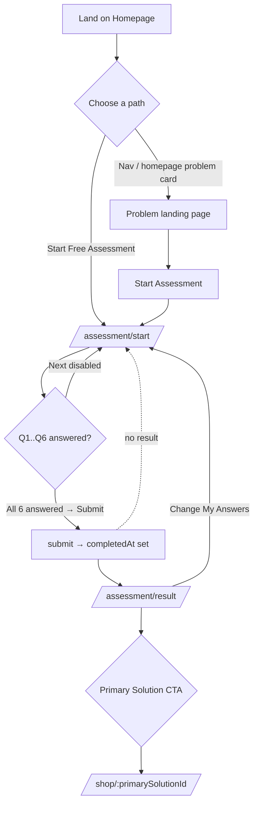
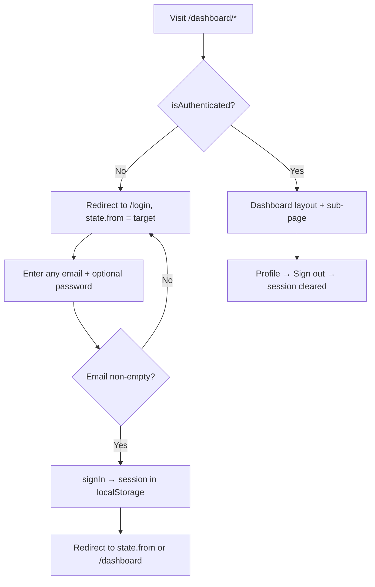

# WeCare — Design Specification & Requirements Document

**Status:** Pre-development discovery / audit of the existing prototype.
**Date:** 2026-08-31
**Prepared by:** Product / UX / BA / Technical analysis pass (Claude, read-only).
**Source of truth for scope & copy rules:** `CLAUDE.md` (in-repo) plus two external
briefs referenced there but **not present in this repository**:
`../Downloads/WeCare_CLI_Implementation_Prompt.md` and
`../Downloads/WeCare Website Structure.md` (`TBD` — obtain and archive in `/docs`).

> **Legend for status tags used throughout:**
> `IMPLEMENTED` · `PARTIAL` · `PLACEHOLDER/MOCK` · `PLANNED` · `MISSING` · `TBD`
> `CONFIRMED` (evidenced in repo/docs) · `ASSUMPTION` (inferred) · `TBD` (unknown)

---

## 1. Project Brief

| Field | Value |
|---|---|
| **Project name** | WeCare |
| **What it is** | A German/Austrian-market **digital health platform for medical cannabis**, built **problem-first** (Sleep · Pain · Stress & Anxiety · Migraine). The doctor / prescription / pharmacy layer is required but sits *behind* a guided self-assessment, never in front of it. |
| **Current form** | A **front-end-only prototype / marketing + guided-flow build**. No backend. All persistence is `localStorage`. Auth, medical review, payment, order fulfilment and lab data are mocked or placeholder. |
| **Origin** | Repurposed from an unrelated Figma Make export ("Visualize Code", an hours-tracking demo). The demo's engineering substrate (Vite + React + Tailwind v4 + shadcn/ui) was kept and reskinned; demo code was stripped phase by phase. |
| **Business problem** (`ASSUMPTION`) | Existing medical-cannabis e-commerce starts with a product catalogue (strains, THC %, formats), which is intimidating, non-compliant-feeling, and a poor fit for patients who just have a problem (bad sleep, pain). WeCare's thesis: start with the problem, guide to a small recommendation set, put the medical review inside the flow. |
| **User problem** (`ASSUMPTION`) | "I have a health problem that might be helped by medical cannabis, but I don't know where to start, I don't want to browse strains, and I don't know if I even qualify." |
| **Proposed solution** | A ~60–90-second, 6-question assessment → 1–2 named "Solutions" (abstract wellness names, not strains) → medical review → prescription *if medically appropriate* → discreet pharmacy delivery → follow-up check-in. |
| **Target market** | Austria first (`de-AT`, EUR, DHL, Austrian legal framework), with Germany implied by "German/Austrian". German is the default locale; English is a toggle. |
| **Primary users** | (1) Prospective patients (adults with sleep / pain / stress-anxiety / migraine concerns). (2) Returning/authenticated patients using "My area" (dashboard). |
| **Stakeholders** (`ASSUMPTION`) | Product owner ("owner" / "Sir Ilay" — makes frequent copy & IA micro-decisions, recorded in `CLAUDE.md`); a licensed doctor / medical-review partner; a dispensing pharmacy; a legal/compliance reviewer; brand/design. |
| **Business objectives** (`ASSUMPTION`, not documented) | Convert problem-aware visitors into completed assessments; route qualified users into medical review; establish a trustworthy, compliant brand distinct from catalogue-first competitors (Bloomwell, DoktorABC). |
| **Product objectives** (`CONFIRMED` from `CLAUDE.md` build order) | Ship: design tokens/fonts/i18n · navigation · homepage · 4 problem landing pages · assessment engine + recommendation logic · result page · recommended-solution page + COA · shop/cart/checkout (out of nav) · full DE/EN. |
| **In scope (this prototype)** | Marketing site, guided assessment, recommendation, solution/COA pages, cart/checkout (mock), mock dashboard, legal draft pages, FAQ, costs, lab-tests. |
| **Out of scope (deliberate)** | Real backend/auth/payments/medical-review integration. CBD Flowers, CBD Hash, Vapes, Aroma Pebbles as products/routes/marketing. `/about`, `/careers`, `/providers`. Knowledge Hub. Any leaf/smoke/dispensary imagery or recreational language. |
| **Known constraints** | Tailwind v4 CSS-config only (no `tailwind.config.js`). Deps deliberately trimmed. `pnpm build` does **not** typecheck. Every user-facing string must ship DE **and** EN with key parity. Austria language rules (never "treats/cures"; "recommended solution" not "prescription"; prescription never guaranteed). |
| **Timeline** | `TBD` — not documented. `index.html` carries `noindex, nofollow` "until the rebuild ships". |

---

## 2. Objectives (traceable)

| ID | Objective | Evidence |
|---|---|---|
| OBJ-1 | Problem-first entry: nav and homepage lead with the 4 problems, never "prescription/treatment". | `PRIMARY_NAV` in `src/app/paths.ts`; `CLAUDE.md` hard rules. |
| OBJ-2 | Guided assessment replaces catalogue browsing as the main path. | `AssessmentEnginePage`; `ComparisonSection`. |
| OBJ-3 | Never imply everyone gets a prescription. | `requiresMedicalReview` framing; `footer.disclaimer`; `MedicalNotice`. |
| OBJ-4 | New users are never led with the stronger option. | `getRecommendation` — primary is fixed per problem. |
| OBJ-5 | Full DE/EN parity for all content, including dynamic. | `src/i18n/`; DE default + fallback. |
| OBJ-6 | One signature visual device (Assessment Ring); quiet motion; liquid-glass + blue-gradient brand language. | `AssessmentRing`; `src/styles/index.css`. |
| OBJ-7 | Commerce exists but is never in primary nav; reachable only post-assessment / footer / dashboard. | `router.tsx`; `paths.ts` comments; `ShopIndexPage`. |
| OBJ-8 | Legal/compliance surface present (6 legal docs, COA/lab tests, checkout disclaimer checkbox). | `LegalPage`; `LabTestsPage`; `CheckoutPage`. |

---

## 3. Scope

### 3.1 In scope (built or partially built)
Homepage · 4 problem landing pages (+ hidden General Wellness) · 6-question assessment engine · recommendation logic · result page · medical-review waiting page (orphaned) · 5 Solution detail pages + example COA · shop index · cart · checkout (mock order) · order confirmation · mock login · mock dashboard (7 sub-pages) · 6 legal draft documents · lab-tests/COA table · FAQ page · costs page · 404 · redirects (`/conditions/*`, `/how-it-works`, `/solution`).

### 3.2 Out of scope (deliberate — do not "add back")
Real auth/backend/payment/medical-review/pharmacy integration · product formats other than the 5 abstract Solutions (Flowers/Hash/Vapes/Pebbles) · `/about` `/careers` `/providers` · Knowledge Hub · any recreational/leaf/smoke imagery or language. *(Dark theme moved from out-of-scope to implemented, Aug 2026.)*

### 3.3 Not yet built (needed before launch — see §20)
`/contact` real content · real data for products/COA/pricing/review-fee · `robots.txt` / `sitemap.xml` · (footer social links + app-store badges were removed) · consent-management platform · analytics · SEO metadata strategy · tests · CI · deployment config · `.env.example`.

---

## 4. Target Users

| User | Description | Primary goal | Notes |
|---|---|---|---|
| **Prospective patient (anonymous)** | Adult in DE/AT with a sleep / pain / stress-anxiety / migraine concern; problem-aware, product-unaware. | Find out what could help and whether they qualify, with minimal friction. | The default persona the whole marketing + assessment flow is designed for. |
| **Returning patient (authenticated)** | Someone who completed the assessment and/or placed an order. | Re-check their recommendation, track order status, do the follow-up check-in, reorder, contact support. | Uses "My area" (`/dashboard/*`). Auth is **mock** — any email signs in. |
| **Unsure visitor** | Doesn't know which problem applies. | Get oriented before committing. | Routed to the hidden **General Wellness** page (from 404 and "not sure?" links only). |
| **Owner / content editor** (`ASSUMPTION`) | Product owner making IA & copy decisions. | Keep the site aligned to the brief and Austria language rules. | Decisions logged in `CLAUDE.md` "Owner overrides". No CMS — content is i18n JSON + code. |
| **Doctor / medical reviewer** | `PLANNED` — no UI. | Review an assessment, issue/deny a prescription. | Referenced in copy only; no integration. |
| **Pharmacy / fulfilment** | `PLANNED` — no UI. | Dispense a strain against a prescription, ship discreetly. | Referenced in copy only. |

---

## 5. User Roles & Permissions

Only **one** real authorization boundary exists in code: authenticated vs. not, gating `/dashboard/*`.

| Role | How you become it | Can access | Cannot access | Actions |
|---|---|---|---|---|
| **Anonymous visitor** | Default. | Everything except `/dashboard/*`. Can run the assessment, view results, browse solutions, add to cart, check out (mock), read legal/FAQ/costs/lab-tests. | `/dashboard` and children → redirected to `/login` with return path. | Complete assessment; add/remove cart items; place mock order; switch language. |
| **Authenticated user (mock)** | Submit any non-empty email at `/login` (`AuthContext.signIn`). Password field is present but **ignored**. Session persists in `localStorage:wecare.auth`. | Everything, plus `/dashboard/*` (overview, my assessment, my recommendation, my orders, follow-up, support, profile). | — | All of the above, plus: view assessment/recommendation/orders, submit follow-up check-in, sign out. |
| **Doctor / Pharmacy / Admin** | `MISSING` — no such role in code. | — | — | — |

### 5.1 Permission matrix

| Area / action | Anonymous | Authenticated (mock) |
|---|---|---|
| Homepage, landing pages, FAQ, costs, legal, lab-tests | ✅ | ✅ |
| Run assessment, view result, view medical-review page | ✅ | ✅ |
| View solution pages, add to cart, cart, checkout, place mock order, order confirmation | ✅ | ✅ |
| `/dashboard` and all children | ❌ → `/login` (`state.from` preserved) | ✅ |
| Sign in / sign out | Sign in only | Sign out (Profile page) |
| Switch language | ✅ (header, footer) | ✅ (also Profile page) |

> **Gap (`BR`/security):** cart, checkout and the mock "order" require **no authentication**. Real checkout almost certainly needs an account and a real medical-review gate. `TBD`.

---

## 6. Requirements

### 6.1 Functional Requirements

| ID | Requirement | Actor | Priority | Status | Depends on | Notes |
|---|---|---|---|---|---|---|
| FR-001 | Global shell: sticky header (logo + 4 problem links + language toggle + conditional cart + Login + "Start assessment" CTA), routed content, dark gradient footer with 4 link columns + icon strip + bottom bar. | All | Must | IMPLEMENTED | — | `SiteHeader`, `SiteFooter`. Header nav collapses to a `Sheet` below `xl`. |
| FR-002 | Primary nav shows **only** Sleep · Pain · Stress & Anxiety · Migraine. No Shop/Products/Flowers/Vapes; no How-It-Works / FAQ. | All | Must | IMPLEMENTED | — | `PRIMARY_NAV`. Owner override vs. brief §17. |
| FR-003 | Homepage with 8 sections in a fixed order (see §10 / IA). | Anonymous | Must | IMPLEMENTED | — | `HomePage.tsx` → `home/sections.tsx`. |
| FR-004 | Four problem landing pages from one shared template + a hidden General Wellness fallback. | Anonymous | Must | IMPLEMENTED | FR-011 | `ConditionLandingPage`; bare slugs; `/conditions/*` redirect. |
| FR-005 | Six-question assessment on a single state-driven page (no route change per question); resumes at first unanswered question; can be pre-filled with `?problem=<key>`. | Anonymous | Must | IMPLEMENTED | FR-006 | `AssessmentEnginePage`, `questions.ts`. |
| FR-006 | Deterministic recommendation from answers: fixed primary + secondary per problem, "Advanced option" re-framing, "start gentle" nudge, always requires medical review. | System | Must | IMPLEMENTED | — | `recommendation.ts`. Pure function, no i18n inside. |
| FR-007 | Result page: answer summary, primary + secondary Solution cards, explanation, conditional gentle nudge, medical-review note, disclaimer, CTAs, "what happens next". | Anonymous | Must | IMPLEMENTED | FR-006 | `ResultPage`. Redirects to `/assessment/start` if no result. |
| FR-008 | Assessment state persists across reloads and is editable; editing any answer invalidates a prior completion. | Anonymous | Must | IMPLEMENTED | — | `AssessmentContext`, `localStorage:wecare.assessment`. |
| FR-009 | Solution detail page per Solution id: name, category, blurb, THC range, price/g, gram selector, add-to-cart, why/usage/suitability/format/ingredients, oil-formulation block, "dispensed as" strain list, example COA, FAQ, guide-back-to-assessment. | Anonymous | Must | IMPLEMENTED | FR-011, FR-012 | `ProductPage` at `/shop/:productId` where `productId` is a `SolutionId`. |
| FR-010 | Shop index: guide panel + 5 Solution cards, no filters, not in nav. | Anonymous | Should | IMPLEMENTED | FR-011 | `ShopIndexPage`. |
| FR-011 | Solution data layer: 5 named Solutions with tier, THC range, oil formulation, price/g, hero strain, strain list, condition mapping. | System | Must | IMPLEMENTED (data is **partly placeholder**) | — | `src/data/solutions.ts`. `category`/`blurb`/`why`/`usage`/`suitability` are i18n, not on the type. |
| FR-012 | Strain (fulfilment) data layer: 19 real products (18 flower + 1 inhaler) with brand, genetics, THC/CBD %, price, origin, irradiation, image; deterministic placeholder COA generator. | System | Must | IMPLEMENTED (**COA + prices + genetics are placeholders**) | — | `src/data/products.ts`. |
| FR-013 | Cart: line items keyed by `SolutionId`, quantity in **grams**; add / set-quantity / remove / clear; subtotal from Solution `priceEur`; persists. | Anonymous | Must | IMPLEMENTED | FR-011 | `CartContext`, `localStorage:wecare.cart`. Cart page stepper step = 5 g, min 5 g. |
| FR-014 | Checkout: customer email + Austrian shipping address + payment method (invoice / bank transfer) + **Terms checkbox** + **required "not intended to diagnose, treat, cure or prevent disease" checkbox**; "Place order" disabled until both ticked; delivery fee = €0; review-fee note links `/costs`. | Anonymous | Must | IMPLEMENTED (**no real payment**) | FR-013 | `CheckoutPage`. `country` field is read-only. |
| FR-015 | Placing an order records a local mock order (`WC-<base36 timestamp>`, lines, total, status) and clears the cart; status = `inReview` when the cart has a prescription item (always true), else `processing`. | System | Must | PLACEHOLDER/MOCK | FR-014 | `orders/orders.ts`, `localStorage:wecare.orders`. |
| FR-016 | Order confirmation page keyed off router `state.orderId`; redirects home if absent. | Anonymous | Must | IMPLEMENTED | FR-015 | `OrderConfirmationPage`. Order id not re-fetchable after navigation away. |
| FR-017 | Mock authentication: any non-empty email signs in; session persists; name derived from local-part; sign-out clears it. | Anonymous → Auth | Must (for demo) | PLACEHOLDER/MOCK | — | `AuthContext`, `localStorage:wecare.auth`. Password ignored. |
| FR-018 | Dashboard ("My area"): auth-gated layout + 7 views (overview, my assessment, my recommendation, my orders, follow-up, support, profile) with empty states. | Auth | Should | IMPLEMENTED (reads mock/local data) | FR-006, FR-015, FR-019 | `DashboardLayout`, `dashboard/pages.tsx`. |
| FR-019 | Follow-up check-in: 5-option prompt ("How was your experience…") → tailored response + 4 actions + "Update My Recommendation" whose target depends on the choice; editable; 14–21-day window note. | Auth | Should | IMPLEMENTED | FR-006 | `followup/followup.ts`, `localStorage:wecare.followup`. |
| FR-020 | Six `/legal/*` documents with real **draft** sectioned content, a visible draft-notice banner, bracketed placeholders, and a TOC when a doc has > 4 sections. | All | Must | PARTIAL (draft, unreviewed, placeholders) | — | `LegalPage`, `legal.json` (**uncommitted**). |
| FR-021 | Lab-tests / COA page: one row per Solution with CBD/CBG/CBN/THC, batch, test date, safety. | All | Should | IMPLEMENTED (values are deterministic placeholders) | FR-011, FR-012 | `LabTestsPage`. |
| FR-022 | FAQ page: 4 categorised accordion groups; footer-linked, not in nav. | All | Should | IMPLEMENTED | — | `FaqPage`, `faq` namespace. |
| FR-023 | Costs page: qualitative "what to expect / what it costs" with **no euro figures**; footer-linked; checkout links to it. | All | Should | IMPLEMENTED | — | `CostsPage`, `costs` namespace. |
| FR-024 | Redirects: `/conditions/*` → bare slugs; `/how-it-works` → `/#how-it-works` (with scroll); `/solution` → recommended product or `/shop`; unknown route → 404. | All | Must | IMPLEMENTED | — | `router.tsx`, `SolutionRedirect`, `ScrollToHash`. |
| FR-025 | Bilingual content (DE default + fallback, EN toggle) for every string incl. dynamic; language persists; `<html lang>` synced; no navigator auto-detect. | All | Must | IMPLEMENTED | — | `i18n/config.ts`, `useLanguage`, `LanguageToggle`, `localStorage:wecare.language`. |
| FR-026 | Journey stepper ("Concern → Assessment → Recommendation → Product → Follow-up") on assessment, result, medical-review, product, cart, checkout. | Anonymous | Should | IMPLEMENTED | — | `JourneyStepper`. |
| FR-027 | Assessment Ring signature component for progress / decoration / completion, with sanctioned reduced-motion-aware arc animation. | All | Should | IMPLEMENTED | — | `AssessmentRing`. |
| FR-028 | Standing medical-safety notice on the 4 problem landing pages (side effects, "not a substitute for standard therapy", "not individual medical advice"). | Anonymous | Must | IMPLEMENTED | — | `MedicalNotice`, `common:medicalNotice.*`. |
| FR-029 | `/contact` route exists as a real link target (from FAQ + Dashboard Support). | All | Could | PLACEHOLDER (title + one line only) | — | `ContactPage` → `PagePlaceholder`. |
| FR-030 | Per-page `document.title` = `"<title> · WeCare"`. | All | Should | IMPLEMENTED | — | `usePageTitle`. No other `<meta>` management (no OG/description per route). |
| FR-031 | Light / Dark appearance, user-toggled, persisted, pre-paint (no flash). Light is the default & reference design; dark is a brand-consistent teal-navy re-skin (colour tokens only). | All | Could | IMPLEMENTED (Aug 2026, owner request) | — | `src/theme/` (`theme.ts` + `useTheme.ts`), `ThemeToggle` in the footer, `.dark` token block in `index.css`, pre-paint script in `index.html`, `localStorage:wecare.theme`, `common:theme.*`. Residual native-control / faint-band polish noted in CLAUDE.md. |
| FR-032 | Decorative gradient backdrop (3 fixed blurred orbs) + fixed page gradient on `<body>`. | All | Should | IMPLEMENTED | — | `GradientBackdrop`, `--page-gradient`. Motion off under reduced-motion. |

### 6.2 Non-Functional Requirements

| ID | Category | Requirement | Status / evidence |
|---|---|---|---|
| NFR-001 | Responsiveness | All pages usable from ~360 px to desktop; Tailwind breakpoints `sm 40rem` `md 48rem` `lg 64rem` `xl 80rem` (v4 defaults). Header collapses to a sheet `< xl`; grids reflow; hero photo repositions `< lg`; trust strip becomes an auto-scrolling marquee when it overflows. | IMPLEMENTED (broadly). Not formally tested. Small-mobile (<360) `TBD`. |
| NFR-002 | Accessibility | Semantic landmarks (`header`/`main`/`footer`/`nav`/`aside`), `aria-label`/`aria-hidden`/`role` on interactive & decorative elements, `role="progressbar"` on the assessment bar, `aria-current="step"` in the stepper, focus-visible rings via `outline-ring/50`, radio/checkbox groups in `<fieldset>`/`<legend>`, `prefers-reduced-motion` respected everywhere motion exists, `text-wrap: balance` on headings. **Target level not stated** — assume **WCAG 2.2 AA**; **not audited**. | PARTIAL. Colour-contrast, form-error semantics, skip-link, focus-trap in the mobile sheet (Radix provides), and dark-section text contrast are unverified. |
| NFR-003 | Performance | Vite build; images imported via `import.meta.glob` (hashed, tree-shaken); below-fold images use `loading="lazy"` + explicit `width`/`height`; Google Fonts `display=swap` + `preconnect`; `backdrop-filter` used sparingly with a solid `@supports` fallback. No route-level code-splitting (all pages statically imported in `router.tsx`). | PARTIAL. No bundle budget, no Lighthouse baseline, no `React.lazy`. Large PNG photos (many 1–4 MB) are unoptimised (no WebP/AVIF). |
| NFR-004 | Security / Privacy | No secrets in repo; no backend calls; all personal input (assessment answers, checkout address, email) stays in the browser (`localStorage` / form fields, never transmitted). `noindex, nofollow`. `rel="noopener noreferrer"` on external links. | IMPLEMENTED for a static prototype. A real build needs: HTTPS, a CMP, server-side data handling + GDPR retention, CSRF/session security, PII-at-rest rules. `TBD`. |
| NFR-005 | Localization | DE + EN, DE default + fallback, key parity enforced by convention; locale-aware date (`de-AT`/`en-GB`) and currency (`de-AT`/`en-IE` EUR) formatting; variables interpolated **inside** translation strings. | IMPLEMENTED. No automated parity check in CI. |
| NFR-006 | Maintainability | Strict TypeScript (`strict`, `noUnusedLocals`, `noUnusedParameters`, `noFallthroughCasesInSwitch`); `@/*` path alias; feature-folder + shared-component structure; design system centralised in one CSS file; shadcn primitives trimmed to what's used. | IMPLEMENTED. **No ESLint / Prettier config**, **no tests**, **no CI**. `pnpm build` does not typecheck (`pnpm typecheck` is separate and currently green). |
| NFR-007 | Browser support | Modern evergreen (uses `:has()`, container-safe `backdrop-filter` with fallback, CSS nesting via Tailwind, `mask-image`, `color-mix()` in the dark scaffold). | ASSUMPTION: last ~2 versions of Chrome/Edge/Firefox/Safari. No matrix documented. IE/legacy unsupported. |
| NFR-008 | SEO | Single `<title>`/`<meta description>` in `index.html`; per-page `document.title` only; `noindex` site-wide; no `robots.txt`/`sitemap.xml`; no per-route meta/OG/canonical/structured data; SPA (no SSR/prerender). | MINIMAL. Full SEO strategy is a launch task. |
| NFR-009 | Reliability / resilience | Every `localStorage` read is `try/catch` with a safe empty default; every glob-resolved image degrades to an inline SVG placeholder via `ImageWithFallback`; guarded routes redirect instead of crashing; `IntersectionObserver` / `matchMedia` absence handled. | IMPLEMENTED (good). |
| NFR-010 | Offline / PWA | None. No service worker, no manifest, no offline handling. | MISSING (not required). |
| NFR-011 | Analytics / consent | None implemented. Cookie-policy legal page exists but there is no cookie banner / CMP and no analytics/tracking. | MISSING (launch task). |
| NFR-012 | Compliance copy | Austria language rules enforced by convention: never "treats/cures"; "recommended solution" not "prescription"; prescription never guaranteed; no recreational/leaf/smoke language or imagery. | IMPLEMENTED by convention; **no linter enforces it** — needs human review. |

---

## 7. User Stories

> Format: *As a [user], I want [action], so that [outcome].* AC = acceptance criteria (see also §18).

| ID | Story | Priority | Related FR | Acceptance criteria (summary) |
|---|---|---|---|---|
| US-001 | As a visitor, I want to pick my problem from the nav or homepage, so that the assessment starts already focused on it. | Must | FR-002, FR-004, FR-005 | Clicking a problem in the nav opens its landing page; its CTA opens `/assessment/start?problem=<key>` with Q1 pre-selected and a "pre-filled" note shown. |
| US-002 | As a visitor, I want a short assessment that isn't a medical form, so that I'm not put off. | Must | FR-005 | 6 questions, one visible at a time, "~60–90 s · not a medical form" copy on step 1, linear progress bar + ring, Back/Restart available, Next disabled until the current question is answered. |
| US-003 | As a visitor, I want my answers remembered if I leave and come back, so that I don't restart. | Must | FR-008 | After reload, the engine resumes at the first unanswered question with prior answers intact; changing an answer clears any "completed" state. |
| US-004 | As a visitor, I want a clear recommendation after the assessment, so that I know what might help. | Must | FR-006, FR-007 | Result page shows selected problem, frequency, strength, a **primary** Solution and a **secondary** ("Advanced option" when applicable), a plain-language explanation, and the exact disclaimer. |
| US-005 | As a new-to-cannabis user, I want to be steered to the gentler option, so that I start safely. | Must | FR-006 | When new / mild / moderate: primary is the lighter Solution, the "start gentle, oil-first" nudge is shown, and the secondary is **not** labelled "Advanced". |
| US-006 | As a visitor, I want to understand a Solution before adding it, so that I can decide. | Must | FR-009 | Solution page shows name, category, why/who-it-suits/format/ingredients, an example COA with a "Lab tested" badge, the oil-formulation starting profile, the strains it may be dispensed as, and a non-aggressive "Add to cart" / "Check availability". |
| US-007 | As a visitor, I want to see that everything is prescription-gated, so that I trust the process. | Must | FR-003, FR-028, FR-007 | Prescription badge on Solution cards; "medical review is part of the flow"; "Not everyone receives a prescription" in the footer; medical-safety notice on landing pages. |
| US-008 | As a visitor, I want to check out for my recommended Solution, so that I can proceed once approved. | Must | FR-013, FR-014, FR-015, FR-016 | Cart shows name/qty(g)/price/free shipping/total + a prescription notice; checkout collects details + two required confirmations; "Place order" is disabled until both are ticked; success shows an order id and links to "My orders". |
| US-009 | As a returning user, I want a dashboard, so that I can see my assessment, recommendation and orders. | Should | FR-017, FR-018 | After signing in (any email), `/dashboard` shows problem + recommended product + latest order status + follow-up reminder; each sub-page has an empty state with a CTA when its data is missing. |
| US-010 | As a returning user, I want a follow-up check-in, so that my recommendation can be adjusted. | Should | FR-019 | Choosing one of Good / stronger / lighter / another format / need support shows a tailored response, 4 actions, and an "Update My Recommendation" button whose target matches the choice; the answer is editable. |
| US-011 | As any user, I want the site in German or English, so that I can read it comfortably. | Must | FR-025 | Toggle in header and footer (and Profile); choice persists across reloads; `<html lang>` updates; dates/prices reformat for the locale. |
| US-012 | As any user, I want legal, cost and lab information, so that I can assess trust and compliance. | Must | FR-020, FR-021, FR-023 | Footer links to 6 legal docs (with a visible "draft" banner), a costs page (no euro figures), and a lab-tests table (one row per Solution). |
| US-013 | As a user who lands on a dead end, I want a way forward, so that I'm not stuck. | Should | FR-024 | 404 offers "Back to home" + a link to the General Wellness assessment; guarded pages redirect to a sensible place (assessment start, cart, login-with-return, shop, home). |
| US-014 | As a keyboard / reduced-motion / screen-reader user, I want the site to be operable, so that I can complete the flow. | Must | NFR-002 | All interactive elements are reachable and labelled; decorative visuals are `aria-hidden`; animations (reveal, ring arc, marquee, orb drift) are disabled under `prefers-reduced-motion`. (**Not audited.**) |
| US-015 | As a mobile user, I want the layout to adapt, so that it's usable one-handed. | Must | NFR-001 | Header condenses to a sheet menu `< xl`; the hero photo moves below the copy `< lg`; grids stack; the mobile assessment CTA is full-width under the hero photo. |
| US-016 | As the owner, I want new copy to always exist in DE and EN, so that nothing ships half-translated. | Must | FR-025, NFR-005 | Every referenced i18n key resolves in both locales; DE/EN files have identical key trees. (**Enforced by convention, not tooling.**) |

---

## 8. User Flows

### 8.1 First-time visitor → completed assessment → recommendation



- **Decision points:** each question gates "Next"; submitting requires all six; `?problem=` pre-fills Q1 only if Q1 is empty.
- **Success:** `/assessment/result` renders with a `Recommendation`.
- **Failure / exit:** navigating to `/assessment/result` without a completed result → redirect to `/assessment/start`. "Restart" clears all answers.

### 8.2 Returning user (assessment already stored)

```mermaid
flowchart TD
    A[Open /assessment/start] --> B[Resume at first unanswered question]
    B --> C{All answered previously?}
    C -->|Yes, and completedAt set| D[result available app-wide]
    C -->|Edited an answer| E[completedAt cleared → must re-submit]
    D --> F[/dashboard shows problem + recommendation]
    D --> G[/solution redirects to recommended product]
```

### 8.3 Authentication (mock) + dashboard gate



### 8.4 Cart → checkout → mock order

```mermaid
flowchart TD
    A[Solution page: pick grams 5/10/15/30] --> B[Add to cart]
    B --> C[/shop/cart/]
    C -->|Empty| Z[Empty state → Back to shop]
    C --> D[Adjust qty ±5g / remove]
    D --> E[Checkout]
    E --> F{Cart empty?}
    F -->|Yes| C
    F -->|No| G[Fill customer + shipping + payment method]
    G --> H{Terms AND disclaimer checked?}
    H -->|No| I[Place order disabled]
    H -->|Yes| J[Place order → addOrder, clear cart]
    J --> K[/shop/confirmation with state.orderId]
    K -->|No orderId| L[Redirect to /]
    K --> M[Order id shown → My orders / Home]
```

- **Business rule:** order `status` = `inReview` because every cart item is prescription-only; otherwise `processing` (dead branch today).
- **No payment is taken.** Delivery fee = €0.

### 8.5 Follow-up check-in

```mermaid
flowchart TD
    A[/dashboard/follow-up/] --> B{result exists?}
    B -->|No| C[Empty state → Start assessment]
    B -->|Yes| D{follow-up entry exists?}
    D -->|No| E[Prompt: Good / stronger / lighter / another format / need support]
    E --> F[setFollowUp → tailored response]
    D -->|Yes| F
    F --> G[4 actions + "Update My Recommendation"]
    G -->|stronger| H[product page of the stronger pair member]
    G -->|lighter| I[product page of the lighter pair member]
    G -->|another format / need support| J[/dashboard/support/]
    G -->|good| K[/dashboard/recommendation/]
    F --> L[Change → clearFollowUp → back to prompt]
```

### 8.6 Redirect / dead-end flows

| From | To | Trigger |
|---|---|---|
| `/conditions/sleep-problems` (and 4 more) | bare slug (`/sleep-problems` …) | `<Navigate replace>` in `router.tsx` |
| `/how-it-works` | `/#how-it-works` then smooth-scroll to the section | `<Navigate replace>` + `ScrollToHash` |
| `/solution` | `/shop/:primarySolutionId` (result) or `/shop` | `SolutionRedirect` |
| `/shop/:productId` where id is not a `SolutionId` | `/shop` | `ProductPage` guard |
| `/assessment/result` or `/assessment/medical-review` with no result | `/assessment/start` | page guard |
| `/shop/checkout` with empty cart | `/shop/cart` | page guard |
| `/shop/confirmation` with no `state.orderId` | `/` | page guard |
| any unknown path | `NotFoundPage` (offers Home + General Wellness) | `path: "*"` |

### 8.7 Error / edge states (behaviour)

| Situation | Behaviour |
|---|---|
| `localStorage` blocked / private mode / malformed JSON | All context loaders `try/catch` → empty defaults; the app still runs, nothing persists. |
| Missing image (bad glob key) | `ImageWithFallback` renders an inline SVG "broken image" placeholder; layout unaffected. |
| `prefers-reduced-motion: reduce` | `Reveal` shows immediately; `AssessmentRing` skips the arc sweep; trust marquee is static & wrapped; orb drift disabled; hash-scroll is instant. |
| No `IntersectionObserver` | `Reveal` shows immediately. |
| Direct URL to a guarded page | Redirect (see 8.6). |
| Form field missing / invalid | Native HTML validation only (`required`, `type="email"`). No custom messages, no inline error summary, no scroll-to-first-error. |
| Slow network / API failure | N/A — there are no network requests. |

---

## 9. Information Architecture

### 9.1 Navigation

- **Primary (header, left):** Logo (→ `/`) · Sleep · Pain · Stress & Anxiety · Migraine.
- **Header (right):** Language toggle · Cart (only when count > 0) · Login · **Start assessment** (CTA).
- **Header `< xl`:** Cart · Language · hamburger → `Sheet` with the 4 problems + Login + Start assessment.
- **Footer columns:** **Concerns** (4 problems) · **WeCare** (How it works, FAQ, Costs, Contact, Lab tests / COA) · **Legal** (Terms, Privacy, Cookie policy, Imprint, Shipping policy, Refund policy) · **Brand** (logo + tagline).
- **Footer bottom bar:** © + Login · emergency disclaimer · Language toggle.
- **Journey stepper** (contextual, not nav): Concern → Assessment → Recommendation → Product → Follow-up.

### 9.2 Sitemap

```
/                                  Homepage (8 sections)
├── /sleep-problems                Problem landing (shared template)
├── /pain-body-discomfort          Problem landing
├── /stress-anxiety                Problem landing
├── /migraine-head-tension         Problem landing
├── /general-wellness              Hidden fallback landing (not in nav)
├── /how-it-works        → 301 →   /#how-it-works
├── /faq                           FAQ page (footer only)
├── /costs                         "What it costs" (footer only)
├── /assessment
│   ├── /start                     Assessment engine (?problem=<key>)
│   ├── /result                    Result page (guarded)
│   └── /medical-review            Waiting state (guarded; orphaned from Result)
├── /solution           → redirect → recommended product or /shop
├── /shop                          Shop index (5 Solution cards; footer/post-assessment only)
│   ├── /shop/:productId           Solution detail (productId = SolutionId)
│   ├── /shop/cart                 Cart
│   ├── /shop/checkout             Checkout (guarded)
│   └── /shop/confirmation         Order confirmation (guarded)
├── /dashboard                     "My area" (auth-gated)
│   ├── (index)                    Overview
│   ├── /assessment                My assessment
│   ├── /recommendation            My recommendation
│   ├── /orders                    My orders
│   ├── /follow-up                 Follow-up check-in
│   ├── /support                   Support
│   └── /profile                   Profile (name, email, language, sign out)
├── /login                         Mock sign-in
├── /contact                       Placeholder (real link target)
├── /legal
│   ├── /imprint  /privacy  /terms
│   ├── /cookie-policy  /shipping-policy  /refund-policy
├── /lab-tests                     COA table
└── *                              404 (→ Home / General Wellness)
```

### 9.3 Content hierarchy — Homepage (render order in `HomePage.tsx`)

1. **Hero** — kicker "Because we care" + headline + subheadline + primary CTA "Start Free Assessment" / secondary "How It Works" + 5 trust points (marquee pill) + layered photo + decorative Assessment Ring arc + 2 floating info chips.
2. **"What do you need help with?"** — 4 problem cards (photo + icon + title + description + CTA).
3. **"Simple recommendations. No confusing catalog."** (dark "brand" section) — 4 support cards (no prices) + `ComboCarousel` (matched pair per problem) + CTA.
4. **"A guided and responsible experience"** (eyebrow "Why WeCare") — 6 trust badges (discreet · clear · guidance · support · austria · noObligation) + anchor photo.
5. **"How WeCare works"** (`id="how-it-works"`) — 4 steps (choose · assessment · match · continue).
6. **Final CTA** (own dark gradient section) — "we care…" heading + subtitle + CTA + doctor photo bleeding off the bottom.
7. **"Two ways to find what helps"** (`ComparisonSection`, eyebrow "Why WeCare") — guided vs. catalogue, 2-column table, 5 rows. *(Owner decision this session: now renders **after** the final CTA — uncommitted.)*
8. **FAQ teaser** — curated 5-question accordion → link to `/faq`.

### 9.4 Content hierarchy — Problem landing page (shared template)

Hero (blue gradient + condition photo; responsive right-band / below-copy) → **"What this is about"** (explanation paragraph **+ "Common situations" checklist**, 5–6 bullets — merged this session) → **"How WeCare helps"** (4 numbered per-page steps) → **"What you might be matched with"** (2 matched Solution cards, name + category + THC only, **no buy CTA**; omitted for General Wellness) → **Medical-safety notice** → **Final CTA** ("we care…" heading + assessment CTA + "not sure?" → General Wellness, hidden on the General Wellness page itself).

---

## 10. Feature Inventory

| ID | Feature | User | Purpose | Priority | Status | Depends on | FR | US |
|---|---|---|---|---|---|---|---|---|
| F-01 | Global header + responsive nav + mobile sheet | All | Wayfinding, problem-first framing | Must | IMPLEMENTED | — | FR-001/002 | US-001/015 |
| F-02 | Dark gradient footer (4 columns + payment/shipping badge strip + bottom bar) | All | Secondary nav, trust marks, legal, language + theme toggles | Must | IMPLEMENTED (social links + app-store badges removed Aug 2026) | — | FR-001 | US-012 |
| F-03 | Homepage (8 sections) | Anonymous | Convert to assessment | Must | IMPLEMENTED | F-04, F-05, F-14 | FR-003 | US-001/007 |
| F-04 | Problem landing template (×5) | Anonymous | Focus a visitor on one problem, route into a pre-filled assessment | Must | IMPLEMENTED | F-13 | FR-004/028 | US-001 |
| F-05 | Assessment engine (6 Q, single page, resumable, pre-fillable) | Anonymous | Capture problem/frequency/strength/experience/preference | Must | IMPLEMENTED | F-06 | FR-005/008 | US-002/003 |
| F-06 | Recommendation engine (deterministic) | System | Map answers → primary + secondary Solution + flags | Must | IMPLEMENTED | F-11 | FR-006 | US-004/005 |
| F-07 | Result page | Anonymous | Present the recommendation + next steps + disclaimer | Must | IMPLEMENTED | F-06, F-13 | FR-007 | US-004 |
| F-08 | Medical-review waiting page | Anonymous | Calm "with a doctor" status | Should | IMPLEMENTED but **orphaned** (URL-only) | F-06 | FR-024 | — |
| F-09 | Solution detail page (×5) | Anonymous | Explain a Solution; add to cart; show COA + strains + oil profile | Must | IMPLEMENTED (data partly placeholder) | F-11, F-12, F-14 | FR-009 | US-006 |
| F-10 | Shop index (5 cards, no filters) | Anonymous | Reference list of Solutions (not the entry path) | Should | IMPLEMENTED | F-11 | FR-010 | — |
| F-11 | Solution data model (5 Solutions) | System | The user-facing product layer | Must | IMPLEMENTED (`priceEur`, `oilFormulation` = spec/placeholder) | — | FR-011 | — |
| F-12 | Strain data model (19 products) + placeholder COA generator | System | Fulfilment layer + example lab values | Must | IMPLEMENTED (**all COA/genetics/prices placeholder**) | — | FR-012/021 | US-006/012 |
| F-13 | Cart (grams, `SolutionId` keyed, persistent) | Anonymous | Hold a Solution + quantity pre-checkout | Must | IMPLEMENTED | F-11 | FR-013 | US-008 |
| F-14 | Checkout form + mock order + confirmation | Anonymous | Collect details + required confirmations; record a local order | Must | PLACEHOLDER/MOCK (no payment) | F-13, F-15 | FR-014/015/016 | US-008 |
| F-15 | Mock order store (`wecare.orders`) | System | Feed the dashboard "My orders" | Must (demo) | PLACEHOLDER/MOCK | — | FR-015 | US-009 |
| F-16 | Mock auth (`wecare.auth`) | Anonymous→Auth | Gate the dashboard for a demo | Must (demo) | PLACEHOLDER/MOCK | — | FR-017 | US-009 |
| F-17 | Dashboard "My area" (7 views + empty states) | Auth | Post-assessment self-service | Should | IMPLEMENTED (mock/local data) | F-06/15/16/18 | FR-018 | US-009 |
| F-18 | Follow-up check-in (`wecare.followup`) | Auth | Step 6 of the flow; adjust the recommendation | Should | IMPLEMENTED | F-06 | FR-019 | US-010 |
| F-19 | Legal draft documents (×6) | All | Compliance surface (draft) | Must | PARTIAL (draft, unreviewed, `legal.json` uncommitted) | — | FR-020 | US-012 |
| F-20 | Lab-tests / COA table | All | Transparency on cannabinoid values | Should | IMPLEMENTED (placeholder values) | F-11/12 | FR-021 | US-012 |
| F-21 | FAQ page (4 categories) | All | Answer common questions; no medical claims | Should | IMPLEMENTED | — | FR-022 | US-012 |
| F-22 | Costs page (qualitative, no euros) | All | Set money expectations | Should | IMPLEMENTED | — | FR-023 | US-012 |
| F-23 | i18n (DE default + fallback, EN toggle) | All | Bilingual content, locale formatting | Must | IMPLEMENTED | — | FR-025 | US-011/016 |
| F-24 | Assessment Ring (signature visual) | All | Progress / decoration / completion | Should | IMPLEMENTED | — | FR-027 | US-002 |
| F-25 | Journey stepper | Anonymous | "Healthcare journey, not a shop" framing | Should | IMPLEMENTED | — | FR-026 | US-004/008 |
| F-26 | Gradient backdrop + page gradient + liquid-glass surfaces | All | Brand atmosphere | Should | IMPLEMENTED | — | FR-032 | — |
| F-27 | Redirects (`/conditions/*`, `/how-it-works`, `/solution`) + `ScrollToHash` | All | Preserve old links, homepage-section pattern | Must | IMPLEMENTED | — | FR-024 | US-013 |
| F-28 | `ComboCarousel` (matched pairs, dependency-free scroll-snap) | Anonymous | Preview the recommendation set on the homepage | Should | IMPLEMENTED (new; **uncommitted**) | F-06/11 | FR-003 | — |
| F-29 | `MedicalNotice` standing safety notice | Anonymous | Compliance on landing pages | Must | IMPLEMENTED | — | FR-028 | US-007 |
| F-30 | Contact page | All | Real link target from FAQ + Support | Could | PLACEHOLDER (title + one line) | — | FR-029 | — |
| F-31 | Light / Dark appearance + toggle | All | Optional appearance, brand-consistent | Could | IMPLEMENTED (Aug 2026) | F-23 | FR-031 | US-011-adjacent |
| F-32 | "We care" tagline voice | All | Brand play on the name in EN headline/tagline spots | Could | IMPLEMENTED (this session; DE keeps warmth without the pun; **uncommitted**) | F-23 | FR-025 | US-016 |
| F-33 | About / Careers / Providers pages | — | — | — | REMOVED (owner decision) — do not re-add | — | — | — |
| F-34 | Knowledge Hub (index + article template + `knowledge` ns) | — | — | — | REMOVED (owner decision; every article body was a placeholder) — do not re-add without real content | — | — | — |
| F-35 | Testimonials section | — | — | — | REMOVED (fabricated quotes, never in the brief) | — | — | — |

---

## 11. Business Rules

> Every rule below is evidenced in code or `CLAUDE.md`. Rules that need a business decision are tagged `TBD — Business clarification required`.

### 11.1 Recommendation & assessment

| ID | Rule |
|---|---|
| BR-001 | The **primary** recommended Solution is **fixed per problem** and never changes with severity or experience: sleep → *Night Now*; pain → *Deep Ease*; stress & anxiety → *Synergy Forte*; migraine → *Synergy Forte*. (`PAIR` in `recommendation.ts`) |
| BR-002 | The **secondary** Solution is also fixed per problem: sleep → *Calm Night*; pain → *Synergy Ultra*; stress & anxiety → *Synergy Ultra*; migraine → *Deep Ease*. |
| BR-003 | The secondary is re-framed as an **"Advanced option"** *only when* the problem's pair `escalates` (true for sleep/pain/stress, **false for migraine**) **AND** (`q3` strength is `strong` or `veryStrong` **OR** the user is experienced: `q4 = prescription` or `q5 ∈ {oil, flowers, vape, other}`). |
| BR-004 | The **"start gentle, oil-first" nudge** (`gentleFirst`) is shown when the user is new to cannabis (`q5` empty or `= new`) **OR** `q3` strength is `mild` or `moderate`. |
| BR-005 | **Every recommendation always requires medical review** (`requiresMedicalReview = true` unconditionally). Medical cannabis is prescription-only; no Solution is ever sold directly. |
| BR-006 | `q1` (problem) drives the recommendation. If `q1` is missing or not one of `pain`/`stressAnxiety`/`migraine`, the problem defaults to **`sleep`**. |
| BR-007 | Launching the assessment from a landing page pre-fills `q1` **only if `q1` is currently empty** (never overwrites an in-progress answer). |
| BR-008 | Editing **any** answer clears a prior completion (`completedAt → null`); the user must re-submit to get a `result`. |
| BR-009 | A `result` is available app-wide **only when** all six questions are answered **and** `completedAt` is set (i.e. the user pressed Submit). |
| BR-010 | The assessment resumes at the **first unanswered question** on load. |
| BR-011 | The Result page's primary CTA routes to the **Solution page** (`/shop/:primarySolutionId`), **not** the medical-review page. (Consolidated-doc decision; `MedicalReviewPage` still exists but is unlinked from Result.) |
| BR-012 | Assessment answers, cart, orders, follow-up and auth are stored **in the browser only** (`localStorage`), never transmitted. |

### 11.2 Products, pricing, commerce

| ID | Rule |
|---|---|
| BR-013 | The user-facing product layer is the **5 named Solutions** (abstract wellness names). Strain names/formats never appear before the assessment; landing pages show only a low-emphasis "what you might be matched with" preview (name + THC, no buy CTA). |
| BR-014 | Cart line quantity is always **grams**; the cart key is a `SolutionId`. Product page gram options: **5 / 10 / 15 / 30** (default 10). Cart adjust step: **5 g**, minimum **5 g**. |
| BR-015 | Subtotal = Σ (Solution `priceEur` per gram × grams). **Delivery fee = €0** (`DELIVERY_FEE_EUR`). Total = subtotal + delivery. `TBD — Business clarification required` (real pricing, whether delivery is always free, VAT display). |
| BR-016 | "Place order" is **disabled until both** the Terms checkbox **and** the "not intended to diagnose, treat, cure or prevent disease" checkbox are ticked. |
| BR-017 | Payment method is a choice between **invoice** and **bank transfer** only. No card/PSP flow. `TBD — Business clarification required` (real payment methods; Klarna/Visa/etc. shown in the footer are decorative). |
| BR-018 | Shipping country is **fixed** (read-only field, value = "Österreich" / "Austria"). `TBD` — is Austria the only shipping destination? |
| BR-019 | A placed order's status is **`inReview`** whenever the cart contains a prescription item (**always true**, since every Solution is prescription-only), otherwise `processing`. `shipped` / `delivered` exist as statuses but are never set by the app. |
| BR-020 | Order id format: `WC-` + `Date.now()` in base-36 uppercase. Orders are prepended (newest first). |
| BR-021 | Example COA values are **deterministically derived** from a product's THC % + id character codes (`getProductCoa`). They are **not real lab data**. `batch` / `testedOn` are likewise synthetic. |
| BR-022 | Commerce (`/shop*`) is **never** in the primary nav; it is reachable only from the Result/Solution flow, the footer, and the dashboard. |
| BR-023 | The cart icon in the header is **hidden when the cart is empty**. |

### 11.3 Content, IA, compliance

| ID | Rule |
|---|---|
| BR-024 | Primary nav contains **exactly** the 4 problems. "How It Works" and "FAQ" are deliberately excluded (owner decision, overrides brief §17). "How It Works" is a homepage section; `/how-it-works` redirects to `/#how-it-works`. "FAQ" has a real page linked only from the footer. |
| BR-025 | No **leaf / smoke / dispensary imagery** and no **recreational language** anywhere. |
| BR-026 | Homepage and problem pages **lead with the problem**, never "prescription" / "treatment". The medical layer appears **after** the assessment as "medical review" / "prescription if medically appropriate" — never guaranteed. |
| BR-027 | Never imply every user gets a prescription (`footer.disclaimer`, `MedicalNotice`, medical-review copy). |
| BR-028 | **Austria language rules:** never "treats" / "cures"; use "recommended solution", not "prescription", in product copy; a prescription is never presented as guaranteed. |
| BR-029 | Every new or touched user-facing string ships in **both** DE and EN; the DE and EN JSON key trees must be **identical** (components reference keys dynamically). Interpolate variables **inside** translation strings. |
| BR-030 | **German is the default and fallback locale**; there is **no** `navigator` language auto-detection. Language choice persists (`wecare.language`) and syncs `<html lang>`. |
| BR-031 | The 4 problem landing pages carry a standing `MedicalNotice`. **General Wellness** is a hidden fallback: it is routed and is the redirect target for `/conditions/general-wellness`, but it is never counted as one of the 4, has no "matched solutions" section, and is linked only from the 404 and the landing pages' "not sure?" link. |
| BR-032 | The 6 `/legal/*` documents are **draft** text (original to WeCare, structurally informed by but not copied from reference sites), each carrying a visible draft-notice banner and bracketed placeholders for real-entity facts (legal entity name, Firmenbuch number, VAT ID, DPO contact, address). **Not reviewed legal advice** — replace placeholders and have counsel review before launch. |
| BR-033 | The required "not intended to diagnose, treat, cure or prevent disease" language ships **only** as the checkout confirmation checkbox (the standalone `/legal/product-disclaimer` page was dropped by owner decision). |
| BR-034 | The `/costs` page contains **no euro figures** (exact fees depend on the medical review). |
| BR-035 | Motion is quiet: fade-and-rise section reveal, a 250 ms glass hover-lift, a slow orb drift, and the Assessment Ring's one sanctioned arc-sweep-on-load. The hero photo and info chips **must not drift**. Everything is disabled under `prefers-reduced-motion`. |
| BR-036 | Feature work happens on a branch; commit/push only when asked. |

---

## 12. Edge Cases & Exception Handling

### 12.1 User states

| Case | Expected behaviour | Status |
|---|---|---|
| First-time user, no stored state | All flows start clean; assessment at Q1; dashboard sub-pages show empty states with CTAs. | HANDLED |
| Returning user, partial assessment | Engine resumes at the first unanswered question; no `result` until Submit. | HANDLED |
| Returning user, completed assessment | `result` available on Result, Solution links, `/solution`, dashboard. | HANDLED |
| Unauthenticated user hits `/dashboard/*` | Redirect to `/login` with `state.from`; after sign-in, return to the intended page. | HANDLED |
| "Authenticated" user (mock) with no assessment / no orders | Dashboard overview + sub-pages show empty states + CTAs. | HANDLED |
| Suspended / deleted / role-mismatched user | Not modelled (no real auth / roles). | `TBD` |

### 12.2 Data states

| Case | Expected behaviour | Status |
|---|---|---|
| No data (empty cart / no orders / no follow-up / no result) | Dedicated empty states everywhere. | HANDLED |
| Malformed / tampered `localStorage` | Loaders `try/catch` + shape-validate → safe empty default; cart also floors quantities to ≥1 and drops unknown `SolutionId`s. | HANDLED |
| Stale data (old order status, old recommendation vs new answers) | Editing answers clears completion; otherwise the app shows whatever is stored — no reconciliation. | PARTIAL / `TBD` |
| Large dataset | N/A — fixed 5 Solutions, 19 products, ≤ small carts/order lists. | N/A |
| Duplicate cart add | `add` merges into the existing line (sums grams). | HANDLED |

### 12.3 Network states

| Case | Behaviour | Status |
|---|---|---|
| Slow / offline / timeout / 5xx / API down | **No network requests exist.** Google Fonts fail → system-font fallback stack. Images are bundled. | N/A (prototype) — real integrations will need loading/error/retry patterns (see §17). |

### 12.4 UI states

| State | Where it's handled | Gaps |
|---|---|---|
| Loading | None needed (no async). | Real data will need skeletons/spinners (never a spinner for the ring). |
| Empty | Cart, orders, follow-up, dashboard overview/assessment/recommendation. | — |
| Error | 404 page; guarded-route redirects; image fallback. | No error boundary; a render error anywhere unmounts the whole app (no `errorElement` on routes). |
| Success | Order confirmation; "Added" tick on the product page; follow-up response. | Order-confirmation id is lost on navigation (only in router `state`). |
| Disabled | "Next"/"Submit" until a question is answered; "Place order" until both checkboxes. | — |
| Read-only | Checkout `country` field. | — |
| Partial completion | Assessment resume. | — |

### 12.5 Form states

| Case | Behaviour | Gap |
|---|---|---|
| Required field missing / bad format | Native browser validation (`required`, `type=email`). | No custom copy, no error summary, no focus-to-first-error, no `aria-describedby` error wiring. |
| Unsaved changes | Assessment answers auto-persist on every change; checkout form does **not** persist. | Leaving checkout loses entered address. |
| Submission failure | Cannot fail (no backend). | — |
| Character limits / duplicates | Not enforced. | `TBD` for real forms. |

### 12.6 Responsive states

| Breakpoint | Notable behaviour |
|---|---|
| Desktop (`≥ xl`) | Full header nav; hero photo as a right-hand band; comparison table 2-col. |
| `lg`–`xl` | Header still full; mobile hero CTA hidden. |
| `< xl` | Header → hamburger `Sheet` (Radix Dialog; focus-trapped). |
| `< lg` | Hero photo moves below the copy (full-bleed band) with a vertical gradient; single-column grids; trust strip auto-scrolls as a marquee. |
| `< sm` / small mobile (< 360) | Relies on wrapping + horizontal-scroll containers (COA table, comparison). Not explicitly tested. |
| Touch | Hover-only affordances (card zoom, glass lift) are cosmetic; all actions are tap-reachable. |

### 12.7 Permission states

| Case | Behaviour |
|---|---|
| Unauthorized dashboard access | Redirect to login with return path (handled). |
| Expired session | No expiry — mock session lives until sign-out or `localStorage` clear. |
| Role mismatch | N/A (single role). |

---

## 13. UI/UX Specification

### 13.1 Layout principles
- Centred content column, `max-w-6xl` for marketing/section content, narrower (`max-w-2xl`–`max-w-4xl`) for reading/flow pages. Horizontal padding `px-4` (`sm:px-6`) is applied on the **full-width** element with a centred `max-w-*` child (so all sections share the same left/right edge — the header, hero and trust pill were aligned to this in-session).
- Vertical rhythm via the `Section` component: `py-16` (`sm:py-24`).
- Full-bleed dark "brand" bands (`Section tone="brand"`, `FinalCtaSection`, condition hero) break the rhythm intentionally.

### 13.2 Navigation behaviour
- Header is `sticky top-0`, translucent, `backdrop-blur`.
- Active nav link: `aria-[current=page]` → petrol text.
- Mobile menu is a right-side `Sheet`; closes on selection (`SheetClose`).
- Cross-route hash targets (`/how-it-works` → `/#how-it-works`) are scrolled by `ScrollToHash` (retries on animation frames; `auto` under reduced motion).
- `ScrollRestoration` handles scroll position on normal navigation.

### 13.3 Interaction patterns / reusable components

| Component | File | Role | Notes |
|---|---|---|---|
| `Button` | `app/components/ui/button.tsx` | All buttons/links-as-buttons | Variants: `default`, `cta` (Azure→cyan gradient + glow — the primary CTA), `outline` (frosted glass), `ghost`, `secondary`, `link`, `destructive`. Sizes `sm`/`default`/`lg`/`xl`/`icon`. `asChild` via Radix `Slot`. Full-pill radius. |
| `Input`, `Label` | `ui/input.tsx`, `ui/label.tsx` | Form fields | shadcn defaults; token-driven. |
| `Sheet` | `ui/sheet.tsx` | Mobile nav drawer | Radix Dialog. |
| `Accordion` | `ui/accordion.tsx` | FAQ (home, page, product) | Radix, `type="single" collapsible`. |
| `Section` / `SectionHeading` | `components/marketing/Section.tsx` | Section wrapper + eyebrow/title/intro | Tones: `surface` (transparent), `raised` (frosted band), `brand` (deep blue-teal gradient, white text), `mint` (faint wash). `SectionHeading` `invert` prop for dark sections. |
| `AssessmentRing` | `components/brand/AssessmentRing.tsx` | The one signature visual | Variants `progress`/`decoration`/`complete`; tones `brand`/`mint`/`deep`; optional `trail` dots + `startLabel` pill; **never a spinner**; reduced-motion aware. |
| `JourneyStepper` | `components/marketing/JourneyStepper.tsx` | "You are here" on flow pages | 5 steps; compact "Step X of Y" `< sm`. |
| `Reveal` | `components/marketing/Reveal.tsx` | Fade+rise on scroll into view | No-op under reduced motion / no `IntersectionObserver`. |
| `MedicalNotice` | `components/marketing/MedicalNotice.tsx` | Standing safety notice | Landing pages only. |
| `GradientBackdrop` | `components/marketing/GradientBackdrop.tsx` | 3 fixed blurred orbs | `-z-10`; drift off under reduced motion. |
| `FloatingChip` | `components/marketing/FloatingChip.tsx` | Frosted info pill over imagery | `light`/`dark` tone. |
| `ComboCarousel` | `components/marketing/ComboCarousel.tsx` | Homepage matched-pair carousel | Dependency-free scroll-snap + dots + prev/next. **New, uncommitted.** |
| `Logo` / `LogoMark` | `components/brand/Logo.tsx` | Brand lockup / mark | `inverse` for dark surfaces (uses white PNG). |
| `ImageWithFallback` | `app/components/figma/ImageWithFallback.tsx` | `` with inline-SVG fallback | Every glob-resolved image renders through this. |
| `FooterIcons` | `components/layout/FooterIcons.tsx` | `TrustBadges` — DHL shipping + payment marks (static images). Social links + app-store badges were removed (Aug 2026 — were `#`-only, no app). |
| `LanguageToggle` | `components/layout/LanguageToggle.tsx` | DE/EN segmented switch | Header, footer, Profile. |

### 13.4 Feedback / states
- **Loading:** none (no async). Add skeletons for real data; **never** a spinner (use the ring for progress).
- **Empty:** consistent `glass` card + explanatory text + a `cta` button (dashboard, cart, orders, follow-up).
- **Error:** 404 page only; guarded routes redirect; images fall back. **No React error boundary** — add one.
- **Success:** order-confirmation page; transient "Added" tick on the product CTA; follow-up "your answer" recap.
- **Disabled:** greyed with `disabled:opacity-50`; "Next"/"Submit"/"Place order" gating.

### 13.5 Accessibility expectations (target: WCAG 2.2 AA — **unverified**)
- Keep landmark roles, `aria-label`s on icon-only controls and decorative visuals `aria-hidden`.
- Keep `role="progressbar"` + `aria-valuenow` on the assessment bar and `aria-current="step"` in the stepper.
- Keep radio/checkbox groups inside `<fieldset>`/`<legend>`.
- Keep `prefers-reduced-motion` handling in `Reveal`, `AssessmentRing`, `.trust-marquee`, `.orb-drift-*`, `ScrollToHash`, glass hover.
- **To add / verify:** a skip-to-content link; visible focus on every interactive element in every tone (esp. dark bands); form error messaging tied via `aria-describedby`; colour-contrast pass on `text-white/70`, `text-sage-100/300`, muted text on glass, and the whole (future) dark theme; `alt` text strategy (most photos are decorative `alt=""` — intentional).

### 13.6 Do not duplicate
Before adding UI, check for an existing primitive: buttons → `Button`; sections → `Section`/`SectionHeading`; progress/rings → `AssessmentRing`; scroll reveal → `Reveal`; frosted surfaces → `.glass`/`.glass-strong`; images → `ImageWithFallback`; steppers → `JourneyStepper`. Add a shadcn component only via `npx shadcn@latest add <name>` when genuinely needed.

---

## 14. Design System / Visual Requirements

**Single source of truth:** `src/styles/index.css` (imports `fonts.css`, imports Tailwind, then `@theme static` → `:root` → `.dark` → `@theme inline` → `@layer base` → `@layer components` → utility classes). There is **no** `tailwind.config.js`. Treat this file as canonical; do not introduce a parallel token system.

### 14.1 Colour

| Token family | Values / meaning |
|---|---|
| **`petrol-*`** (Azure teal ramp — brand / trust / medical UI / CTA) | `50 #f2fafb` · `100 #dcf1f3` · `200 #b9e2e6` · `300 #8bccd3` · `400 #54acb6` · **`600 #218390` (Azure — primary)** · `700 #1a6a74` · `800 #134e56` · **`900 #0d444b` (Dark Azure)** · `950 #082f34` |
| **`sage-*`** (Light Green ramp — secondary / progress / "answered" / success) | `50 #f1f9f4` · `100 #e8f4ed` (Light Green) · `200`–`900` … |
| **`danger-*`** | Functional error red **only** — not a brand colour. |
| **`sky-*`** ("Care blue" companion) | `50`–`500` — gradients / glass tints / orbs only; Azure stays the interactive colour. |
| **Flat tokens** | `ink #0d2e33` (body text) · `ink-muted #4c6a6f` · `surface #f4f5fa` (page ground) · `surface-raised #ffffff` (cards) · `border #dbe3e6` |
| **Brand aliases** | `--color-azure #218390` · `--color-dark-azure #0d444b` · `--color-light-azure #f9fdfe` · `--color-light-green #e8f4ed` |
| **Semantic (`:root`)** | `--primary` = Azure · `--secondary` = sage-100 · `--muted #eef1f3` · `--cta` = Azure / `--cta-hover` = Dark Azure · `--progress` = Azure · `--ring` = Azure · shadcn `--card`/`--popover`/`--accent`/`--destructive`/… mapped onto the palette. |
| **Gradients** | `--page-gradient` (sky → white → mint, `177deg`) · `--cta-gradient` (`#218390 → #2aa7b0`, `118deg`) · `--footer-gradient` (`#0a2c42 → #0d444b → #12586c`, `162deg`). The `Section tone="brand"`, `FinalCtaSection` and condition-hero gradients are currently **hardcoded hex in `className`** (a candidate for a `--brand-band-gradient` token). |
| **Glass** | `--glass-bg rgba(255,255,255,.66)` · `--glass-bg-strong rgba(255,255,255,.82)` · `--glass-border rgba(255,255,255,.7)` · `--glass-highlight rgba(255,255,255,.9)` · `--glass-blur 18px` |
| **Shadows** | `--shadow-soft` · `--shadow-float` · `--shadow-glow` (teal glow, `rgba(42,167,176,.4)`) |
| **Dark (`.dark`)** | A **real, wired** dark appearance (Aug 2026). `.dark` on `<html>` re-defines the flat primitives (`--color-ink/-surface/-surface-raised/-border`), the Azure mid stops (`--color-petrol-600/700/800`, lighter — accent-text use), the pale `--color-sage-50/100` (→ dim teal), `--page-gradient` / `--footer-gradient` / `--brand-band-gradient` (brand bands get their own deep muted teal in dark, `#0c3945→#0e5566`), `--image-glow`, glass + shadow tokens, and `color-scheme: dark`. `SectionHeading invert` intro / `FinalCta` subtitle / condition-hero subtitle switched from `text-sage-100` to `text-white/80` (sage-100 is a bg token in dark). Toggled by `src/theme/` (`useTheme` — a `useSyncExternalStore` store, no provider), persisted to `localStorage:wecare.theme`, applied pre-paint by an inline script in `index.html`. `@custom-variant dark (&:is(.dark *))` drives the ~20 `dark:` overrides for genuinely light-only chrome. |

### 14.2 Typography

| Role | Face (stack) | Usage |
|---|---|---|
| `font-sans` / body / UI | **Figtree** → system-ui (Google Fonts) | Running text, controls, eyebrows (`font-semibold uppercase tracking-[0.16em]`). |
| `font-display` / headings | **Schibsted Grotesk** → Figtree (Google Fonts; free stand-in for Bloomwell's commercial *Gellix*) | `h1`–`h6`; `h1` `text-4xl/700` `lh 1.1`, `h2` `text-3xl/700`, `h3` `text-2xl/700`, `h4`–`h6` `500`; `letter-spacing -0.011em`; `text-wrap: balance`. |
| `font-accent` | **Batangas** → Figtree (commercial, **not loaded** — falls back to Figtree; drop `@font-face` in `fonts.css` if licensed) | Editorial accents; the Assessment Ring's numeral + start-label. |
| `font-mono` / `font-data` | system monospace (`ui-monospace`, "SF Mono", …) | **Verified data only** — COA values, batch numbers, prices, order IDs. |

`--font-size: 16px` base. Was Inter + TT Hoves through Aug 2026; swapped to echo the Bloomwell type pairing without licensing Gellix.

### 14.3 Shape, elevation, motion
- `--radius: 1.25rem` (20 px); derived `sm/md/lg/xl/2xl/3xl` via `@theme inline`. Buttons are **full pills**.
- `.glass` / `.glass-strong` — frosted translucent + `backdrop-blur` + luminous border + soft shadow; solid `@supports` fallback. Use on calm/marketing surfaces; **keep forms, the COA table and assessment options solid**.
- `.glass-hover` — 250 ms translateY(-2px) lift (off under reduced motion).
- `.image-glow` — radial "held" glow behind floating product/hero imagery.
- `.image-fade-b` / `-r` / `-rb`, `.hero-photo-mask` — `mask-image` edge fades so cut-out photos never end on a hard crop (responsive; the homepage hero photo's bottom fade was extended to desktop in-session).
- `.trust-marquee` — 24 s marquee when the row overflows; static & wrapped `≥ lg` and under reduced motion.
- `.orb-drift-a/b/c` — 26–34 s alternating drift; off under reduced motion.
- `AssessmentRing` arc: blue→azure `<linearGradient>` + drop-shadow glow; one sanctioned sweep-in on load.

### 14.4 Iconography
`lucide-react` only, `strokeWidth` ~1.75 for decorative, 2 for functional; sized in `rem` via `size-*`. Third-party brand marks (payments + DHL) are raster assets in `src/assets/icons/` used only in the footer.

### 14.5 Responsive breakpoints
Tailwind v4 defaults: `sm 40rem` · `md 48rem` · `lg 64rem` · `xl 80rem` · `2xl 96rem`. Header nav switches at `xl`; hero layout at `lg`.

### 14.6 Assets
- `src/assets/logos/` — official WeCare lockup + mark PNGs (black / white), via `Logo.tsx`.
- `src/assets/icons/` — payment + DHL shipping marks → `FooterIcons.tsx` (`TrustBadges`). Social + app-store image files remain but are unimported (removed from the footer Aug 2026).
- `src/assets/products/` — 19 real product photos → `products.ts` via `productImages.ts` (glob by NFC-normalised filename).
- `src/assets/images/` — marketing photography → `siteImages.ts` (glob, `IMG` map). Folder names include a legacy `Knowledge Hub/` (the page is gone; the photos are generic stock, several reused elsewhere).
- `public/` — `favicon.png` (512², white mark on Azure), `apple-touch-icon.png`. **No `robots.txt` / `sitemap.xml`.**
- **Image optimisation:** photos are large unoptimised PNGs (many 1–4 MB). No WebP/AVIF, no responsive `srcset`. A performance task.

---

## 15. Technical Requirements

### 15.1 Architecture

- **Type:** Client-only SPA. No server, no SSR, no API layer, no database.
- **Entry:** `index.html` (`<html lang="de">`, `noindex,nofollow`, Google Fonts preconnect+stylesheet, inline `html,body{height:100%}`) → `src/main.tsx` (`StrictMode`, imports `./i18n/config` for side effects + `./styles/index.css`) → `src/app/App.tsx` (`<RouterProvider router={router} />`) → `src/app/router.tsx` (`createBrowserRouter`) → `RootLayout`.
- **Shell (`RootLayout`):** `<Providers>` → `<GradientBackdrop/>` + `flex min-h-screen flex-col` { `<SiteHeader/>`, `<main class="flex-1"><Outlet/></main>`, `<SiteFooter/>`, `<ScrollRestoration/>`, `<ScrollToHash/>` }.
- **Providers (`src/app/Providers.tsx`):** `AuthProvider` › `AssessmentProvider` › `CartProvider`. (Orders + follow-up are plain `localStorage` modules, not React context.)
- **Routing:** `react-router` v7 **library / data mode** (`createBrowserRouter`), all routes under one layout route. **No `loader`/`action`/`errorElement`** — guards are in-component (`<Navigate replace>`). **No route-level code splitting** (every page is a static import).
- **State:** three React contexts (auth, assessment, cart) + two module singletons (orders, follow-up), each mirrored to `localStorage`; `i18next` holds language. No global store library.
- **Data flow:** static TS data (`solutions.ts`, `products.ts`) + build-time image globs → contexts/pages → `localStorage`. Recommendation is a **pure function** (`getRecommendation`) with no i18n inside (keys only).

### 15.2 Technology

| Concern | Choice | Version |
|---|---|---|
| Framework | React | 18.3.1 |
| Language | TypeScript | 5.7.2 (`strict`, `noUnusedLocals/Parameters`, `noFallthroughCasesInSwitch`, `moduleResolution: bundler`, `allowImportingTsExtensions`) |
| Build / dev | Vite | 6.3.5 (pinned via `pnpm.overrides`) |
| Styling | Tailwind CSS v4 via `@tailwindcss/vite` | 4.1.12 — **CSS-configured** in `src/styles/index.css`; `postcss.config.mjs` is empty |
| Animation utils | `tw-animate-css` | 1.3.8 |
| UI primitives | shadcn/ui (Radix) — **trimmed** to `button`, `input`, `label`, `sheet`, `accordion` + `utils` | Radix: accordion 1.2.3, dialog 1.1.6, label 2.1.2, slot 1.1.2 |
| Icons | `lucide-react` | 0.487.0 |
| Class utils | `class-variance-authority` 0.7.1, `clsx` 2.1.1, `tailwind-merge` 3.2.0 (`cn()` in `ui/utils.ts`) |
| Routing | `react-router` | 7.13.0 |
| i18n | `i18next` 24.2.2 + `react-i18next` 15.4.1 |
| Package manager | pnpm (workspace with a single package `.`); `onlyBuiltDependencies`: `@tailwindcss/oxide`, `esbuild` |
| Node types | `@types/node` 22.10.2 |

### 15.3 Build / tooling gaps
- `pnpm build` = `vite build` only — **does not typecheck**. `pnpm typecheck` is separate (currently **green**).
- **No ESLint / Prettier config**, **no editorconfig**, **no Husky/lint-staged**.
- **No test runner** (no Vitest/Jest/Playwright), **no tests**.
- **No CI** (no `.github/`), **no deployment config** (no `netlify.toml`/`vercel.json`/`Dockerfile`/`_redirects`).
- **No `.env` usage** anywhere (`import.meta.env` / `process.env` not referenced) and **no `.env.example`**.
- A Vite plugin `figmaAssetResolver` maps `figma:asset/<f>` imports to `src/assets/<f>` (legacy from the Figma export; not currently used in `src/`).
- `dist/` exists (a prior build) and is git-ignored.

### 15.4 Integrations
**None.** No auth provider, no payment provider, no analytics, no email, no storage/CDN service, no medical-review or pharmacy API. The footer shows Visa/Amex/Mastercard/Google Pay/Apple Pay/Klarna and DHL **as static images only**; the `#`-only social links and the Google Play / App Store badges were removed (Aug 2026).

### 15.5 Repository / VCS state (at audit time)
- Git initialised; branches: `master` (only the initial commit) and **`faq-page-and-howitworks-redirect`** (current, +8 commits). `CLAUDE.md` calls the default branch `master`; there is **no `main`**.
- The working tree has **large uncommitted changes**: modified `README.md`, `CLAUDE.md`, `index.html`, `paths.ts`, `router.tsx`, `SiteHeader`, `SiteFooter`, `GradientBackdrop`, `MedicalNotice`, `AssessmentRing`, `sections.tsx`, `ConditionLandingPage`, `ResultPage`, `siteImages.ts`, `i18n/config.ts`, several locale JSONs, `styles/*`; **deleted** `src/data/knowledge.ts`, `KnowledgeHubPage.tsx`, `KnowledgeArticlePage.tsx`, `knowledge.json` (×2), `src/pages/dev/FoundationPreviewPage.tsx`; **untracked** `src/components/marketing/ComboCarousel.tsx`, `src/i18n/locales/{de,en}/legal.json`, `src/pages/legal/`.
- **Implication:** the "current product" is the working tree, not any commit. Committing (with `pnpm typecheck` green) and confirming the trunk branch is a prerequisite for handing off. `TBD — is the feature branch the intended trunk?`

---

## 16. Data Requirements

All data is **static in the repo** or **browser-local**. No schema/DB. Types below are the contracts developers must preserve.

### 16.1 `Solution` — `src/data/solutions.ts` (the user-facing product layer)

| Field | Type | Required | Notes |
|---|---|---|---|
| `id` | `"night-now" \| "calm-night" \| "deep-ease" \| "synergy-forte" \| "synergy-ultra"` | ✅ | The id used by cart, orders, recommendation, `/shop/:productId`. |
| `name` | `string` | ✅ | Abstract wellness name (never a strain name). |
| `conditionKeys` | `ConditionKey[]` | ✅ | Which of the 4 problems it serves (Deep Ease = pain only; Synergy Forte = stress + migraine; Synergy Ultra = stress + pain). |
| `tier` | `"lighter" \| "stronger"` | ✅ | Position within a problem's pair. |
| `thcRange` | `string` | ✅ | Display range, e.g. `"20–24 %"`. |
| `oilFormulation` | `{ strengthPercent: number; cbd: string; cbg: string\|null; cbn: string\|null; melatonin?: boolean }` | ✅ | Founder-spec CBD-oil "starting format" profile (distinct from the dispensed flower COA). |
| `priceEur` | `number` | ✅ | **€ per gram — placeholder.** |
| `heroStrainId` | `string` (a `Product.id`) | ✅ | Represents the Solution (photo, example COA). |
| `strainIds` | `string[]` | ✅ | All strains the Solution may be dispensed as post-prescription. |
| `category`, `blurb`, `why`, `usage`, `suitability` | — | ✅ (content) | **Live in i18n** `shop:solutions.<id>.*`, **not on the type**. DE/EN parity required. |

Helpers: `SOLUTION_BY_ID`, `isSolutionId`, `solutionHeroStrain`, `solutionImage`, `solutionExampleCoa`, `solutionStrains`, `solutionsForCondition`.

### 16.2 `Product` — `src/data/products.ts` (fulfilment / strain layer, 19 items)

| Field | Type | Notes |
|---|---|---|
| `id` | `string` (slug) | — |
| `brand`, `strain`, `name` | `string` | `strain` is `""` for the inhaler. |
| `format` | `"flower" \| "inhaler"` | 18 flower + 1 Curaleaf inhaler. |
| `genetics` | `"indica" \| "sativa" \| "hybrid" \| null` | **Placeholder.** `null` for the inhaler. |
| `thcPercent`, `cbdPercent` | `number` | **Placeholder.** `cbdPercent < 1` renders as "< 1 %". |
| `priceEur` | `number` | **Placeholder.** Per gram (flower) / per unit (inhaler). |
| `unit` | `"g" \| "unit"` | — |
| `originCountry` | `string` | **Placeholder** (Deutschland / Kanada / Portugal). |
| `irradiated` | `boolean` | **Placeholder.** |
| `requiresPrescription` | `true` | Always. |
| `primaryConditionKey` | `ConditionKey` | — |
| `imageFile` | `string` | Exact filename in `src/assets/products/`. |

`ProductCoa` = `{ thc, cbd, cbg, cbn, batch, testedOn }` — **all synthesised** by `getProductCoa(p)` (seeded from `thcPercent` + id char codes). `productFullName(p)` → e.g. `"enua · G13 Ultra 27/1"`.

### 16.3 `AssessmentAnswers` — `src/features/assessment/questions.ts`

`Partial<Record<"q1".."q6", string>>`. Option keys (labels via `assessment:questions.<id>.options.<key>`):

| Q | Meaning | Option keys |
|---|---|---|
| q1 | Problem | `sleep` · `pain` · `stressAnxiety` · `migraine` |
| q2 | Frequency | `sometimes` · `weekly` · `almostDaily` · `daily` |
| q3 | Strength | `mild` · `moderate` · `strong` · `veryStrong` |
| q4 | Tried anything before | `no` · `basic` · `cbd` · `prescription` · `notSure` |
| q5 | Used CBD/cannabis before | `new` · `oil` · `flowers` · `vape` · `other` |
| q6 | Preferred support type | `oil` · `flower` · `vape` · `guidance` |

`isComplete`, `answeredCount`, `TOTAL_QUESTIONS = 6`.

### 16.4 `Recommendation` — `src/features/assessment/recommendation.ts`

`{ problem: ConditionKey; primarySolutionId: SolutionId; secondarySolutionId: SolutionId; secondaryIsAdvanced: boolean; gentleFirst: boolean; requiresMedicalReview: true; explanationKey: string }`. `PAIR` table + `escalates` flag; see BR-001…BR-005. `pairCounterpart(problem, "lighter"|"stronger")`, `matchedSolutionIds(problem)`.

### 16.5 Browser-local stores

| Key | Shape | Written by | Read by |
|---|---|---|---|
| `wecare.assessment` | `{ answers: AssessmentAnswers; completedAt: string \| null }` | `AssessmentContext` | assessment/result/dashboard/solution-redirect |
| `wecare.cart` | `Array<{ productId: SolutionId; quantity: number /* grams */ }>` | `CartContext` | cart / checkout / header badge |
| `wecare.auth` | `{ name: string; email: string }` | `AuthContext` | dashboard gate, profile |
| `wecare.orders` | `Array<Order>` — `Order = { id; placedAt; lines: {productId,quantity}[]; totalEur; status: "processing"\|"inReview"\|"shipped"\|"delivered" }` | `orders/orders.ts` (`addOrder`) | dashboard overview / orders |
| `wecare.followup` | `{ choice: "good"\|"stronger"\|"lighter"\|"format"\|"support"; at: string }` | `followup/followup.ts` | dashboard follow-up / overview |
| `wecare.language` | `"de" \| "en"` | `i18n/config.ts` (`persistLanguage`) | i18n init |

### 16.6 i18n resources — `src/i18n/locales/{de,en}/`

Namespaces (must have identical key trees per locale): `common` (192 lines EN — nav, cta, language, footer, pages titles/descriptions, journey, medicalNotice) · `home` (200) · `conditions` (124) · `assessment` (139) · `dashboard` (121) · `shop` (187) · `faq` (75) · `costs` (32) · `legal` (**434** — 6 docs × sectioned content; **uncommitted**). Total ~1,500 lines/locale.

> **Do not invent DB tables.** If a backend is added, the entities to model are: User/Account, Assessment (answers + result + timestamps), Recommendation, MedicalReview (status + doctor + outcome + prescription), Prescription, Solution & Strain catalogue (+ real COA/batch feed), Cart, Order (+ line items + fulfilment/shipment), FollowUp, Address, Payment/Invoice, plus GDPR consent/audit records. Field-level requirements are **`TBD — Business/Backend clarification required`.**

---

## 17. API / Backend Requirements

**No backend exists.** Everything below is `Backend Requirement — Not Yet Implemented`. Endpoints/shapes are indicative; auth/validation/error contracts are `TBD`.

| # | Capability | Triggered by (UI) | Needs |
|---|---|---|---|
| BE-01 | Real authentication (register / login / session / logout / password reset) | `/login`, `/dashboard/*` gate, Profile sign-out | Replace `AuthContext` mock. Session or token; return-path handling already in UI. Decide: email/password, magic link, or SSO. |
| BE-02 | Persist & retrieve an assessment + its result per user | `AssessmentEnginePage` submit; dashboard | `POST /assessments`, `GET /assessments/me/latest`. Server-side recommendation (or keep client `getRecommendation` and store its output). GDPR: this is health data. |
| BE-03 | Medical review workflow | After result / checkout | Create a review case, doctor queue, status transitions (`inReview → approved/declined`), prescription issuance, patient notification, turnaround SLA (copy says 24–48 h — confirm). `MedicalReviewPage` is the patient-facing waiting state (currently orphaned — decide where it re-enters the flow). |
| BE-04 | Product / Solution / strain catalogue + **real COA feed** | Solution pages, `/lab-tests`, `ComboCarousel` | `GET /solutions`, `GET /solutions/:id`, `GET /solutions/:id/coa` (real batch certificates). Replace `getProductCoa` synthesis. Real genetics/origin/irradiation/prices. |
| BE-05 | Pricing + review fee | Solution pages, cart, checkout, `/costs` | Real `priceEur`, VAT handling, the deliberately-unstated **review fee** (shown before it applies), delivery policy (currently €0). |
| BE-06 | Cart (optional server cart) | `/shop/cart` | Could stay client-side until checkout; server cart needed if carts must survive devices. |
| BE-07 | Checkout + payment | `/shop/checkout` "Place order" | Real PSP for invoice / bank transfer (and anything else). Address validation. Create order, return id. The two required confirmation checkboxes must be recorded (consent/audit). |
| BE-08 | Orders + fulfilment/shipment tracking | `/shop/confirmation`, `/dashboard/orders` | `GET /orders/me`, `GET /orders/:id`. Real statuses incl. `shipped`/`delivered` + carrier/tracking. |
| BE-09 | Follow-up submission | `/dashboard/follow-up` | `POST /followups`. Optionally feed a real "update my recommendation" / re-consult. The 14–21-day window is a copy note today. |
| BE-10 | Contact / support | `/contact`, Dashboard Support | A real form → ticketing/email, or channel links (email/phone/WhatsApp — WhatsApp icon is in the footer). |
| BE-11 | Consent management + analytics | Site-wide (cookie policy exists) | A CMP + a compliant analytics setup; nothing exists today. |
| BE-12 | Transactional email / notifications | review status, order status, follow-up reminder | Provider + templates (DE/EN). |
| BE-13 | Legal entity data | `/legal/*` bracketed placeholders | Real Impressum/Firmenbuch/VAT/DPO/address, then a legal review. |

**Cross-cutting for every endpoint:** loading state (skeletons; **never** a spinner for progress — use the ring), error state (retry + human-readable copy in the interface's voice, DE/EN), optimistic-vs-pessimistic decisions, rate-limit/timeout handling, and a top-level **React error boundary** (none today).

---

## 18. Acceptance Criteria (Given / When / Then)

> One block per major feature. These are testable and trace to §7/§10/§11.

### AC-1 Problem → pre-filled assessment (F-04, F-05 / US-001, BR-006/007)
- **Given** I am on `/sleep-problems`, **when** I click "Start Sleep Assessment", **then** I land on `/assessment/start?problem=sleep` with Q1 = "Sleep" selected and a "your concern is pre-filled" note visible on step 1.
- **Given** I already had `q1 = pain` in progress, **when** I open `/assessment/start?problem=sleep`, **then** `q1` stays `pain` (pre-fill does not overwrite).

### AC-2 Assessment engine (F-05 / US-002/003, BR-008/009/010)
- **Given** an unanswered question, **when** I look at the footer, **then** "Next" is disabled and a "select an option" hint shows.
- **Given** I answered questions 1–3, **when** I reload the page, **then** the engine reopens at question 4 with 1–3 intact.
- **Given** all six answered, **when** I click "Submit", **then** `completedAt` is set and I am navigated to `/assessment/result`.
- **Given** a completed assessment, **when** I change any answer, **then** any prior "completed" state is cleared and `/assessment/result` redirects me back to `/assessment/start` until I re-submit.
- **Given** `prefers-reduced-motion: reduce`, **when** the ring renders, **then** it shows its final arc with no sweep animation.

### AC-3 Recommendation logic (F-06 / US-004/005, BR-001…BR-005)
- **Given** `q1 = pain`, **then** the primary is *Deep Ease* and the secondary is *Synergy Ultra*, regardless of other answers.
- **Given** `q1 = sleep` and `q3 = strong`, **then** `secondaryIsAdvanced` is true and the secondary card reads "Advanced option".
- **Given** `q1 = migraine` and `q3 = veryStrong`, **then** `secondaryIsAdvanced` is **false** (migraine's pair does not escalate).
- **Given** `q5 = new` (or unanswered), **then** `gentleFirst` is true and the Result page shows the "start gentle, oil-first" nudge.
- **For every** combination of answers, `requiresMedicalReview` is true.

### AC-4 Result page (F-07 / US-004, BR-011)
- **Given** a completed assessment, **when** `/assessment/result` renders, **then** it shows: selected problem; frequency and strength (when answered); a primary Solution card and a secondary/"Advanced option" card, each linking to `/shop/:id`; a plain-language explanation; the exact disclaimer text; and a "What happens next" 3-step block.
- **When** I click the primary CTA, **then** I go to `/shop/:primarySolutionId` (not `/assessment/medical-review`).
- **Given** no completed result, **when** I open `/assessment/result` directly, **then** I am redirected to `/assessment/start`.

### AC-5 Solution page (F-09 / US-006, BR-013/014)
- **Given** `/shop/night-now`, **then** I see the name, category pill, prescription badge, THC range, price per gram, a gram selector defaulting to 10 (options 5/10/15/30), why/usage/suitability/format/ingredients, an "Oil formulation — starting format" block, a "Dispensed as" strain list, an example COA with a "Lab tested" badge, a 3-question FAQ, and a "not sure?" panel linking to the assessment.
- **Given** `/shop/not-a-real-id`, **then** I am redirected to `/shop`.
- **When** I click "Add to cart", **then** the chosen grams are added to the cart and the button briefly shows a check.

### AC-6 Cart & checkout (F-13, F-14 / US-008, BR-014…BR-020)
- **Given** an empty cart, **when** I open `/shop/cart`, **then** I see an empty state with a "Back to shop" CTA; opening `/shop/checkout` redirects me to `/shop/cart`.
- **Given** a cart with items, **then** each line shows name, grams, a ±5 g stepper (min 5 g), line price and a remove control; totals show Subtotal, Shipping "Included/Free", Total; a prescription notice is shown.
- **Given** the checkout form, **when** the Terms **or** the disclaimer checkbox is unticked, **then** "Place order" is disabled.
- **When** both are ticked and I submit, **then** an order (`WC-…`) is created with status `inReview`, the cart is cleared, and I land on `/shop/confirmation` showing the order id with links to "My orders" and Home.
- **Given** I navigate to `/shop/confirmation` without an order in route state, **then** I am redirected to `/`.

### AC-7 Auth & dashboard (F-16, F-17 / US-009, §5)
- **Given** I am not signed in, **when** I open `/dashboard/orders`, **then** I am redirected to `/login`; after entering any non-empty email and submitting, I return to `/dashboard/orders`.
- **Given** I am signed in with no assessment, **when** I open `/dashboard`, **then** the overview shows an empty state with a "Start assessment" CTA; each sub-page shows its own empty state.
- **Given** I am signed in, **when** I open Profile and click "Sign out", **then** the session is cleared and `/dashboard/*` redirects me to `/login` again.

### AC-8 Follow-up (F-18 / US-010, BR §11.1)
- **Given** a completed assessment and no follow-up entry, **when** I open `/dashboard/follow-up`, **then** I see a 5-option prompt.
- **When** I choose "stronger", **then** I see a tailored response and "Update My Recommendation" links to the **stronger** pair member's product page; choosing "lighter" links to the lighter one; "another format"/"need support" link to Support; "Good" links to My recommendation.
- **When** I click "Change", **then** the entry is cleared and the prompt returns.

### AC-9 i18n (F-23 / US-011/016, BR-029/030)
- **Given** the site loads with no stored language, **then** it renders in **German**.
- **When** I switch to English via the header toggle, **then** the whole UI updates without a reload, `<html lang>` becomes `en`, `localStorage:wecare.language = "en"`, and prices/dates reformat (`en-IE` / `en-GB`); the choice survives a reload.
- **For every** i18n key referenced in a rendered component, a value exists in **both** `de` and `en` (no visible raw keys, no missing-key fallbacks).

### AC-10 Redirects & dead ends (F-27 / US-013, BR-024)
- `/conditions/chronic-pain` → 302/replace → `/pain-body-discomfort` (and the other four).
- `/how-it-works` → `/#how-it-works` and the page scrolls to the "How WeCare works" section (`auto` under reduced motion).
- `/solution` → `/shop/:primarySolutionId` when a result exists, else `/shop`.
- An unknown URL renders the 404 with "Back to home" and a link to the General Wellness assessment.

### AC-11 Compliance surface (F-19, F-20, F-29 / US-007/012, BR-025…BR-034)
- Every `/legal/*` page shows a visible "draft" banner and (where applicable) bracketed placeholders; docs with > 4 sections show a table of contents.
- The 4 problem landing pages render the `MedicalNotice` (side effects, "not a substitute for standard therapy", "not individual medical advice").
- The `/costs` page contains **no** "€" amount.
- No page contains a cannabis-leaf / smoking image or recreational phrasing (**manual check** — not automatable here).

### AC-12 Accessibility & motion (NFR-002, BR-035) — *to be verified*
- Every interactive control is reachable by keyboard with a visible focus indicator, in every section tone.
- Decorative visuals (orbs, ring in `decoration` variant, chips) are `aria-hidden`; the mobile menu traps focus and closes on Escape.
- With `prefers-reduced-motion: reduce`: no section reveal transition, no ring sweep, no marquee scroll, no orb drift, instant hash scrolling.

---

## 19. Traceability Matrix

`Business Objective → Requirement → User Story → Feature → Flow → Acceptance Criteria`

| OBJ | FR | US | Feature | Flow (§8) | AC |
|---|---|---|---|---|---|
| OBJ-1 problem-first entry | FR-001, FR-002, FR-003, FR-004 | US-001, US-007, US-015 | F-01, F-02, F-03, F-04 | 8.1 | AC-1, AC-11 |
| OBJ-2 guided assessment is the path | FR-005, FR-006, FR-026 | US-002, US-003 | F-05, F-06, F-25, F-28 | 8.1, 8.2 | AC-2, AC-3 |
| OBJ-3 never imply a guaranteed prescription | FR-007, FR-028, FR-014 | US-004, US-007 | F-07, F-29, F-14 | 8.1, 8.4 | AC-4, AC-6, AC-11 |
| OBJ-4 new users not led with the stronger option | FR-006 | US-005 | F-06 | 8.1 | AC-3 |
| OBJ-5 full DE/EN parity | FR-025, NFR-005 | US-011, US-016 | F-23, F-32 | 8.3 (toggle) | AC-9 |
| OBJ-6 one signature device, quiet motion, glass/gradient | FR-027, FR-032, NFR-002 | US-014 | F-24, F-26 | — | AC-2, AC-12 |
| OBJ-7 commerce out of nav, post-assessment only | FR-009, FR-010, FR-013, FR-014, FR-015, FR-016 | US-006, US-008, US-013 | F-09, F-10, F-13, F-14, F-15, F-27 | 8.1, 8.4, 8.6 | AC-5, AC-6, AC-10 |
| OBJ-8 compliance surface | FR-020, FR-021, FR-023, FR-028, FR-029 | US-007, US-012 | F-19, F-20, F-21, F-22, F-29, F-30 | — | AC-4, AC-11 |
| (returning-user self-service) | FR-017, FR-018, FR-019, FR-024 | US-009, US-010, US-013 | F-16, F-17, F-18, F-27 | 8.3, 8.5, 8.6 | AC-7, AC-8, AC-10 |

---

## 20. Open Questions / Clarifications

> Ordered by how likely they are to block development. **Bold** = probable blocker.

### Business
- **B-1** Is the **feature branch `faq-page-and-howitworks-redirect` the intended trunk**, and should the large uncommitted working tree be committed as the baseline (`pnpm typecheck` is green)? What is the real default branch (`master` vs a `main`)?
- **B-2** Real **pricing**: per-gram Solution prices, the **medical review fee** (deliberately unstated in copy — where/when is it shown, and how much?), VAT display, whether delivery is always €0.
- **B-3** Real **payment methods** — is it genuinely invoice + bank transfer only? What about the card brands / Klarna shown in the footer (remove if not real)?
- **B-4** **Shipping**: destinations (Austria only? Germany?), carriers (DHL assumed), delivery times, any fees, packaging/discretion claims.
- B-5 Is Germany in scope now or later? (README says "German/Austrian"; copy/config are Austria-first.)
- B-6 Business KPIs / success metrics for the flow (assessment completion, review submission, order rate)?
- B-7 Reimbursement / insurance claims — the `/costs` page references it; is there a real process?

### Technical / Backend
- **T-1** Target **auth** model (email+password / magic link / SSO) and session strategy.
- **T-2** Where does the **medical review** live? Doctor queue, status model, prescription issuance, patient notifications, turnaround SLA (copy says 24–48 h). Where does `MedicalReviewPage` re-enter the flow (it's currently unlinked from Result)?
- **T-3** **Real product & COA data source** — replace `getProductCoa` synthesis, real batch certificates, genetics/origin/irradiation, and the mapping of a prescription to a dispensed strain.
- T-4 Hosting / deployment target (Netlify/Vercel/other), SPA fallback routing, environment configuration, CI.
- T-5 Do we add route-level code splitting and a top-level error boundary now?
- T-6 State/data layer for real APIs — introduce React Query / router `loader`s, or keep contexts?
- T-7 Should assessment answers move server-side (health data + GDPR), or stay client-only until account creation?

### UX / Design
- U-1 ~~Dark theme wanted?~~ **Resolved** — Light/Dark toggle implemented (Aug 2026, owner request). Remaining: a WCAG contrast audit of the dark palette + a few native-control / faint-`raised`-band polish items (listed in CLAUDE.md).
- U-2 Accessibility conformance target (assume WCAG 2.2 AA) and who audits it. Skip-link, focus visibility on dark bands, form-error semantics need work.
- U-3 Loading/skeleton patterns once data is async.
- U-4 Image strategy — large PNGs need WebP/AVIF + responsive `srcset`; is a media pipeline available?
- U-5 The homepage section order (Comparison moved after the final CTA in-session) — confirm.

### Content
- C-1 `/contact` real content (channels: email/phone/WhatsApp?).
- C-2 ~~Real social URLs for the footer~~ **Resolved** — the `#`-only social links and app-store badges were removed from the footer (Aug 2026). If real social profiles / apps exist later, re-add.
- C-3 Copy sign-off against the Austria language rules — who is the reviewer, and is there a checklist?
- C-4 The external briefs (`WeCare_CLI_Implementation_Prompt.md`, `WeCare Website Structure.md`) should be committed to `/docs` as the authoritative scope reference.

### Legal / Security / Compliance
- **L-1** Real legal entity facts for every `/legal/*` placeholder (entity name, Firmenbuch number, VAT ID, registered address, DPO contact) **and** a lawyer review of the draft text.
- **L-2** Austria advertising rules for prescription medicines — what may be shown pre-prescription (Solution pages, THC ranges, COA), and does the current site comply?
- L-3 GDPR: lawful basis + retention for assessment (health) data, consent records for the checkout confirmations, DSAR handling.
- L-4 Consent-management platform + cookie inventory (the Cookie Policy page exists but nothing is implemented).
- L-5 Age gating / eligibility checks (18+)?

### Product
- P-1 Does every problem's assessment truly always produce a recommendation (default-to-sleep on a missing/odd `q1` is a silent fallback — acceptable?).
- P-2 The unused answer dimensions (`q2` frequency, `q4` prior-treatment, `q6` preferred format) don't affect the recommendation — is that intended, or should they?
- P-3 `shipped` / `delivered` order statuses are never set — who/what advances them?

---

## 21. Assumptions

| Tag | Statement |
|---|---|
| `CONFIRMED` | Stack, commands, routes, i18n setup, recommendation logic, data models, storage keys, section orders, owner overrides — all read directly from the repo and `CLAUDE.md`. |
| `CONFIRMED` | `pnpm typecheck` passes at audit time. `pnpm build` does not typecheck. |
| `CONFIRMED` | There is no backend, no test suite, no linter config, no CI, no deploy config, no env-var usage. |
| `CONFIRMED` | All personal data stays in the browser; nothing is transmitted. |
| `ASSUMPTION` | Target browsers = last ~2 versions of evergreen Chrome/Edge/Firefox/Safari (from CSS feature usage). |
| `ASSUMPTION` | Accessibility target = WCAG 2.2 AA (not stated anywhere). |
| `ASSUMPTION` | "Owner" / "Sir Ilay" is the product-decision authority; `CLAUDE.md` "Owner overrides" reflect their calls. |
| `ASSUMPTION` | Austria is the launch market; Germany is a later expansion. |
| `ASSUMPTION` | The prototype's purpose is stakeholder validation + a front-end baseline for a real build, not production. |
| `ASSUMPTION` | The intended trunk is the current feature branch's working tree (it is strictly ahead of `master`). |
| `TBD` | Everything under §20 not tagged `CONFIRMED`/`ASSUMPTION`. |

---

## 22. Development Readiness

### Checklist

| Item | State | Note |
|---|---|---|
| Requirements defined | ✅ (this doc, FR/NFR) | Front-end behaviour is fully specified from code. |
| User roles defined | ✅ | One real boundary (auth); doctor/pharmacy/admin are `PLANNED`. |
| User stories defined | ✅ (US-001…016) | — |
| User flows defined | ✅ (§8, Mermaid) | — |
| Features identified | ✅ (F-01…35, with status) | — |
| Business rules defined | ✅ (BR-001…036) | Several tagged `TBD — Business clarification required`. |
| Edge cases considered | ✅ (§12) | Gaps noted: no error boundary, native-only form validation, checkout form not persisted. |
| Acceptance criteria defined | ✅ (AC-1…12, Given/When/Then) | AC-12 (a11y) is *to be verified*. |
| Data requirements documented | ✅ (§16, exact TS contracts) | No DB — real entities listed but field-level is `TBD`. |
| API requirements documented | ✅ (§17, BE-01…13) | All "Not Yet Implemented". |
| UI/UX behaviour documented | ✅ (§13) | — |
| Responsive behaviour documented | ✅ (§12.6, §14.5) | Small-mobile (<360) untested. |
| Accessibility considerations documented | ⚠️ (§13.5, NFR-002) | **No audit done**; target level assumed. |
| Dependencies identified | ✅ (§15.2) | Minimal, pinned, trimmed. |
| Open questions identified | ✅ (§20) | Blockers flagged. |
| Technical constraints identified | ✅ (§15.3) | Build-doesn't-typecheck, no lint/tests/CI/deploy. |
| Existing implementation understood | ✅ | All 52 source files read. |
| README verified | ✅ (see §23 of the task / updated `README.md`) | Old README was accurate-but-thin and **stale** (see below). |

### README discrepancies found (old `README.md`, 29 lines)

| Old README says | Reality |
|---|---|
| "Doctor-led, prescription-appropriate — the medical layer sits behind the assessment" | ✅ accurate framing, but there is **no doctor layer at all** — it's mock/copy only. Not stated. |
| Stack list (React 18, Vite 6, Tailwind v4, shadcn, react-i18next) | ✅ accurate but **incomplete**: omits `react-router` v7 (data mode), `lucide-react`, `cva`/`clsx`/`tailwind-merge`, `tw-animate-css`. |
| Commands | ✅ accurate. Doesn't warn that `build` skips typecheck. |
| Localization paragraph | ✅ accurate. |
| — | **Missing entirely:** what routes/pages exist; that it's a front-end-only prototype with mock auth/orders/payments/COA; that state lives in `localStorage`; the design-system location & rules; that there are **no tests / lint / CI / deploy config / env vars**; the dev server port; the branch situation; `CLAUDE.md` as the working source of truth; the two external briefs; `noindex`. |

The old README was **not wrong**, just far too thin to hand to a developer. It has been **replaced** with a fuller version that links here (see the new `README.md`).

### Verdict: **READY WITH CONDITIONS**

The **front-end** is coherent, typechecks, follows one design system, and its behaviour is now fully documented — a frontend developer could pick up polish/feature work immediately against this spec.

It is **NOT ready** for a production build until the following are resolved (all in §20):

1. **Commit the baseline** and confirm the trunk branch (B-1). The "product" currently only exists as an uncommitted working tree.
2. **Backend decisions** for auth, medical review, payments, orders/fulfilment, and a real product/COA data source (T-1…T-3, BE-01…BE-08). Roughly everything that matters for a real medical-cannabis service is mocked.
3. **Legal/compliance** sign-off: real entity data + counsel review of the draft legal docs (L-1), Austria prescription-advertising review (L-2), a consent-management platform (L-4).
4. **Real pricing** incl. the review fee (B-2), and honest payment methods (B-3).
5. **Engineering hygiene:** add an ESLint/Prettier config, a test setup with at least `recommendation.ts` + guard/redirect coverage, a top-level error boundary, `pnpm build` gated on `pnpm typecheck`, CI, and a deployment config (T-4, T-5, U-2).
6. **Content:** `/contact`, image optimisation, and archiving the two external briefs (C-1…C-4).

---

## Appendix A — Route → Page → Guard → i18n namespace

| Route | Component | Guard / redirect | Primary i18n ns |
|---|---|---|---|
| `/` | `HomePage` → `home/sections.tsx` | — | `home` |
| `/sleep-problems` `/pain-body-discomfort` `/stress-anxiety` `/migraine-head-tension` `/general-wellness` | `ConditionLandingPage` (shared) | — | `conditions` (+ `common`, `shop`) |
| `/conditions/*` (5) | `<Navigate replace>` | → bare slug | — |
| `/how-it-works` | `<Navigate replace>` | → `/#how-it-works` (+ `ScrollToHash`) | — |
| `/faq` | `FaqPage` | — | `faq` |
| `/costs` | `CostsPage` | — | `costs` |
| `/assessment/start` | `AssessmentEnginePage` | reads `?problem=`; resumes at first unanswered | `assessment` |
| `/assessment/result` | `ResultPage` | no `result` → `/assessment/start` | `assessment` (+ `shop`) |
| `/assessment/medical-review` | `MedicalReviewPage` | no `result` → `/assessment/start`; **not linked from Result** | `assessment` |
| `/solution` | `SolutionRedirect` | → `/shop/:primarySolutionId` or `/shop` | — |
| `/shop` | `ShopIndexPage` | — | `shop` (+ `conditions`) |
| `/shop/:productId` | `ProductPage` | non-`SolutionId` → `/shop` | `shop` (+ `conditions`) |
| `/shop/cart` | `CartPage` | empty → inline empty state | `shop` |
| `/shop/checkout` | `CheckoutPage` | empty cart → `/shop/cart` | `shop` |
| `/shop/confirmation` | `OrderConfirmationPage` | no `state.orderId` → `/` | `shop` |
| `/dashboard` (+ index) | `DashboardLayout` → `DashboardHomePage` | `!isAuthenticated` → `/login` (`state.from`) | `dashboard` (+ `assessment`) |
| `/dashboard/assessment` | `DashboardAssessmentPage` | via layout | `dashboard` (+ `assessment`) |
| `/dashboard/recommendation` | `DashboardRecommendationPage` | via layout | `dashboard` |
| `/dashboard/orders` | `DashboardOrdersPage` | via layout | `dashboard` |
| `/dashboard/follow-up` | `DashboardFollowUpPage` | via layout | `dashboard` |
| `/dashboard/support` | `DashboardSupportPage` | via layout | `dashboard` |
| `/dashboard/profile` | `DashboardProfilePage` | via layout | `dashboard` (+ `LanguageToggle`) |
| `/login` | `LoginPage` | already auth → `state.from`/`/dashboard` | `dashboard` (`auth.*`) |
| `/contact` | `ContactPage` → `PagePlaceholder` | — | `common` (`pages.contact.*`) |
| `/legal/imprint` `/privacy` `/terms` `/cookie-policy` `/shipping-policy` `/refund-policy` | `LegalPage doc=…` | — | `legal` (+ `common`) |
| `/lab-tests` | `LabTestsPage` | — | `common` (+ `shop`) |
| `*` | `NotFoundPage` | — | `common` (`pages.notFound.*`) |

## Appendix B — Files created / modified

### By the discovery pass (docs only)
- **Created:** `docs/DESIGN-SPECIFICATION.md` (this file).
- **Modified:** `README.md` (expanded; links here).

### By the subsequent dark-appearance implementation (Aug 2026, owner-approved)
- **Created:** `src/theme/theme.ts`, `src/theme/useTheme.ts`, `src/components/layout/ThemeToggle.tsx`.
- **Modified:** `index.html` (pre-paint script + `color-scheme` meta); `src/styles/index.css` (`:root` `color-scheme` + `--brand-band-gradient`/`--image-glow` tokens, a full `.dark` token block, `::selection` + photo-dim rules, `.image-glow` → token); `src/i18n/locales/{en,de}/common.json` (`theme.*`); `src/components/layout/SiteHeader.tsx`, `SiteFooter.tsx` (mount `ThemeToggle` + header dark chrome); `src/components/layout/LanguageToggle.tsx` + `ThemeToggle.tsx` (`bg-primary` active); `src/components/brand/Logo.tsx` (auto-white in dark); `src/components/marketing/{Section,GradientBackdrop,FloatingChip,JourneyStepper}.tsx`; `src/pages/home/sections.tsx`; `src/pages/assessment/AssessmentEnginePage.tsx`; `src/pages/shop/{ProductPage,ShopIndexPage,CartPage}.tsx`; `src/pages/dashboard/{DashboardLayout,pages}.tsx`; `CLAUDE.md`, `README.md`, this spec.
- **Verified:** `pnpm typecheck` green, `pnpm build` green, DE/EN key parity, manual light + dark pass on homepage / assessment.
