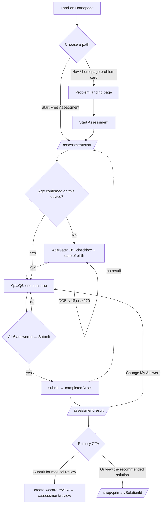
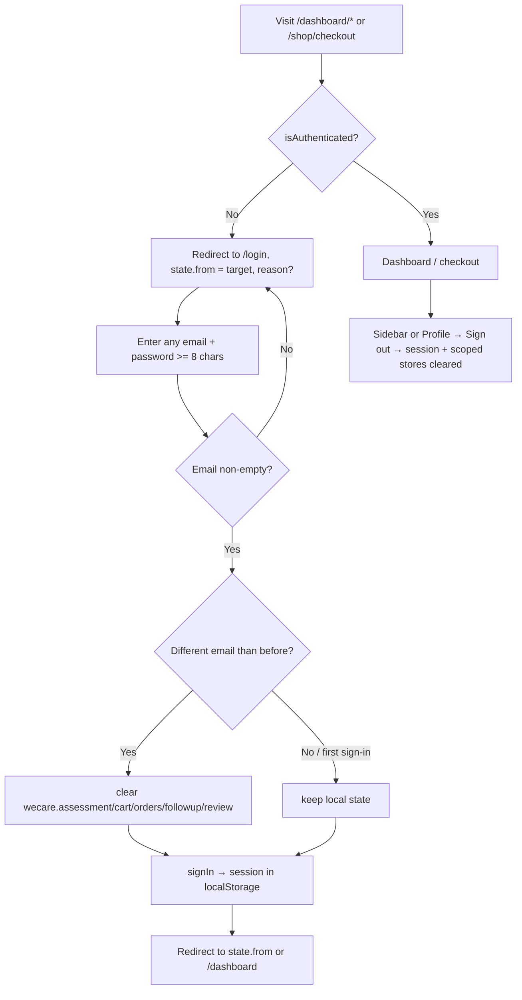

# WeCare — Design Specification & Requirements Document

**Status:** Pre-development discovery / audit of the existing prototype.
**Date:** 2026-09-02 (supersedes the 2026-08-31 version — see the Change Log at the end).
**Prepared by:** Product / UX / BA / Technical analysis pass (Claude, read-only).
**Repo state audited:** branch `audit-fixes` @ commit `0958279` (clean working tree, pushed
to `origin/audit-fixes`; 15 commits ahead of `main`, which is a clean fast-forward ancestor).
**Sources of truth for scope & copy rules:** `CLAUDE.md` (in-repo, ~1,300 lines — the running
log of scope, copy rules and product-owner decisions) plus two external briefs referenced there
but **not present in this repository**: `WeCare_CLI_Implementation_Prompt.md` and
`WeCare Website Structure.md` (`TBD` — obtain and archive in `/docs`).
**Companion docs:** `docs/BACKEND-ARCHITECTURE.md` (PO direction D3/D16/D24), `docs/STRAIN-SOLUTION-MAPPING.md`
(provisional strain→Solution audit + PO decision sets 3–4).

> **Legend for status tags used throughout:**
> `IMPLEMENTED` · `PARTIAL` · `MOCK/PLACEHOLDER` · `PLANNED` · `MISSING` · `REMOVED`
> `CONFIRMED` (evidenced in repo/docs) · `ASSUMPTION` (inferred) · `TBD` (unknown)

---

## 1. Project Brief

| Field | Value |
|---|---|
| **Project name** | WeCare |
| **What it is** | A German/Austrian-market **digital health platform for medical cannabis**, built **problem-first** (Sleep · Pain & Body Comfort · Stress & Anxiety · Migraine). The doctor / prescription / pharmacy layer is required but sits *behind* a guided self-assessment, never in front of it. |
| **Current form** | A **front-end-only prototype**: marketing site + guided assessment + recommendation + medical-review status flow + Solution/COA pages + a mock cart/checkout and a signed-in "My area" dashboard. **No backend.** All persistence is `localStorage`. Auth, the medical review, payment, order fulfilment and lab (COA) data are mock or placeholder. |
| **Origin** | Repurposed from an unrelated Figma Make export ("Visualize Code", an hours-tracking demo). The demo's engineering substrate (Vite + React + Tailwind v4 + shadcn/ui) was kept and reskinned; demo code was stripped phase by phase. |
| **Business problem** (`ASSUMPTION`) | Medical-cannabis e-commerce typically starts with a product catalogue (strains, THC %, formats) — intimidating, non-compliant-feeling, a poor fit for a patient who just has a problem (bad sleep, pain). WeCare's thesis: start with the problem, guide to a small recommendation set, put the medical review inside the flow. |
| **User problem** (`ASSUMPTION`) | "I have a health problem that might be helped by medical cannabis, but I don't know where to start, I don't want to browse strains, and I don't know if I even qualify." |
| **Proposed solution** | A ~60–90-second, 6-question assessment → 1–2 named "Solutions" (abstract wellness names, not strains) → **submit for medical review** → prescription *if medically appropriate* → discreet pharmacy delivery → follow-up check-in. |
| **Target market** | Austria first (`de-AT`, EUR, DHL, Austrian legal framework), with Germany implied by "German/Austrian". German is the default locale; English is a toggle. |
| **Primary users** | (1) Prospective patients (adults with sleep / pain / stress-anxiety / migraine concerns). (2) Returning/authenticated patients using "My area" (dashboard). |
| **Stakeholders** (`ASSUMPTION` + `CLAUDE.md`) | Product owner ("owner" / "Sir Ilay" — makes frequent copy & IA micro-decisions, recorded in `CLAUDE.md`; has issued four formal decision briefs D1–D26 + sets 3–4); a licensed doctor / medical-review partner; a dispensing pharmacy; Austrian/EU legal counsel; brand/design. |
| **Business objectives** (`ASSUMPTION`) | Convert problem-aware visitors into completed assessments; route qualified users into medical review; establish a trustworthy, compliant brand distinct from catalogue-first competitors (Bloomwell, DoktorABC). |
| **In scope (this prototype)** | Marketing site, guided assessment (+ 18+/DOB gate), recommendation, medical-review status flow, Solution/COA pages, cart/checkout (mock), signed-in dashboard, 6 legal draft documents, FAQ, costs, lab-tests. |
| **Out of scope (deliberate — do not "add back")** | Real backend/auth/payments/medical-review/pharmacy integration. CBD Flowers, CBD Hash, Vapes, Aroma Pebbles as products/routes/marketing. `/about`, `/careers`, `/providers`. Knowledge Hub. **Dark theme** (built Aug 2026, fully removed Sept 2026 — owner decision). Any leaf/smoke/dispensary imagery or recreational language. |
| **Known constraints** | Tailwind v4 CSS-config only (no `tailwind.config.js`). Deps deliberately trimmed. `pnpm build` does **not** typecheck. Every user-facing string must ship DE **and** EN with identical key trees. Austria language rules (never "treats/cures"; "recommended solution" not "prescription"; a prescription is never presented as guaranteed). All DE user-facing copy uses **"Fragebogen"**, not "Assessment" (client decision, Sept 2 2026). |
| **Timeline** | `TBD` — not documented. `index.html` carries `noindex, nofollow` and `public/robots.txt` is `Disallow: /` "until the rebuild ships". A backend MVP is estimated by the PO at **3–5 weeks** once partner API specs exist (`docs/BACKEND-ARCHITECTURE.md`). |

---

## 2. Objectives (traceable)

| ID | Objective | Evidence |
|---|---|---|
| OBJ-1 | Problem-first entry: nav and homepage lead with the 4 problems, never "prescription/treatment". | `PRIMARY_NAV` in `src/app/paths.ts`; `CLAUDE.md` hard rules; `HomePage.tsx`. |
| OBJ-2 | Guided assessment replaces catalogue browsing as the main path. | `AssessmentEnginePage`; `ComparisonSection`. |
| OBJ-3 | Never imply everyone gets a prescription. | `requiresMedicalReview` (always true); `ReviewStatusPage` per-status copy incl. `notApproved`; `footer.disclaimer`; `MedicalNotice`. |
| OBJ-4 | New users are never led with the stronger option. | `getRecommendation` — primary is fixed per problem; `gentleFirst` nudge. |
| OBJ-5 | Full DE/EN parity for all content, including dynamic. | `src/i18n/` (9 namespaces); DE default + fallback; parity verified. |
| OBJ-6 | One signature visual device (Assessment Ring); quiet motion; liquid-glass + blue-gradient brand language. | `AssessmentRing`; `src/styles/index.css`; `Reveal` / `PageReveal`. |
| OBJ-7 | Commerce exists but is never in primary nav; reachable only post-assessment / footer / dashboard. | `router.tsx`; `paths.ts` comments; `ShopIndexPage`. |
| OBJ-8 | Legal/compliance surface present (6 legal docs, COA/lab tests, checkout disclaimer checkbox, 18+/DOB gate). | `LegalPage`; `LabTestsPage`; `CheckoutPage`; `AgeGate`. |
| OBJ-9 | Nothing fabricated is presented as real. | `PRICES_CONFIRMED` / `COA_CONFIRMED` flags (`src/config.ts`) gate every price/lab claim; `oilFormulationProvisional` caveat; no legal draft-banner removed but entity data is obviously provisional. |

---

## 3. Scope

### 3.1 In scope (built or partially built)
Homepage (9 sections) · 4 problem landing pages + hidden General Wellness (one shared template) · 18+/DOB **age gate** · 6-question assessment engine · deterministic recommendation logic · result page (with D1 personalisation copy) · **medical-review status page** (`/assessment/review`, 6-status mock model) · 5 Solution detail pages + dispensing-options accordion + COA section (gated) · shop index · cart · checkout (auth-gated, mock order) · order confirmation · mock login · signed-in dashboard (7 views, desktop app-shell + mobile app-bar/tab-bar) · 6 legal draft documents · lab-tests/COA page (gated) · FAQ page · costs page · `/contact` (real: support email + hours + `mailto:` form) · 404 · redirects (`/conditions/*`, `/how-it-works`, `/solution`) · consent banner (per-category) · analytics seam · React error boundary · `robots.txt` / `sitemap.xml` / `.env.example`.

### 3.2 Out of scope (deliberate — do not "add back")
Real auth/backend/payment/medical-review/pharmacy integration · product formats other than the 5 abstract Solutions (Flowers/Hash/Vapes/Pebbles) · `/about` `/careers` `/providers` · Knowledge Hub · **dark theme** (built then fully removed — owner decision, Sept 2026) · any recreational/leaf/smoke imagery or language · a 6th Solution to house inventory.

### 3.3 Not yet built / not real (needed before launch — see §20)
Real backend for every mocked capability · real product / COA / pricing / review-fee data · a real consent-management platform (Usercentrics — the banner + gate are in place) · a wired analytics vendor (PostHog EU — the seam is in place, `dispatch()` is empty) · a wired error reporter (GlitchTip — the seam is in place) · real legal entity data + counsel review · Austria prescription-advertising review · real payment methods · image optimisation (WebP/AVIF + `srcset`) · ESLint/Prettier · a test suite · CI · deployment config · the mobile real-device QA pass.

---

## 4. Target Users

| User | Description | Primary goal | Notes |
|---|---|---|---|
| **Prospective patient (anonymous)** | Adult in DE/AT with a sleep / pain / stress-anxiety / migraine concern; problem-aware, product-unaware. | Find out what could help and whether they qualify, with minimal friction. | The default persona the whole marketing + assessment flow is designed for. Must pass the 18+/DOB gate before the assessment. |
| **Returning patient (authenticated)** | Someone who completed the assessment and/or submitted a review and/or placed an order. | Re-check their recommendation, track review + order status, do the follow-up check-in, reorder, contact support, edit profile. | Uses "My area" (`/dashboard/*`). Auth is **mock** — any email signs in. |
| **Unsure visitor** | Doesn't know which problem applies. | Get oriented before committing. | Routed to the hidden **General Wellness** page (from the 404 and assessment-start only). |
| **Owner / content editor** (`ASSUMPTION`) | Product owner making IA & copy decisions. | Keep the site aligned to the brief and Austria language rules. | Decisions logged in `CLAUDE.md`. No CMS — content is i18n JSON + code. |
| **Doctor / medical reviewer** | `PLANNED` — no UI, no integration. | Review an assessment, issue/deny a prescription, request info, require a consultation. | Modelled only as a 6-status enum in the mock `wecare.review` store + copy on `ReviewStatusPage`. |
| **Pharmacy / fulfilment** | `PLANNED` — no UI, no integration. | Dispense a strain against a prescription, ship discreetly, supply real batch COAs and prices. | Referenced in copy + `docs/STRAIN-SOLUTION-MAPPING.md` + the (unwired) `DispensingOption` schema. |

---

## 5. User Roles & Permissions

Only **one** real authorization boundary exists in code: authenticated vs. not.

| Role | How you become it | Can access | Cannot access | Actions |
|---|---|---|---|---|
| **Anonymous visitor** | Default. | Homepage, landing pages, FAQ, costs, legal, lab-tests, contact; the assessment (after the age gate), result, review-status page; Solution pages, shop index, cart. | `/dashboard/*` → redirected to `/login` (return path preserved). `/shop/checkout` → redirected to `/login` (`reason: "checkout"`). | Pass the age gate; complete the assessment; submit for medical review; add/remove cart items; switch language; set a consent choice. |
| **Authenticated user (mock)** | Submit any non-empty email at `/login` (`AuthContext.signIn`). Password field is present, `required minLength={8}`, but **ignored**. Session persists in `localStorage:wecare.auth`. | Everything, plus `/dashboard/*` and `/shop/checkout`. | — | All of the above, plus: checkout → place a mock order; view assessment/recommendation/review/orders in the dashboard; submit the follow-up check-in; edit profile (name + phone); sign out. |
| **Doctor / Pharmacy / Admin** | `MISSING` — no such role in code. | — | — | — |

### 5.1 Permission matrix

| Area / action | Anonymous | Authenticated (mock) |
|---|---|---|
| Homepage, landing pages, FAQ, costs, legal, lab-tests, contact | ✅ | ✅ |
| Age gate + assessment + result + review-status page | ✅ | ✅ |
| Solution pages, add to cart, cart | ✅ | ✅ |
| `/shop/checkout`, place mock order, order confirmation | ❌ → `/login` (`reason: "checkout"`, `from` preserved) | ✅ |
| `/dashboard` and all children | ❌ → `/login` (`state.from` preserved) | ✅ |
| Sign in / sign out | Sign in only | Sign out (sidebar / Profile page) |
| Switch language | ✅ (header, footer, dashboard) | ✅ |
| Edit profile (name, phone) | — | ✅ |

> **Session data hygiene (WC-13):** `wecare.assessment` / `wecare.cart` / `wecare.orders` / `wecare.followup` / `wecare.review` are cleared on sign-out **and** when a *different* email signs in on the same browser (a first sign-in from anonymous does **not** clear — the add-to-cart → sign-in → checkout path is preserved). `wecare.language`, `wecare.consent` and `wecare.ageConfirmed` are device preferences and are kept.
> **Gap (`BR`/security):** the mock "order" still requires no real identity, payment or medical-review gate. A real checkout needs an account, a real payment step, and to be gated on an `approved` review. `TBD`.

---

## 6. Requirements

### 6.1 Functional Requirements

| ID | Requirement | Actor | Priority | Status | Depends on | Notes |
|---|---|---|---|---|---|---|
| FR-001 | Global shell: skip-to-content link, decorative gradient backdrop, sticky header (logo + 4 problem links + language + conditional cart + Login/"My area" + "Start assessment" CTA), routed content wrapped in a route-transition reveal, dark gradient footer (4 columns + badge strip + bottom bar). | All | Must | IMPLEMENTED | — | `RootLayout`, `SiteHeader`, `SiteFooter`, `GradientBackdrop`, `PageReveal`. Header collapses to a `Sheet` below `lg`. |
| FR-002 | Primary nav shows **only** Sleep · Pain & Body Comfort · Stress & Anxiety · Migraine. No Shop/Products/Flowers/Vapes; no How-It-Works / FAQ. | All | Must | IMPLEMENTED | — | `PRIMARY_NAV`. Owner override vs. brief §17. |
| FR-003 | Homepage with 9 sections in a fixed order (see §9.3). | Anonymous | Must | IMPLEMENTED | FR-004, FR-005 | `HomePage.tsx` → `home/sections.tsx`. Hero headline cycles the 4 problems via `RotatingWord` (reduced-motion-safe, `sr-only` static sentence). |
| FR-004 | Four problem landing pages from one shared template + a hidden General Wellness fallback. | Anonymous | Must | IMPLEMENTED | FR-011 | `ConditionLandingPage`; bare slugs (`/sleep-problems` …); `/conditions/*` 301-redirect. |
| FR-005 | Six-question assessment on a single state-driven page (no route change per question); resumes at first unanswered question; can be pre-filled with `?problem=<key>`. | Anonymous | Must | IMPLEMENTED | FR-006, FR-033 | `AssessmentEnginePage`, `questions.ts`. Per-option plain-language hint lines (WC-05). |
| FR-006 | Deterministic recommendation from answers: fixed primary + secondary per problem, "Advanced option" re-framing, "start gentle" nudge, always requires medical review. | System | Must | IMPLEMENTED | — | `recommendation.ts`. Pure function, no i18n inside. Reads `q1/q3/q4/q5` only. |
| FR-007 | Result page: answer summary; one dominant **primary** Solution card (name, category, the "why" explanation inline, THC/price/oil-profile behind a "details" disclosure, **two co-equal buttons** — the review CTA (`cta`, lead) + "View recommended solution" (`outline`) → the product page); the secondary as a quiet **alternative link**; D1 personalisation notes (frequency, format preference); a consolidated info panel (review-required + conditional gentle nudge + disclaimer); "Change my answers"; a "what's still ahead" 3-step block. | Anonymous | Must | IMPLEMENTED | FR-006, FR-018 | `ResultPage`. Redirects to `/assessment/start` if no result. The "view recommended solution" button was promoted from a text link on stakeholder feedback (2026-09-02) — softens owner decision D3; flag for PO. |
| FR-008 | Assessment state persists across reloads and is editable; editing any answer invalidates a prior completion; a `?problem=` deep link switches `q1` even over a different stored value and invalidates the completion (WC-04). | Anonymous | Must | IMPLEMENTED | — | `AssessmentContext`, `localStorage:wecare.assessment`. |
| FR-009 | Solution detail page per Solution id: `SolutionMark` medallion, name, category pill, prescription badge, THC range ("Typical THC range"), price/g (indicative note while `!PRICES_CONFIRMED`), gram selector (5/10/15/30, default 10), **single** "Add to cart" CTA (adds then navigates to the cart), why/usage/suitability/format/ingredients, "Oil formulation — starting format" block (with a provisional caveat), an **"Available dispensing options"** accordion (flower options + an "Alternative dispensing format" device block), a COA section (real grid only if `COA_CONFIRMED`, else a plain "you'll get a real batch certificate" line), a 3-question FAQ, an "orderable once approved" line, and a guide-back-to-assessment panel. | Anonymous | Must | IMPLEMENTED (data partly placeholder; COA/price claims gated) | FR-011, FR-012 | `ProductPage` at `/shop/:productId` where `productId` is a `SolutionId`. |
| FR-010 | Shop index: 5 Solution cards (`SolutionMark`, category, prescription badge, "Lab tested" badge only if `COA_CONFIRMED`), no filters, not in nav. | Anonymous | Should | IMPLEMENTED | FR-011 | `ShopIndexPage`. |
| FR-011 | Solution data layer: 5 named Solutions with `conditionKeys`, `tier`, `thcRange` (descriptive only), `oilFormulation` (provisional), `priceEur` (placeholder), `heroStrainId` (feeds example COA only), `strainIds`. `category`/`blurb`/`why`/`usage`/`suitability` live in i18n. | System | Must | IMPLEMENTED (data is **partly placeholder**) | — | `src/data/solutions.ts`. |
| FR-012 | Strain (fulfilment) data layer: ~19 real products (18 flower + 1 device) with brand, genetics, THC/CBD %, price, origin, irradiation, image; deterministic placeholder COA generator. | System | Must | IMPLEMENTED (**COA + prices + genetics are placeholders**) | — | `src/data/products.ts`. `zoiks-tangrini` removed from Night Now; `tannenbusch-tubitti-frubitti` removed from Synergy Forte (UNMAPPED). |
| FR-013 | Cart: line items keyed by `SolutionId`, quantity in **grams**; add (merges) / set-quantity / remove / clear; subtotal from Solution `priceEur`; `lineCount` (distinct products) drives the header + dashboard cart badge; persists. | Anonymous | Must | IMPLEMENTED | FR-011 | `CartContext`, `localStorage:wecare.cart`. Cart page stepper = 5 g, min 5 g. |
| FR-014 | Checkout (**auth-gated**): the signed-in email shown as a read-only confirmation (no re-entry — `checkout.signedInAs`, stakeholder feedback 2026-09-02) + Austrian shipping address (country read-only) + payment method (invoice / bank transfer) + **Terms checkbox** (with `<Trans>` links to `/legal/terms` + `/legal/privacy`) + **required "not intended to diagnose, treat, cure or prevent disease" checkbox**; "Place order" disabled until both ticked; delivery fee = €0; indicative-price note while `!PRICES_CONFIRMED`; review-fee note links `/costs`. | Auth | Must | IMPLEMENTED (**no real payment**) | FR-013, FR-017 | `CheckoutPage`. Guests are redirected to `/login` (`reason: "checkout"`, return path). A `placed` flag exempts the empty-cart guard during submit (WC-01). |
| FR-015 | Placing an order records a local mock order (`WC-<base36 timestamp>`, lines, total, status) and clears the cart; status = `inReview` (cart always has a prescription item). | System | Must | MOCK/PLACEHOLDER | FR-014 | `orders/orders.ts`, `localStorage:wecare.orders`. `shipped`/`delivered` exist as statuses but are never set by the app. |
| FR-016 | Order confirmation page keyed off router `state.orderId`, falling back to `getOrders()[0]` on refresh/direct visit (WC-01); redirects home if neither. Shows a **positive forward-looking body + a 3-step status list** (order received → medical review → pharmacy dispatch) rather than a conditional "ships once approved" sentence (stakeholder feedback 2026-09-02). | Auth | Must | IMPLEMENTED | FR-015 | `OrderConfirmationPage`. |
| FR-017 | Mock authentication: any non-empty email signs in; a password + **confirm-password** field are `required minLength={8}` and must match, but the value is ignored (stakeholder feedback 2026-09-02); session persists; name derived from the local-part; profile name + phone are editable; sign-out clears the session + session-scoped stores. | Anonymous → Auth | Must (for demo) | MOCK/PLACEHOLDER | — | `AuthContext`, `localStorage:wecare.auth`. `AuthUser = { name, email, phone? }`. |
| FR-018 | **Submit for medical review:** the Result page's primary CTA creates a mock `MedicalReview` (`WR-<base36>`, status starts at `inReview`, holds the assessment answers) and routes to `/assessment/review`. If a review already exists, the CTA instead links there ("View your review status"). | Anonymous | Must | MOCK/PLACEHOLDER | FR-006, FR-007 | `src/features/review/review.ts`, `localStorage:wecare.review`. Owner decision D3. |
| FR-019 | **Review status page** (`/assessment/review`): per-status heading/label/body for the 6 statuses (`submitted`, `inReview`, `infoRequired`, `approved`, `notApproved`, `consultation`) + "we'll email you" + "not guaranteed" copy + a 4-step explainer + CTAs (always "to dashboard"; "to solution" if `approved`; "to support" → `/contact` if `infoRequired`/`notApproved`/`consultation`). Redirects to `/assessment/result` if no review exists. | Anonymous | Must | MOCK/PLACEHOLDER | FR-018 | `ReviewStatusPage`. Real doctor updates + emails are the backend. |
| FR-020 | Dashboard ("My area", auth-gated): a self-contained app surface (no marketing header/footer). Desktop `lg+` = a persistent frosted left sidebar (logo, 7 areas, user block + language + sign-out) + a content pane with its own header row + cart chip. Mobile `<lg` = a sticky frosted app-bar + a floating bottom tab bar (5 primary areas). 7 views: Overview, My Assessment, My Recommendation, My Orders, Follow-up, Support, Profile — each with an empty state. | Auth | Should | IMPLEMENTED (reads mock/local data) | FR-006, FR-015, FR-018, FR-021 | `DashboardLayout`, `DashboardTabBar`, `dashboard/{nav,ui,pages}.tsx`. |
| FR-021 | Dashboard content widgets, each backed by a real record — never fabricated: a 4-stage **patient journey** stepper (Assessment → Medical review → Prescription → Order & delivery, `journeyState()` from `review.status` + latest order), a "Your recommendation" panel, a full six-answer assessment recap, a "delivery" card (`AustriaMap` coverage + `deliveryBanner` policy copy + a real-order tracker via `DELIVERY_STAGE` — **no fabricated live van/GPS/ETA**), an Orders `<table>` at `lg+`, an editable Profile form. | Auth | Should | IMPLEMENTED | FR-020 | `dashboard/ui.tsx` (`SectionCard`, `DashboardJourney`), `dashboard/pages.tsx`. |
| FR-022 | Follow-up check-in: 5-option prompt ("How was your experience…") → tailored response + 4 actions + "Update My Recommendation" whose target depends on the choice; editable; 14–21-day window note. | Auth | Should | IMPLEMENTED | FR-006 | `followup/followup.ts`, `localStorage:wecare.followup`. |
| FR-023 | Six `/legal/*` documents with real **draft** sectioned content (Terms 23 · Privacy 26 · Cookies 9 · Imprint 10 · Shipping 10 · Refund 7 sections), a TOC when a doc has > 4 sections, obviously-provisional entity placeholders, **no** visible draft-notice banner (removed, owner decision), effective date 31 August 2026. | All | Must | PARTIAL (draft, unreviewed, provisional entity data) | — | `LegalPage`, `legal` namespace (~1,195 lines/locale). |
| FR-024 | Lab-tests / COA page: one row per Solution with CBD/CBG/CBN/THC + batch + test date + safety **only when `COA_CONFIRMED`**; while `false`, a plain per-Solution list (name + category + link), no fabricated table. | All | Should | IMPLEMENTED (gated) | FR-011, FR-012 | `LabTestsPage`. |
| FR-025 | FAQ page: categorised accordion; footer-linked, not in nav. Plus a curated 5-question FAQ section on the homepage linking to it. | All | Should | IMPLEMENTED | — | `FaqPage`, `faq` namespace; `FaqSection`. |
| FR-026 | Costs page: qualitative "what to expect / what it costs" with **no euro figures**; footer-linked; checkout links to it via the review-fee note. | All | Should | IMPLEMENTED | — | `CostsPage`, `costs` namespace. |
| FR-027 | `/contact`: real page — support email (`SUPPORT_EMAIL` from `src/config.ts`), support hours, a `mailto:`-composing form, an emergency-number notice. | All | Could | IMPLEMENTED (WC-03; `mailto:`, no server) | — | `ContactPage` in `src/pages/content.tsx`. The shared `PagePlaceholder` component it replaced was deleted (2026-09-02). |
| FR-028 | Redirects: `/conditions/*` → bare slugs; `/how-it-works` → `/#how-it-works` (with scroll); `/solution` → recommended product or `/shop`; non-`SolutionId` `/shop/:id` → `/shop`; unknown route → 404. | All | Must | IMPLEMENTED | — | `router.tsx`, `SolutionRedirect`, `ScrollToHash`. |
| FR-029 | Bilingual content (DE default + fallback, EN toggle) for every string incl. dynamic; language persists; `<html lang>` synced; no navigator auto-detect. All DE copy uses "Fragebogen", not "Assessment". | All | Must | IMPLEMENTED | — | `i18n/config.ts`, `useLanguage`, `LanguageToggle`, `localStorage:wecare.language`. |
| FR-030 | Journey stepper ("Concern → Assessment → Recommendation → Product → Follow-up") on assessment, result, review, product, cart, checkout. | Anonymous | Should | IMPLEMENTED | — | `JourneyStepper`. |
| FR-031 | Assessment Ring signature component for progress / decoration / completion, with a sanctioned reduced-motion-aware arc animation; never a spinner. | All | Should | IMPLEMENTED | — | `AssessmentRing`. |
| FR-032 | Standing medical-safety notice on the 4 problem landing pages (side effects, "not a substitute for standard therapy", "not individual medical advice"). | Anonymous | Must | IMPLEMENTED | — | `MedicalNotice`, `common:medicalNotice.*`. |
| FR-033 | **18+ / date-of-birth age gate** shown once per device before the assessment: an "I am 18 or older" checkbox **and** a real date-of-birth input; blocks if the DOB computes to < 18 or > 120. Device-local, self-reported — **not identity verification**. | Anonymous | Must | IMPLEMENTED (legal sufficiency `TBD`) | FR-005 | `AgeGate`, `src/features/age/age.ts`, `localStorage:wecare.ageConfirmed` (stores the DOB ISO string; a legacy `"true"` value is treated as unset). Owner decisions D14 + PO set 4 #13. |
| FR-034 | Per-page `document.title` = `"<title> · WeCare"`; `usePageTitle` also syncs `<meta name="description">` when a description is passed (wired on home / conditions / assessment / result / faq / costs / lab-tests / legal). | All | Should | IMPLEMENTED | — | `usePageTitle`. `index.html` carries static `<title>` + description + OG/Twitter tags + `noindex,nofollow`. |
| FR-035 | Per-category consent banner: **Essential** (locked, always on) + **Analytics** (toggle) rows; actions "Accept all" / "Save choices" / "Essential only"; choice persists (`unset`/`essential`/`all`); non-essential analytics gates on `all`; re-openable from the footer "Cookie settings" button. | All | Must | IMPLEMENTED (**not a real CMP**) | — | `src/features/consent/`, `ConsentBanner`, `localStorage:wecare.consent`. Usercentrics is a launch blocker. |
| FR-036 | Funnel analytics seam: a `track(event, props)` helper gated on consent, dev-console in dev, an empty `dispatch()` to wire a vendor into; instrumented at every funnel point (homepage/problem CTAs, assessment start / per-question / back / complete, recommendation view + 6 recommendation-page events, medical-review submit, product view, add-to-cart, checkout start, order placed, login/logout, follow-up). Data-minimised: no raw answer values, no PII. | All | Should | IMPLEMENTED (seam only; **no vendor wired**) | FR-035 | `src/lib/analytics.ts`. Target = PostHog EU (`VITE_POSTHOG_*`). |
| FR-037 | App-wide React error boundary: catches a render error anywhere and shows a bilingual fallback (language from `localStorage`) with reload / home actions, instead of a blank page; `componentDidCatch` logs (GlitchTip seam). | All | Should | IMPLEMENTED | — | `src/app/RootErrorBoundary.tsx` wraps `<RouterProvider>` in `App.tsx`. |
| FR-038 | Self-hosted brand fonts (Figtree + Schibsted Grotesk, variable, 4 woff2 in `public/fonts/`); `@font-face` in `fonts.css`; `index.html` preloads the two latin woff2. **Zero request to `fonts.gstatic.com`.** | All | Should | IMPLEMENTED (WC-07 / L-4 sub-item) | — | `src/styles/fonts.css`. |
| FR-039 | `PRICES_CONFIRMED` / `COA_CONFIRMED` flags (`src/config.ts`, both `false`) gate every "real price" and every COA-derived claim across the product page, cart, checkout, shop grid and `/lab-tests`. | System | Must | IMPLEMENTED | — | Owner decisions D6 / D11. |
| FR-040 | Pre-launch launch files: `public/robots.txt` (`Disallow: /` + `Sitemap:` line), `public/sitemap.xml` (14 public routes, `wecare.example` origin), `.env.example` (`VITE_SITE_ORIGIN`, `VITE_POSTHOG_*`, `VITE_ERROR_DSN`). | All | Should | IMPLEMENTED (WC-20; placeholder origin) | — | Flip `robots.txt` + `<meta robots>` at launch. |

### 6.2 Non-Functional Requirements

| ID | Category | Requirement | Status / evidence |
|---|---|---|---|
| NFR-001 | Responsiveness | All pages usable from ~360 px to desktop; Tailwind v4 default breakpoints (`sm 40rem` `md 48rem` `lg 64rem` `xl 80rem`). Header collapses to a sheet **`< lg`** (WC-21, was `xl`); grids reflow; the condition hero photo repositions `< lg`; the dashboard switches from sidebar to app-bar/tab-bar `< lg`; the homepage trust strip auto-scrolls as a marquee when it overflows. | IMPLEMENTED (broadly). **Not formally tested on real devices** — the PO requires a real-device QA pass pre-launch (device matrix in `CLAUDE.md`). Small-mobile (< 360) `TBD`. |
| NFR-002 | Accessibility | Semantic landmarks; a real **skip-to-content link** (WC-22); `aria-label`/`aria-hidden`/`role` on interactive & decorative elements; `role="progressbar"` on the assessment bar; `aria-current="step"` in the stepper; radio/checkbox groups in `<fieldset>`/`<legend>`; focus-visible rings; `prefers-reduced-motion` respected everywhere motion exists; `text-wrap: balance` on headings. **Target level not stated** — assume **WCAG 2.2 AA**; **not audited**. | PARTIAL. Colour-contrast, form-error semantics, and the mobile-sheet focus trap (Radix provides) are unverified. Dark-mode contrast is no longer a concern (dark mode removed). |
| NFR-003 | Performance | Vite build; images imported via `import.meta.glob` (hashed, tree-shaken); below-fold images use `loading="lazy"` + explicit `width`/`height`; fonts self-hosted + preloaded; `backdrop-filter` used sparingly with a solid `@supports` fallback. **No route-level code-splitting** (all pages statically imported); single ~763 kB JS chunk (gzip ~226 kB). | PARTIAL. No bundle budget, no Lighthouse baseline, no `React.lazy`. Large PNG photos (many 1–4 MB) are unoptimised (no WebP/AVIF, no `srcset`) — deliberately deferred (WC-17). |
| NFR-004 | Security / Privacy | No secrets in repo; no backend calls; all personal input (assessment answers, checkout address, email, DOB) stays in the browser (`localStorage` / form fields), never transmitted. `noindex, nofollow` + `robots.txt Disallow: /`. `rel="noreferrer"` on new-tab links. Analytics is data-minimised and consent-gated (and currently a no-op). Session-scoped stores are cleared on account switch. | IMPLEMENTED for a static prototype. A real build needs: HTTPS, EU/EEA data residency for all sub-processors, a CMP, server-side health-data handling + GDPR retention, session security, PII-at-rest rules, audited pharmacy-data updates. `TBD`. |
| NFR-005 | Localization | DE + EN, DE default + fallback, key parity enforced by convention (**verified at audit time across all 9 namespaces**); locale-aware date (`de-AT`/`en-GB`) and currency (`de-AT`/`en-IE` EUR) formatting; variables interpolated **inside** translation strings; all DE copy uses "Fragebogen". | IMPLEMENTED. **No automated parity check in CI.** |
| NFR-006 | Maintainability | Strict TypeScript (`strict`, `noUnusedLocals`, `noUnusedParameters`, `noFallthroughCasesInSwitch`); `@/*` path alias; feature-folder + shared-component structure; design system centralised in one CSS file; shadcn primitives trimmed to `button`/`input`/`label`/`sheet`/`accordion` (+ `utils`). | IMPLEMENTED. **No ESLint / Prettier config**, **no tests**, **no CI**. `pnpm build` does not typecheck (`pnpm typecheck` is separate and currently **green**). |
| NFR-007 | Browser support | Modern evergreen (uses `:has()`, `backdrop-filter` + fallback, CSS nesting via Tailwind, `mask-image`). | `ASSUMPTION`: last ~2 versions of Chrome/Edge/Firefox/Safari. No matrix documented. IE/legacy unsupported. |
| NFR-008 | SEO | Static `<title>` + `<meta description>` + OG/Twitter tags in `index.html`; per-route `document.title` + `description` sync via `usePageTitle`; **`noindex` site-wide**; `robots.txt` (`Disallow: /`) + `sitemap.xml` present but pre-launch; no per-route canonical/structured data; SPA (no SSR/prerender). | MINIMAL by design. Full SEO strategy + OG image + real origin are launch tasks (owner decisions D20/D21). |
| NFR-009 | Reliability / resilience | Every `localStorage` read is `try/catch` with a safe empty default + shape validation; every glob-resolved image degrades to an inline SVG placeholder via `ImageWithFallback`; guarded routes redirect instead of crashing; `IntersectionObserver` / `matchMedia` absence handled; **an app-wide React error boundary** catches render errors (FR-037). | IMPLEMENTED (good). |
| NFR-010 | Offline / PWA | None. No service worker, no manifest, no offline handling. | MISSING (not required). |
| NFR-011 | Analytics / consent | A **per-category consent banner** + a **consent-gated analytics seam** exist (FR-035/036). **No CMP** (vendor scanning, consent logging/proof, pre-consent script blocking) and **no analytics vendor** are wired. | PARTIAL — both are launch blockers per the PO (Usercentrics is a hard blocker for a public launch with any non-essential tracking; PostHog is required before paid acquisition). |
| NFR-012 | Compliance copy | Austria language rules enforced by convention: never "treats/cures"; "recommended solution" not "prescription"; prescription never guaranteed; no recreational/leaf/smoke language or imagery; DE = "Fragebogen"; formal DE uses the slash gender form (`Nutzer/innen`), never the colon. | IMPLEMENTED by convention; **no linter enforces it.** A full Austrian medicine/cannabis advertising review of specific phrasing (homepage, problem pages, assessment, recommendation page, product descriptions, review flow, checkout, follow-up, paid-ad landing pages) is a **hard launch blocker** (PO decision set 4 #11/#14). |
| NFR-013 | Data residency | All future hosting + every sub-processor (auth, DB, file storage, email, analytics, error reporting, backups) must be **EU/EEA region** (owner decision D16). | `PLANNED` — nothing hosted yet. Enforced in `analytics.ts` data-minimisation and named in `.env.example` / `docs/BACKEND-ARCHITECTURE.md`. |

---

## 7. User Stories

> Format: *As a [user], I want [action], so that [outcome].* AC = acceptance criteria (see §18).

| ID | Story | Priority | Related FR | Acceptance criteria (summary) |
|---|---|---|---|---|
| US-001 | As a visitor, I want to pick my problem from the nav or homepage, so that the assessment starts already focused on it. | Must | FR-002, FR-004, FR-005 | Clicking a problem opens its landing page; its CTA opens `/assessment/start?problem=<key>` with Q1 pre-selected and a "pre-filled" note on step 1. |
| US-002 | As a visitor, I want to confirm I'm an adult before a prescription-related flow, so that the process is lawful. | Must | FR-033 | The first time (per device) I open the assessment I must tick "18 or older" **and** enter a date of birth; a DOB under 18 (or over 120) blocks me with a clear message; once confirmed I'm not asked again on that device. |
| US-003 | As a visitor, I want a short assessment that isn't a medical form, so that I'm not put off. | Must | FR-005 | 6 questions, one at a time, "~60–90 s · not a medical form" copy on step 1, a linear progress bar + ring, Back/Restart available, Next disabled until the current question is answered, plain-language hints under cannabis-format options. |
| US-004 | As a visitor, I want my answers remembered if I leave and come back, so that I don't restart. | Must | FR-008 | After reload the engine resumes at the first unanswered question with prior answers intact; changing an answer clears any "completed" state. |
| US-005 | As a visitor, I want a clear recommendation after the assessment, so that I know what might help. | Must | FR-006, FR-007 | Result page shows selected problem, frequency, strength, one dominant **primary** Solution with the "why" up front and specs behind a disclosure, and a quiet **alternative** link (labelled "Advanced option" only when applicable). |
| US-006 | As a new-to-cannabis user, I want to be steered to the gentler option, so that I start safely. | Must | FR-006 | When new / mild / moderate: the primary is the lighter Solution, the "start gentle, oil-first" nudge is shown, and the alternative is **not** labelled "Advanced". |
| US-007 | As a visitor, I want to submit my assessment for a medical review and see its status, so that I understand what happens next. | Must | FR-018, FR-019 | The Result CTA "Submit my assessment for medical review" creates a review and takes me to `/assessment/review`, which shows a status, a "we'll email you / not guaranteed" note, a 4-step explainer, and status-appropriate next actions. Returning to Result shows "View your review status" instead. |
| US-008 | As a visitor, I want to understand a Solution before adding it, so that I can decide. | Must | FR-009 | Solution page shows name, category, why/who-it-suits/format/ingredients, the oil-formulation starting profile (with a provisional caveat), the dispensing options, a COA section (real values only if confirmed, else a plain certificate note), and a single non-aggressive "Add to cart". |
| US-009 | As a visitor, I want to see that everything is prescription-gated, so that I trust the process. | Must | FR-003, FR-032, FR-019 | Prescription badge on Solution cards; "medical review is part of the flow"; "Not everyone receives a prescription"; a `notApproved` review status exists; medical-safety notice on landing pages. |
| US-010 | As a signed-in user, I want to check out for my recommended Solution, so that I can proceed once approved. | Must | FR-014, FR-015, FR-016, FR-017 | Guests are sent to log in first (and back). Checkout collects details + a payment method + two required confirmations; "Place order" is disabled until both are ticked; success shows an order id and links to "My orders". Prices carry an "indicative" note. |
| US-011 | As a returning user, I want a dashboard, so that I can see my journey, recommendation, review and orders. | Should | FR-020, FR-021 | After signing in, `/dashboard` shows a 4-stage journey stepper, my recommendation, my six answers, my review/order status, a delivery card, and follow-up/support; each sub-page has an empty state with a CTA when its data is missing. On desktop it's a real sidebar app shell; on mobile an app-bar + bottom tabs. |
| US-012 | As a returning user, I want a follow-up check-in, so that my recommendation can be adjusted. | Should | FR-022 | Choosing one of Good / stronger / lighter / another format / need support shows a tailored response, 4 actions, and an "Update My Recommendation" button whose target matches the choice; the answer is editable. |
| US-013 | As any user, I want the site in German or English, so that I can read it comfortably. | Must | FR-029 | Toggle in header, footer and the dashboard; choice persists across reloads; `<html lang>` updates; dates/prices reformat for the locale; DE reads "Fragebogen", not "Assessment". |
| US-014 | As any user, I want control over non-essential storage, so that I can consent per category. | Must | FR-035 | A banner offers Essential (locked) + Analytics (toggle) with "Accept all" / "Save choices" / "Essential only"; my choice persists and is re-openable from the footer; analytics only runs after "Accept all". |
| US-015 | As any user, I want legal, cost and lab information, so that I can assess trust and compliance. | Must | FR-023, FR-024, FR-026 | Footer links to 6 legal drafts, a costs page (no euro figures), and a lab-tests page (a plain per-Solution list while COA data is unconfirmed). |
| US-016 | As a user who lands on a dead end, I want a way forward, so that I'm not stuck. | Should | FR-028 | 404 offers "Back to home" + a link to the General Wellness assessment; guarded pages redirect to a sensible place (assessment start, cart, login-with-return, shop, home); a render error shows a bilingual recovery screen, not a blank page. |
| US-017 | As a keyboard / reduced-motion / screen-reader user, I want the site to be operable, so that I can complete the flow. | Must | NFR-002 | A skip link is present; all interactive elements are reachable and labelled; decorative visuals are `aria-hidden`; animations (page reveal, scroll reveal, ring arc, marquee, orb drift, rotating hero word) are disabled under `prefers-reduced-motion`. (**Not audited.**) |
| US-018 | As a mobile user, I want the layout to adapt, so that it's usable one-handed. | Must | NFR-001 | Header condenses to a sheet menu `< lg`; the condition hero photo moves below the copy `< lg`; the dashboard uses an app-bar + bottom tabs `< lg`; grids stack. |
| US-019 | As the owner, I want new copy to always exist in DE and EN, so that nothing ships half-translated. | Must | FR-029, NFR-005 | Every referenced i18n key resolves in both locales; DE/EN files have identical key trees. (**Enforced by convention, not tooling.**) |
| US-020 | As a returning user, I want to edit my profile, so that my details stay current. | Could | FR-017 | Profile has an edit/save/cancel form for name + phone; email is the read-only identity; the change persists. |

---

## 8. User Flows

### 8.1 First-time visitor → age gate → completed assessment → recommendation → review



- **Decision points:** the age gate blocks until a valid adult DOB is entered; each question gates "Next"; submitting requires all six; `?problem=` switches `q1` (and invalidates a prior completion) unless it already matches.
- **Success:** `/assessment/result` renders with a `Recommendation`; the primary CTA creates a `MedicalReview` and lands on `/assessment/review`.
- **Failure / exit:** `/assessment/result` without a completed result → redirect to `/assessment/start`. "Restart" clears all answers. `/assessment/review` without a review → redirect to `/assessment/result`.

### 8.2 Returning user (assessment already stored)

```mermaid
flowchart TD
    A[Open /assessment/start] --> AG{Age confirmed?}
    AG -->|Yes| B[Resume at first unanswered question]
    B --> C{All answered previously + completedAt set?}
    C -->|Yes| D[result available app-wide]
    C -->|Edited an answer| E[completedAt cleared → must re-submit]
    D --> F[/dashboard shows journey + recommendation + review status]
    D --> G[/solution redirects to recommended product]
    D --> H[/assessment/result → "View your review status" if a review exists]
```

### 8.3 Authentication (mock) + dashboard / checkout gate



### 8.4 Cart → checkout → mock order

```mermaid
flowchart TD
    A[Solution page: pick grams 5/10/15/30] --> B[Add to cart → navigate to cart]
    B --> C[/shop/cart/]
    C -->|Empty| Z[Empty state → Back to shop]
    C --> D[Adjust qty ±5g / remove]
    D --> E[Checkout]
    E --> F0{Authenticated?}
    F0 -->|No| LOGIN[/login reason=checkout → back]
    F0 -->|Yes| F{Cart empty?}
    F -->|Yes| C
    F -->|No| G[Fill customer + shipping + payment method]
    G --> H{Terms AND disclaimer checked?}
    H -->|No| I[Place order disabled]
    H -->|Yes| J[Place order → addOrder status=inReview, clear cart, placed=true]
    J --> K[/shop/confirmation with state.orderId]
    K -->|No orderId| K2[fall back to getOrders 0]
    K2 -->|none| L[Redirect to /]
    K --> M[Order id shown → My orders / Home]
```

- **No payment is taken.** Delivery fee = €0. Prices carry an "indicative — confirmed after your medical review" note while `PRICES_CONFIRMED` is `false`.

### 8.5 Follow-up check-in

```mermaid
flowchart TD
    A[/dashboard/follow-up/] --> B{result exists?}
    B -->|No| C[Empty state → Start assessment]
    B -->|Yes| D{follow-up entry exists?}
    D -->|No| E[Prompt: Good / stronger / lighter / another format / need support]
    E --> F[setFollowUp → tailored response]
    D -->|Yes| F
    F --> G[4 actions + "Update My Recommendation"]
    G -->|stronger| H[product page of the stronger pair member]
    G -->|lighter| I[product page of the lighter pair member]
    G -->|another format / need support| J[/dashboard/support/]
    G -->|good| K[/dashboard/recommendation/]
    F --> L[Change → clearFollowUp → back to prompt]
```

### 8.6 Redirect / dead-end flows

| From | To | Trigger |
|---|---|---|
| `/conditions/sleep-problems` (+ 4 more) | bare slug (`/sleep-problems` …) | `<Navigate replace>` in `router.tsx` |
| `/how-it-works` | `/#how-it-works` then smooth-scroll to the section | `<Navigate replace>` + `ScrollToHash` |
| `/solution` | `/shop/:primarySolutionId` (if a result exists) or `/shop` | `SolutionRedirect` |
| `/shop/:productId` where id is not a `SolutionId` | `/shop` | `ProductPage` guard |
| `/assessment/result` with no result | `/assessment/start` | page guard |
| `/assessment/review` with no `wecare.review` | `/assessment/result` | page guard |
| `/shop/checkout` with empty cart (and not mid-submit) | `/shop/cart` | page guard |
| `/shop/checkout` while unauthenticated | `/login` (`reason: "checkout"`, `from`) | page guard |
| `/shop/confirmation` with no `state.orderId` and no stored orders | `/` | page guard (falls back to `getOrders()[0]` first) |
| `/dashboard/*` while unauthenticated | `/login` (`state.from`) | `DashboardLayout` guard |
| any unknown path | `NotFoundPage` (offers Home + General Wellness) | `path: "*"` |
| any render error | `RootErrorBoundary` bilingual fallback (reload / home) | `getDerivedStateFromError` |

### 8.7 Error / edge states (behaviour)

| Situation | Behaviour |
|---|---|
| `localStorage` blocked / private mode / malformed JSON | All context/module loaders `try/catch` + shape-validate → safe empty defaults; the app still runs, nothing persists. |
| Missing image (bad glob key) | `ImageWithFallback` renders an inline SVG placeholder; layout unaffected. |
| `prefers-reduced-motion: reduce` | `PageReveal` / `Reveal` show immediately; `AssessmentRing` skips the arc sweep; the hero rotating word renders joined and static; the trust marquee is static & wrapped; orb drift disabled; hash-scroll is instant. |
| No `IntersectionObserver` | `Reveal` shows immediately. |
| Direct URL to a guarded page | Redirect (see 8.6). |
| Form field missing / invalid | Native HTML validation only (`required`, `type="email"`, `minLength`). No custom messages, no inline error summary, no scroll-to-first-error. |
| React render error anywhere | Caught by `RootErrorBoundary` → bilingual recovery screen (no blank page). |
| Slow network / API failure | N/A — there are no network requests. |

---

## 9. Information Architecture

### 9.1 Navigation

- **Primary (header, left):** Logo (→ `/`) · Sleep · Pain & Body Comfort · Stress & Anxiety · Migraine.
- **Header (right, `lg+`):** Language toggle · Cart (only when `lineCount > 0`) · Login / "My area" · **Start assessment** (CTA).
- **Header `< lg`:** Cart · Language · hamburger → right-side `Sheet` with the 4 problems + Login/"My area" + Start assessment.
- **Footer columns:** **Brand** (logo + tagline) · **Concerns** (4 problems) · **WeCare** (How it works, FAQ, Costs, Contact, Lab tests / COA) · **Legal** (Terms, Privacy, Cookie policy, Imprint, Shipping policy, Refund policy).
- **Footer badge strip:** DHL + "Invoice · Bank transfer" (text) + Language toggle. *(Payment-card/wallet badges were removed — owner decision D7.)*
- **Footer bottom bar:** © + Login/"My area" · "Cookie settings" (re-opens the consent banner).
- **Dashboard (`/dashboard/*`) — its own chrome, no marketing header/footer:** desktop = a frosted left sidebar (Logo → `/dashboard`, the 7 areas, user block + language + sign-out); mobile = a sticky app-bar + a floating bottom tab bar (5 primary areas: Overview, My Assessment, My Recommendation, My Orders, Profile).
- **Journey stepper** (contextual, not nav): Concern → Assessment → Recommendation → Product → Follow-up.

### 9.2 Sitemap

```
/                                  Homepage (9 sections)
├── /sleep-problems                Problem landing (shared template)
├── /pain-body-discomfort          Problem landing
├── /stress-anxiety                Problem landing
├── /migraine-head-tension         Problem landing
├── /general-wellness              Hidden fallback landing (not in nav)
├── /how-it-works        → 301 →   /#how-it-works
├── /faq                           FAQ page (footer only)
├── /costs                         "What it costs" (footer only)
├── /contact                       Contact (real: support email + hours + mailto form)
├── /assessment
│   ├── /start                     Age gate → assessment engine (?problem=<key>)
│   ├── /result                    Result page (guarded)
│   └── /review                    Medical-review status page (guarded)
├── /solution           → redirect → recommended product or /shop
├── /shop                          Shop index (5 Solution cards; footer/post-assessment only)
│   ├── /shop/:productId           Solution detail (productId = SolutionId)
│   ├── /shop/cart                 Cart
│   ├── /shop/checkout             Checkout (auth-gated)
│   └── /shop/confirmation         Order confirmation (guarded)
├── /dashboard                     "My area" (auth-gated; own app shell)
│   ├── (index)                    Overview
│   ├── /assessment                My assessment
│   ├── /recommendation            My recommendation
│   ├── /orders                    My orders
│   ├── /follow-up                 Follow-up check-in
│   ├── /support                   Support
│   └── /profile                   Profile (identity + editable name/phone + language + sign out)
├── /login                         Mock sign-in
├── /legal
│   ├── /imprint  /privacy  /terms
│   ├── /cookie-policy  /shipping-policy  /refund-policy
├── /lab-tests                     COA table (gated on COA_CONFIRMED)
└── *                              404 (→ Home / General Wellness)
```

### 9.3 Content hierarchy — Homepage (render order in `HomePage.tsx`)

1. **Hero** — kicker "Because we care" + headline (line 1 static, line 2 a `RotatingWord` cycling Sleep / Pain / Stress & Anxiety / Migraine, larger + bold + Azure; `sr-only` static full sentence for AT/reduced-motion) + subheadline + primary CTA "Start Free Assessment" / secondary "How It Works" + 5 trust points (marquee pill) + layered photo + decorative Assessment Ring arc + 2 floating info chips (rise-in on load, then gently bob).
2. **`ChooseProblemSection`** — "What do you need help with?" — 4 problem cards (photo + icon + title + description + a solid Azure pill CTA).
3. **`SolutionsPreviewSection`** — "Simple recommendations. No confusing catalog." — centred heading, then a 2-col split: 4 support cards (no prices) + a single anchor photo with `OrbitRings` + two name chips (persistent at every width).
4. **`TrustSection`** — "A guided and responsible experience" — 6 badges, no photo.
5. **`HowItWorksSection`** (`id="how-it-works"`) — 4 steps (choose · assessment · match · continue) + a photo + step-timeline panel.
6. **`DeliveryBannerSection`** — a slim gradient band: "Fast delivery, all across Austria" + city list + "order before 12:00 for next-day delivery" + an `AustriaMap` with coverage pins.
7. **`ComparisonSection`** — "Two ways to find what helps" — guided vs. catalogue, 2-column table.
8. **`FaqSection`** — a curated 5-question accordion → link to `/faq`.
9. **`FinalCtaSection`** — "we care…" heading + subtitle + CTA + a bottom-faded portrait, flush above the footer.

### 9.4 Content hierarchy — Problem landing page (shared template)

Hero (blue gradient + condition photo; responsive right-band / below-copy; **single** CTA = the assessment) → **"What this is about"** (explanation paragraph **+ "Common situations" checklist**, 5–6 bullets, one `surface` section) → **"How WeCare helps"** (`tone="brand"`, 4 numbered per-page steps) → **"What you might be matched with"** (a 2-panel `surface` section: left = heading + `<ComboCard showHeader={false}>` — name + category + one-line blurb icon-medallion tiles, **no THC line, no product/strain photos** — then the assessment CTA; right = `<MedicalNotice>`). **General Wellness** skips the matched section and shows only `<MedicalNotice>` centred.

---

## 10. Feature Inventory

| ID | Feature | User | Purpose | Priority | Status | Depends on | FR | US |
|---|---|---|---|---|---|---|---|---|
| F-01 | Global shell + skip link + responsive nav + mobile sheet | All | Wayfinding, problem-first framing, a11y | Must | IMPLEMENTED | — | FR-001/002/034 | US-001/017/018 |
| F-02 | Dark gradient footer (4 columns + DHL/text-payment badge strip + bottom bar + "Cookie settings") | All | Secondary nav, trust marks, legal, language, consent re-open | Must | IMPLEMENTED (payment-card badges removed D7; ThemeToggle removed) | — | FR-001/035 | US-015 |
| F-03 | Homepage (9 sections, rotating hero word) | Anonymous | Convert to assessment | Must | IMPLEMENTED | F-04, F-05, F-11 | FR-003 | US-001/009 |
| F-04 | Problem landing template (×4 + hidden General Wellness) | Anonymous | Focus a visitor on one problem, route into a pre-filled assessment | Must | IMPLEMENTED | F-11, F-06 | FR-004/032 | US-001 |
| F-05 | 18+ / DOB **age gate** | Anonymous | Confirm adulthood before a prescription-related flow | Must | IMPLEMENTED (legal sufficiency `TBD`) | F-06 | FR-033 | US-002 |
| F-06 | Assessment engine (6 Q, single page, resumable, pre-fillable, per-option hints) | Anonymous | Capture problem/frequency/strength/experience/preference | Must | IMPLEMENTED | F-07 | FR-005/008 | US-003/004 |
| F-07 | Recommendation engine (deterministic, pure) | System | Map answers → primary + secondary Solution + flags | Must | IMPLEMENTED | F-11 | FR-006 | US-005/006 |
| F-08 | Result page (dominant primary card + quiet alternative link + D1 personalisation + consolidated info panel) | Anonymous | Present the recommendation + submit for review + next steps + disclaimer | Must | IMPLEMENTED | F-07, F-09 | FR-007 | US-005 |
| F-09 | **Submit for medical review** + **review status page** (6-status mock model) | Anonymous | The medical layer, framed as conditional | Must | MOCK/PLACEHOLDER | F-07 | FR-018/019 | US-007/009 |
| F-10 | Solution detail page (×5) — medallion, why/usage/suitability/format/ingredients, oil profile, dispensing-options accordion, gated COA, single CTA | Anonymous | Explain a Solution; add to cart | Must | IMPLEMENTED (data partly placeholder; COA/price gated) | F-11, F-12, F-13 | FR-009 | US-008 |
| F-11 | Solution data model (5 Solutions) | System | The user-facing product layer | Must | IMPLEMENTED (`priceEur`, `oilFormulation`, `thcRange` are provisional/descriptive) | — | FR-011 | — |
| F-12 | Strain data model (~19 products) + placeholder COA generator + **unwired `DispensingOption` target schema** | System | Fulfilment layer + example lab values; future dispensing model | Must | IMPLEMENTED (**all COA/genetics/prices placeholder**); schema is design-only | — | FR-012/024 | US-008/015 |
| F-13 | Cart (grams, `SolutionId` keyed, persistent, `lineCount` badge) | Anonymous | Hold a Solution + quantity pre-checkout | Must | IMPLEMENTED | F-11 | FR-013 | US-010 |
| F-14 | Checkout (**auth-gated**) + mock order + confirmation | Auth | Collect details + required confirmations; record a local order | Must | MOCK/PLACEHOLDER (no payment) | F-13, F-15, F-16 | FR-014/015/016 | US-010 |
| F-15 | Mock order store (`wecare.orders`) | System | Feed the dashboard "My orders" + the delivery tracker | Must (demo) | MOCK/PLACEHOLDER | — | FR-015 | US-011 |
| F-16 | Mock auth (`wecare.auth`, editable name/phone, session-scoped clears) | Anonymous→Auth | Gate the dashboard + checkout for a demo | Must (demo) | MOCK/PLACEHOLDER | — | FR-017 | US-011/020 |
| F-17 | Dashboard "My area" — desktop sidebar app shell + mobile app-bar/tab-bar, 7 views, journey stepper, delivery card, empty states | Auth | Post-assessment self-service | Should | IMPLEMENTED (mock/local data) | F-07/09/15/16 | FR-020/021 | US-011 |
| F-18 | Follow-up check-in (`wecare.followup`) | Auth | Step 6 of the flow; adjust the recommendation | Should | IMPLEMENTED | F-07 | FR-022 | US-012 |
| F-19 | Legal draft documents (×6, sectioned, TOC, provisional entity data, no visible draft banner) | All | Compliance surface (draft) | Must | PARTIAL (draft, unreviewed) | — | FR-023 | US-015 |
| F-20 | Lab-tests / COA page (gated on `COA_CONFIRMED`) | All | Transparency on cannabinoid values | Should | IMPLEMENTED (plain list while unconfirmed) | F-11/12 | FR-024 | US-015 |
| F-21 | FAQ page + homepage FAQ section | All | Answer common questions; no medical claims | Should | IMPLEMENTED | — | FR-025 | US-015 |
| F-22 | Costs page (qualitative, no euros) | All | Set money expectations | Should | IMPLEMENTED | — | FR-026 | US-015 |
| F-23 | i18n (DE default + fallback, EN toggle, "Fragebogen") | All | Bilingual content, locale formatting | Must | IMPLEMENTED | — | FR-029 | US-013/019 |
| F-24 | Assessment Ring (signature visual) | All | Progress / decoration / completion | Should | IMPLEMENTED | — | FR-031 | US-003 |
| F-25 | Journey stepper | Anonymous | "Healthcare journey, not a shop" framing | Should | IMPLEMENTED | — | FR-030 | US-005/010 |
| F-26 | Gradient backdrop + page gradient + liquid-glass surfaces + entrance motion (`PageReveal`/`Reveal`) | All | Brand atmosphere | Should | IMPLEMENTED | — | FR-001 | US-017 |
| F-27 | Redirects (`/conditions/*`, `/how-it-works`, `/solution`) + `ScrollToHash` | All | Preserve old links, homepage-section pattern | Must | IMPLEMENTED | — | FR-028 | US-016 |
| F-28 | `ComboCard` (matched pair, photo-free medallion tiles) | Anonymous | Preview the recommendation set on landing pages | Should | IMPLEMENTED (`ComboCarousel` deleted; homepage carousel removed) | F-07/11 | FR-004 | — |
| F-29 | `MedicalNotice` standing safety notice | Anonymous | Compliance on landing pages | Must | IMPLEMENTED | — | FR-032 | US-009 |
| F-30 | Contact page (support email + hours + `mailto:` form + emergency note) | All | Real link target from FAQ + Support | Could | IMPLEMENTED (WC-03) | — | FR-027 | — |
| F-31 | Per-category consent banner + consent-gated analytics seam | All | Consent + measurement seam | Must | IMPLEMENTED (**no CMP, no vendor wired**) | F-23 | FR-035/036 | US-014 |
| F-32 | App-wide React error boundary (bilingual fallback) | All | Recover from render errors | Should | IMPLEMENTED | — | FR-037 | US-016 |
| F-33 | Self-hosted brand fonts (no Google Fonts request) | All | Privacy + performance | Should | IMPLEMENTED | — | FR-038 | — |
| F-34 | `PRICES_CONFIRMED` / `COA_CONFIRMED` gating flags | System | Never present fabricated data as real | Must | IMPLEMENTED | — | FR-039 | US-008/010 |
| F-35 | Pre-launch launch files (`robots.txt`, `sitemap.xml`, `.env.example`) | All | Launch readiness scaffolding | Should | IMPLEMENTED (placeholder origin) | — | FR-040 | — |
| F-36 | Dashboard delivery tracker + `AustriaMap` coverage | Auth | Delivery expectations without fabricating a live position | Should | IMPLEMENTED | F-15 | FR-021 | US-011 |
| F-37 | Light / **Dark** appearance + toggle | — | — | — | **REMOVED** (built Aug 2026, fully removed Sept 2026 — owner decision). Do not re-add without a new owner decision. | — | — | — |
| F-38 | About / Careers / Providers pages | — | — | — | **REMOVED** (owner decision) — do not re-add | — | — | — |
| F-39 | Knowledge Hub (index + article template + `knowledge` ns) | — | — | — | **REMOVED** (owner decision; every article body was a placeholder) — do not re-add without real content | — | — | — |
| F-40 | Testimonials section | — | — | — | **REMOVED** (fabricated quotes, never in the brief) | — | — | — |
| F-41 | `MedicalReviewPage` (old orphaned waiting page) | — | — | — | **REMOVED** (WC-09) — replaced by `ReviewStatusPage` at `/assessment/review` (F-09) | — | — | — |
| F-42 | Standalone `/legal/product-disclaimer` page | — | — | — | **REMOVED** (owner decision) — the "not intended to diagnose…" language ships as the checkout checkbox instead | — | — | — |
| F-43 | Footer payment-card / wallet badges (Visa/Amex/MC/GPay/Apay/Klarna) | — | — | — | **REMOVED** (owner decision D7) — replaced by "Invoice · Bank transfer" text | — | — | — |

---

## 11. Business Rules

> Every rule below is evidenced in code or `CLAUDE.md`. Rules that need a business decision are tagged `TBD — Business clarification required`.

### 11.1 Recommendation & assessment

| ID | Rule |
|---|---|
| BR-001 | The **primary** recommended Solution is **fixed per problem** and never changes with severity or experience: sleep → *Night Now*; pain → *Deep Ease*; stress & anxiety → *Synergy Forte*; migraine → *Synergy Forte*. (`PAIR` in `recommendation.ts`) |
| BR-002 | The **secondary** Solution is also fixed per problem: sleep → *Calm Night*; pain → *Synergy Ultra*; stress & anxiety → *Synergy Ultra*; migraine → *Deep Ease*. |
| BR-003 | The secondary is re-framed as an **"Advanced option"** *only when* the problem's pair `escalates` (true for sleep/pain/stress, **false for migraine**) **AND** (`q3` strength ∈ {`strong`, `veryStrong`} **OR** the user is experienced: `q4 = prescription` **OR** `q5 ∈ {oil, flowers, vape, other}`). |
| BR-004 | The **"start gentle, oil-first" nudge** (`gentleFirst`) is shown when the user is new to cannabis (`q5` empty or `= new`) **OR** `q3` strength ∈ {`mild`, `moderate`}. (Fires on severity regardless of experience — WC-14.) |
| BR-005 | **Every recommendation always requires medical review** (`requiresMedicalReview = true` unconditionally). Medical cannabis is prescription-only; no Solution is ever sold directly. |
| BR-006 | `q1` (problem) drives the recommendation. If `q1` is missing or not one of `pain`/`stressAnxiety`/`migraine`, the problem defaults to **`sleep`**. |
| BR-007 | **`q2` (frequency) and `q6` (format preference) do NOT change the recommendation** (owner decision D1). They personalise the Result-page copy (a "noted for your medical review" line for `q2`; an "acknowledged, but oil-first" line for `q6 ∈ {flower, vape}`) and are captured for the reviewing doctor / future personalisation. |
| BR-008 | Launching the assessment from a landing page applies `?problem=`: it **switches `q1`** even over a different stored value and **clears any prior completion** (WC-04); it no-ops only when `q1` already matches. |
| BR-009 | Editing **any** answer clears a prior completion (`completedAt → null`); the user must re-submit to get a `result`. |
| BR-010 | A `result` is available app-wide **only when** all six questions are answered **and** `completedAt` is set (Submit was pressed). |
| BR-011 | The assessment resumes at the **first unanswered question** on load. |
| BR-012 | The Result page's **primary CTA** creates a `MedicalReview` (mock) and routes to `/assessment/review` (owner decision D3). "Or view the recommended solution while you wait" is a demoted quiet link to `/shop/:primarySolutionId`. |
| BR-013 | The **18+/DOB age gate** must be passed once per device before the assessment engine renders. It stores the entered date of birth (not a boolean); confirmation is derived as `calculateAge(dob) >= 18`; a hand-typed DOB > 120 years is also rejected. It is **device-local and self-reported** — not identity verification; the regulated check is done later by the medical/pharmacy partner. Legal sufficiency: `TBD — LEGAL REVIEW REQUIRED`. |
| BR-014 | Assessment answers, DOB, cart, orders, follow-up, review and auth are stored **in the browser only** (`localStorage`), never transmitted. |

### 11.2 Products, pricing, commerce

| ID | Rule |
|---|---|
| BR-015 | The user-facing product layer is the **5 named Solutions** (abstract wellness names). Strain names/formats never appear before the assessment; the Solution's visual identity is `<SolutionMark>` (the primary problem's icon in a medallion) — **not** a strain photo. Real strain photos appear only post-assessment, inside the Solution page's dispensing-options accordion. |
| BR-016 | `Solution.thcRange` is shown as **"Typical THC range"** and is **descriptive metadata only, not the eligibility rule** (owner decision, PO set 3 #1). A Solution is defined by the medical/pharmacy partner approving a dispensing option as fitting its profile. Hierarchy: approved profile fit → format → product characteristics → THC/CBD data. |
| BR-017 | Cart line quantity is always **grams**; the cart key is a `SolutionId`. Product-page gram options: **5 / 10 / 15 / 30** (default 10). Cart adjust step: **5 g**, minimum **5 g**. The header/dashboard cart badge counts **distinct products** (`lineCount`), not total grams. |
| BR-018 | Subtotal = Σ (Solution `priceEur` per gram × grams). **Delivery fee = €0** (`DELIVERY_FEE_EUR`). Total = subtotal + delivery. |
| BR-019 | `Solution.priceEur` is a **placeholder** and is **not the target architecture** — price belongs on the `DispensingOption` (different products under one Solution can carry different real pharmacy prices; owner decision PO set 4 #1). While `PRICES_CONFIRMED` is `false`, **every** price shown (product page, cart, checkout) carries an "indicative — confirmed after your medical review" note. `TBD — Business clarification required` (real prices; VAT display; whether checkout should be disabled entirely pending real prices). |
| BR-020 | "Place order" is **disabled until both** the Terms checkbox **and** the "not intended to diagnose, treat, cure or prevent disease" checkbox are ticked. The Terms label carries `<Trans>` links to `/legal/terms` and `/legal/privacy` (WC-06). |
| BR-021 | **Checkout requires authentication.** A guest hitting `/shop/checkout` is redirected to `/login` with `reason: "checkout"` and a return path. |
| BR-022 | Payment method is a choice between **invoice** and **bank transfer** only (owner decision D7). No card/PSP flow. Copy: "no card details are collected here — you pay by invoice or bank transfer once a doctor has approved your prescription." |
| BR-023 | Shipping country is **fixed** (read-only field, "Österreich" / "Austria"). `TBD` — is Austria the only shipping destination? |
| BR-024 | A placed order's status is **`inReview`** (the cart always contains a prescription item). `processing` is a dead branch. `shipped` / `delivered` exist as statuses but are **never set by the app** — `TBD` who/what advances them. |
| BR-025 | Order id format: `WC-` + `Date.now()` in base-36 uppercase; orders are prepended (newest first). Medical-review id format: `WR-` + same. |
| BR-026 | COA / batch / test-date values are **deterministically synthesised** (`getProductCoa`) — **not real lab data**. While `COA_CONFIRMED` is `false`: the product page shows a plain "you'll get a real batch certificate with your delivery" line (no cannabinoid grid, no batch/date, no "Lab tested" badge); `/lab-tests` shows a plain per-Solution list; shop-grid cards drop the "Lab tested" badge (owner decision D11). |
| BR-027 | `Solution.oilFormulation` is **real founder-spec intent** but **pre-launch / not lab-verified** — the accordion shows an `oilFormulationProvisional` caveat ("intended formulation targets, not a lab-verified certificate"). Terpene copy is not shown (needs the medical partner). |
| BR-028 | Commerce (`/shop*`) is **never** in the primary nav; it is reachable only from the Result/Solution flow, the footer, and the dashboard. |
| BR-029 | The `Solution → FulfillmentFormat → DispensingOption` model is the **permanent target** for the fulfilment layer, but is deliberately **not built** — the launch UI runs on the simpler `Product` / `ProductFormat` (`flower` | `device`) model. A `src/data/dispensing.ts` type sketch existed briefly and was removed in the 2026-09-02 repo cleanup; the field list (§16.3) is the spec to re-create it from. `mappingStatus ∈ {pending_medical_validation, approved, rejected}`, per Solution an option is listed under. Do not build a complex inventory UI before real pharmacy data (D10/D11). |
| BR-030 | **Do not add a 6th Solution** to house inventory (incl. no CBD-dominant Solution — no CBD-dominant product exists). Only with a coherent customer need, ≥ 2–3 validated options, and PO + pharmacy/medical + legal sign-off. |
| BR-031 | **Option D** (returning-approved-patient *preference* among already-eligible dispensing options) is **Phase 2, not launch**. Required wording, verbatim: never "Choose your strain" — **"Select your preferred dispensing option"**, always paired with **"Final dispensing remains subject to medical approval and pharmacy availability."** Beginners are never asked to choose. |

### 11.3 Content, IA, compliance

| ID | Rule |
|---|---|
| BR-032 | Primary nav contains **exactly** the 4 problems. "How It Works" and "FAQ" are deliberately excluded (owner decision, overrides brief §17). "How It Works" is a homepage section; `/how-it-works` redirects to `/#how-it-works`. "FAQ" has a real page linked only from the footer (+ the homepage FAQ section). |
| BR-033 | Nav label for pain is **"Pain & Body Comfort" / "Schmerzen & Körperkomfort"** (owner decision D2); the Pain landing hero leads with "Living with daily pain or body discomfort?". |
| BR-034 | No **leaf / smoke / dispensary imagery** and no **recreational language** anywhere. Product/strain photos never appear on the homepage or landing pages. |
| BR-035 | Homepage and problem pages **lead with the problem**, never "prescription" / "treatment". The medical layer appears **after** the assessment as "medical review" / "prescription if medically appropriate" — never guaranteed. |
| BR-036 | Never imply every user gets a prescription (`footer.disclaimer`, `MedicalNotice`, `ReviewStatusPage` incl. a `notApproved` status, `result.reviewRequiredNote`). |
| BR-037 | **Austria language rules:** never "treats" / "cures"; use "recommended solution", not "prescription", in product copy; a prescription is never presented as guaranteed; use "ärztliche Prüfung". |
| BR-038 | Every new or touched user-facing string ships in **both** DE and EN; the DE and EN JSON key trees must be **identical** (components reference keys dynamically). Interpolate variables **inside** translation strings. |
| BR-039 | **All DE user-facing copy uses "Fragebogen"**, not the English loanword "Assessment" (client decision, Sept 2 2026 — masculine: `der/den/des Fragebogen(s)`). The 4 problem-page + homepage-card CTAs use "Jetzt unverbl. Fragebogen starten". EN keeps "assessment". Only the i18n *keys* still read `startAssessment` / `assessmentCta` etc. |
| BR-040 | Formal DE copy uses the **slash gender form** — `Nutzer/innen`, `Kund/innen`, `Verbraucher/innen` — never the gender-colon (`Nutzer:innen`). |
| BR-041 | **German is the default and fallback locale**; there is **no** `navigator` language auto-detection. Language choice persists (`wecare.language`) and syncs `<html lang>`. |
| BR-042 | The 4 problem landing pages carry a standing `MedicalNotice`. **General Wellness** is a hidden fallback: routed, the redirect target for `/conditions/general-wellness`, but never counted as one of the 4, has no "matched solutions" section, and is linked only from the 404 and the assessment-start default. |
| BR-043 | The 6 `/legal/*` documents are **draft** text (transcribed from / structurally informed by owner-supplied sources, plus a Claude-drafted Privacy Policy), with obviously-provisional entity facts (`WeCare GmbH`, `Musterstraße 1, 1010 Wien`, `FN 000000a`, `ATU00000000`, `Max Mustermann`, `*@wecare.example`, effective date `31 August 2026`) and **no visible draft-notice banner** (removed, owner decision). **Not reviewed legal advice** — replace placeholders and have Austrian/EU counsel review before launch. |
| BR-044 | The required "not intended to diagnose, treat, cure or prevent disease" language ships **only** as the checkout confirmation checkbox (the standalone `/legal/product-disclaimer` page was dropped). |
| BR-045 | The `/costs` page contains **no euro figures** (exact fees depend on the medical review). |
| BR-046 | Motion is quiet: route-transition reveal (`PageReveal`, replays per pathname), scroll reveal (`Reveal`), a 250 ms glass hover-lift, a slow orb drift, the rotating hero word, and the Assessment Ring's one sanctioned arc-sweep-on-load. The hero photo and ring do **not** drift; the info chips rise in then gently bob. Everything is disabled under `prefers-reduced-motion`. Dashboard / shop / cart / checkout / login stay static (no `Reveal`). |
| BR-047 | **Analytics data minimisation** (owner decision D16): never send raw health information. Coarse categories only (`problem: "sleep"`, SKU ids, order value); `assessment_question_answered` carries the question id + index only. Never send name, email, DOB, documents, medication names, diagnoses. Error reporting (GlitchTip seam) gets technical data only. |
| BR-048 | Consent: only two categories exist — **Essential** (always on) and **Analytics** (the only non-essential storage). Analytics gates on the `all` choice. A real CMP (Usercentrics) is a **hard launch blocker** for a public launch with any non-essential tracking active. |
| BR-049 | Feature work happens on a branch; commit/push only when explicitly asked. |

---

## 12. Edge Cases & Exception Handling

### 12.1 User states

| Case | Expected behaviour | Status |
|---|---|---|
| First-time user, no stored state | Age gate first; then assessment at Q1; dashboard sub-pages show empty states with CTAs. | HANDLED |
| Returning user, partial assessment | Age gate skipped (device already confirmed); engine resumes at the first unanswered question; no `result` until Submit. | HANDLED |
| Returning user, completed assessment, no review | `result` available; Result CTA offers "Submit my assessment for medical review". | HANDLED |
| Returning user, review already submitted | Result CTA offers "View your review status"; `/assessment/review` shows the mock status. | HANDLED |
| Legacy age-gate value (`"true"` from before DOB capture) | Treated as unset — the visitor is asked once for a real DOB. | HANDLED |
| Unauthenticated user hits `/dashboard/*` or `/shop/checkout` | Redirect to `/login` with `state.from` (+ `reason: "checkout"`); after sign-in, return to the intended page. | HANDLED |
| Different account signs in on a shared browser | `wecare.assessment/cart/orders/followup/review` cleared; providers remount via `sessionKey`. First sign-in from anonymous does **not** clear. | HANDLED |
| "Authenticated" user (mock) with no assessment / no orders / no review | Dashboard overview + sub-pages show empty states + CTAs; the journey stepper sits at "Assessment". | HANDLED |
| Suspended / deleted / role-mismatched user | Not modelled (no real auth / roles). | `TBD` |

### 12.2 Data states

| Case | Expected behaviour | Status |
|---|---|---|
| No data (empty cart / no orders / no follow-up / no result / no review) | Dedicated empty states everywhere; the dashboard journey + delivery tracker degrade gracefully. | HANDLED |
| Malformed / tampered `localStorage` | Every loader `try/catch` + shape-validate → safe empty default; cart floors quantities to ≥ 1 and drops unknown `SolutionId`s; review requires `id` + a valid status + `problem`. | HANDLED |
| Stale data (old order status, old recommendation vs new answers) | Editing answers clears completion; otherwise the app shows whatever is stored — no reconciliation between a stored review and re-answered questions. | PARTIAL / `TBD` |
| Large dataset | N/A — fixed 5 Solutions, ~19 products, small carts/order lists. | N/A |
| Duplicate cart add | `add` merges into the existing line (sums grams). | HANDLED |

### 12.3 Network states

| Case | Behaviour | Status |
|---|---|---|
| Slow / offline / timeout / 5xx / API down | **No network requests exist.** Fonts are self-hosted (no third-party request). Images are bundled. | N/A (prototype) — real integrations will need loading/error/retry patterns (see §17). |

### 12.4 UI states

| State | Where it's handled | Gaps |
|---|---|---|
| Loading | None needed (no async). | Real data will need skeletons; **never** a spinner for progress — use the ring. |
| Empty | Cart, orders, follow-up, dashboard overview/assessment/recommendation, `/lab-tests` (while unconfirmed). | — |
| Error | 404 page; guarded-route redirects; image fallback; **`RootErrorBoundary`** for render errors. | Boundary is app-wide only (no per-route boundary); `componentDidCatch` only `console.error`s (GlitchTip not wired). |
| Success | Order confirmation; follow-up "your answer" recap; consent "preference saved". | Order-confirmation id survives a refresh via the `getOrders()[0]` fallback. |
| Disabled | "Next"/"Submit" until a question is answered; "Continue" on the age gate until both fields are valid; "Place order" until both checkboxes. | — |
| Read-only | Checkout `country`; Profile `email`. | — |
| Partial completion | Assessment resume. | — |

### 12.5 Form states

| Case | Behaviour | Gap |
|---|---|---|
| Required field missing / bad format | Native browser validation (`required`, `type=email`, `minLength={8}` on the mock password, `min`/`max` on the DOB input). | No custom copy, no error summary, no focus-to-first-error, no `aria-describedby` error wiring. |
| Age gate — DOB out of range | `min="1926-01-01"` / `max={today}` guard the picker; a hand-typed out-of-range date is caught by `age < 18 || age > 120` → inline message. | — |
| Unsaved changes | Assessment answers auto-persist on every change; **checkout form does not persist** (leaving loses the entered address); Profile persists on save. | Checkout form loss on navigation. |
| Submission failure | Cannot fail (no backend). The `mailto:` on `/contact` and the checkout both just proceed. | — |
| Character limits / duplicates | Not enforced. | `TBD` for real forms. |

### 12.6 Responsive states

| Breakpoint | Notable behaviour |
|---|---|
| Desktop (`≥ lg`) | Full header nav; condition hero photo as a right-hand band; comparison table 2-col; **dashboard = frosted left sidebar + content pane**; result/product = image-beside-content split. |
| `< lg` | Header → hamburger `Sheet` (Radix Dialog; focus-trapped); condition hero photo moves below the copy with a vertical gradient; single-column grids; **dashboard = sticky app-bar + floating bottom tab bar (no sidebar, no marketing chrome)**; homepage trust strip auto-scrolls as a marquee. |
| `< sm` / small mobile (< 360) | Relies on wrapping + horizontal-scroll containers (COA table, comparison, orders table). Not explicitly tested. |
| Touch | Hover-only affordances (card zoom, glass lift, chip bob) are cosmetic; all actions are tap-reachable. |

### 12.7 Permission states

| Case | Behaviour |
|---|---|
| Unauthorized dashboard / checkout access | Redirect to login with return path (handled). |
| Expired session | No expiry — mock session lives until sign-out or `localStorage` clear. |
| Role mismatch | N/A (single role). |

---

## 13. UI/UX Specification

### 13.1 Layout principles
- Centred content column, `max-w-6xl` for marketing/section content, narrower (`max-w-2xl`–`max-w-4xl`) for reading/flow pages. Horizontal padding `px-4` (`sm:px-6`) sits on the full-width element with a centred `max-w-*` child, so all sections share the same left/right edge.
- Vertical rhythm via the `Section` component: `py-16` (`sm:py-24`). `Section` self-reveals its content by default (`reveal` prop) — homepage sections + condition pages pass `reveal={false}` and choreograph their own children.
- Full-bleed dark "brand" bands (`Section tone="brand"`, `FinalCtaSection`, condition hero) break the rhythm intentionally.
- The dashboard is a distinct surface: no `Section` rhythm, its own sidebar/app-bar shell, card-first content, `lg:`-gated desktop layout.

### 13.2 Navigation behaviour
- Header is `sticky top-0`, translucent, `backdrop-blur`. Active nav link: `aria-[current=page]` → petrol text. Desktop nav appears from **`lg`** up; below that a right-side `Sheet` (closes on selection).
- Cross-route hash targets (`/how-it-works` → `/#how-it-works`) are scrolled by `ScrollToHash` (retries on animation frames; `auto` under reduced motion). `ScrollRestoration` handles normal navigation.
- `PageReveal` (keyed by `location.pathname`) replays a fade + 12 px rise on every route change; a same-page hash nav does **not** re-trigger it.

### 13.3 Interaction patterns / reusable components

| Component | File | Role | Notes |
|---|---|---|---|
| `Button` | `app/components/ui/button.tsx` | All buttons / links-as-buttons | Variants: `default`, `cta` (Azure→cyan gradient + glow — the primary CTA), `outline` (frosted glass), `ghost`, `secondary`, `link`, `destructive`. Sizes `sm`/`default`/`lg`/`xl`/`icon`. `asChild` via Radix `Slot`. Full-pill radius. |
| `Input`, `Label` | `ui/input.tsx`, `ui/label.tsx` | Form fields | shadcn defaults; token-driven. |
| `Sheet` | `ui/sheet.tsx` | Mobile nav drawer | Radix Dialog. |
| `Accordion` | `ui/accordion.tsx` | FAQ (home, page, product), Result "details" disclosure, dispensing options | Radix, `type="single" collapsible`. |
| `Section` / `SectionHeading` | `components/marketing/Section.tsx` | Section wrapper + eyebrow/title/intro | Tones: `surface` (transparent), `raised` (frosted band), `brand` (deep blue-teal gradient, white text), `mint` (faint wash). `invert` on `SectionHeading` for dark sections. |
| `AssessmentRing` | `components/brand/AssessmentRing.tsx` | The one signature visual | Variants `progress`/`complete`/decoration; tones `brand`/`mint`/`deep`; **never a spinner**; reduced-motion aware. |
| `SolutionMark` | `components/brand/SolutionMark.tsx` | A Solution's visual identity everywhere | The Solution's primary problem icon in a soft medallion — **not** a strain photo. |
| `JourneyStepper` | `components/marketing/JourneyStepper.tsx` | "You are here" on flow pages | 5 steps; compact "Step X of Y" `< sm`. |
| `PageReveal` / `Reveal` | `components/marketing/` | Route-transition + scroll-into-view fade+rise | No-op under reduced motion / no `IntersectionObserver`. |
| `RotatingWord` | `components/marketing/RotatingWord.tsx` | The homepage hero's cycling problem word | `aria-hidden`; `sr-only` static sentence alongside; joined + static under reduced motion. |
| `MedicalNotice` | `components/marketing/MedicalNotice.tsx` | Standing safety notice | Landing pages + dashboard "good to know". |
| `GradientBackdrop` | `components/marketing/GradientBackdrop.tsx` | 3 fixed blurred orbs | `-z-10`; drift off under reduced motion. |
| `FloatingChip` / `InfoHint` | `components/marketing/` | Frosted info pill over imagery / hover tooltip | `InfoHint` used on the product page's "orderable once approved" hint. |
| `OrbitRings` / `AustriaMap` | `components/marketing/` | Homepage anchor-photo rings / Austria coverage map | `AustriaMap` also reused in the dashboard delivery card. |
| `ComboCard` | `components/marketing/ComboCard.tsx` | Matched-pair preview (name + category + blurb medallion tiles, **no photos, no THC line**) | `ComboCarousel` was deleted; only the `showHeader={false}` path has callers now. |
| `Logo` / `LogoMark` | `components/brand/Logo.tsx` | Brand lockup / mark | `inverse` prop = the white artwork for dark surfaces (footer). **No longer theme-aware** (dark mode removed). |
| `ImageWithFallback` | `app/components/figma/ImageWithFallback.tsx` | `` with inline-SVG fallback | Every glob-resolved image renders through this. |
| `FooterIcons` (`TrustBadges`) | `components/layout/FooterIcons.tsx` | DHL mark + "Invoice · Bank transfer" text | Payment-card/wallet badges removed (D7). |
| `LanguageToggle` | `components/layout/LanguageToggle.tsx` | DE/EN segmented switch | Header, footer, dashboard sidebar + Profile. |
| `ConsentBanner` | `components/layout/ConsentBanner.tsx` | Per-category consent (Essential locked + Analytics toggle) | Mounted in `RootLayout`; split into an outer `needsChoice` gate + `ConsentBannerBody` that re-seeds the toggle each open. |
| `DashboardJourney` / `SectionCard` | `pages/dashboard/ui.tsx` | 4-stage patient-journey stepper / titled glass panel | `DashboardJourney` state is derived from real records; `bare` prop for the nested delivery tracker. |
| `RootErrorBoundary` | `app/RootErrorBoundary.tsx` | App-wide render-error fallback | Class component; bilingual copy from `localStorage`. |

### 13.4 Feedback / states
- **Loading:** none (no async). Add skeletons for real data; **never** a spinner (use the ring for progress).
- **Empty:** consistent `glass` card / `EmptyState` + explanatory text + a `cta` button.
- **Error:** 404 page; guarded routes redirect; images fall back; **`RootErrorBoundary`** for render errors.
- **Success:** order-confirmation page; follow-up "your answer" recap; consent "preference saved" line.
- **Disabled:** greyed with `disabled:opacity-50`; age-gate "Continue", "Next"/"Submit", "Place order" gating.

### 13.5 Accessibility expectations (target: WCAG 2.2 AA — **unverified**)
- Keep the skip-to-content link, landmark roles, `aria-label`s on icon-only controls, decorative visuals `aria-hidden`.
- Keep `role="progressbar"` + `aria-valuenow` on the assessment bar and `aria-current="step"` in steppers.
- Keep radio/checkbox groups inside `<fieldset>`/`<legend>`.
- Keep `prefers-reduced-motion` handling in `PageReveal`, `Reveal`, `AssessmentRing`, `RotatingWord`, `.trust-marquee`, `.orb-drift-*`, `ScrollToHash`, glass hover.
- **To add / verify:** form-error messaging tied via `aria-describedby`; a colour-contrast pass on `text-white/70`, muted text on glass, the dashboard status pills, and the age-gate `text-danger-600` message; the mobile-sheet focus trap (Radix provides — confirm); `alt` text strategy (most photos are decorative `alt=""` — intentional).

### 13.6 Do not duplicate
Before adding UI, check for an existing primitive: buttons → `Button`; sections → `Section`/`SectionHeading`; progress/rings → `AssessmentRing`; a Solution's identity → `SolutionMark`; route/scroll reveal → `PageReveal`/`Reveal`; frosted surfaces → `.glass`/`.glass-strong`; images → `ImageWithFallback`; steppers → `JourneyStepper` (marketing) / `DashboardJourney` (dashboard); titled dashboard panels → `SectionCard`. Add a shadcn component only via `npx shadcn@latest add <name>` when genuinely needed.

---

## 14. Design System / Visual Requirements

**Single source of truth:** `src/styles/index.css` (imports `fonts.css`, imports Tailwind, then `@theme static` → `:root` → `@theme inline` → `@layer base` → `@layer components` → utility classes). There is **no** `tailwind.config.js`; `postcss.config.mjs` is empty. **`:root` is `color-scheme: light` — light-only. Dark mode was removed (owner decision, Sept 2026): no `.dark {}` block, no `@custom-variant dark`, no `src/theme/`, no `ThemeToggle`, no `dark:` utilities.** Do not re-add a dark theme without a new owner decision.

### 14.1 Colour

| Token family | Values / meaning |
|---|---|
| **`petrol-*`** (Azure teal ramp — brand / trust / medical UI / CTA) | Light Azure `#f9fdfe` · **Azure `#218390`** (primary) · **Dark Azure `#0d444b`** · full `50…950` ramp. |
| **`sage-*`** (Light Green ramp — secondary / progress / "answered" / success) | `100 #e8f4ed` (Light Green) + ramp. |
| **`danger-*`** | Functional error red **only** — not a brand colour. |
| **`sky-*`** (soft blue companion) | Gradients / glass tints / orbs only; Azure stays the interactive colour. |
| **Flat tokens** | `ink` (body text) · `ink-muted` · `surface` (page ground) · `surface-raised` (cards) · `border`. |
| **Brand aliases** | `--color-azure` · `--color-dark-azure` · `--color-light-azure` · `--color-light-green`. |
| **Semantic (`:root`)** | shadcn's `--primary`/`--secondary`/`--muted`/`--card`/`--popover`/`--accent`/`--destructive`/… mapped onto the palette; `--cta` = Azure / `--cta-hover` = Dark Azure; `--progress` = Azure; `--ring` = Azure. |
| **Gradients** | `--page-gradient` (sky → white → mint, fixed on `<body>`) · `--cta-gradient` (Azure → cyan) · `--footer-gradient` (deep navy-blue → teal) · `--brand-band-gradient` (the deep band for `Section tone="brand"`, the final CTA and the condition hero). |
| **Glass** | `--glass-bg` · `--glass-bg-strong` · `--glass-border` · `--glass-highlight` + blur. |
| **Shadows** | `--shadow-soft` · `--shadow-float` · `--shadow-glow` (teal glow). |

There is **no warm/amber accent** — the brand colour is the CTA. Dashboard status pills use petrol/sage/neutral/danger only.

### 14.2 Typography

| Role | Face (stack) | Usage |
|---|---|---|
| `font-sans` / body / UI | **Figtree** → system-ui (**self-hosted**, `public/fonts/figtree-latin.woff2`, variable) | Running text, controls; eyebrows are `font-semibold uppercase tracking-[0.16em]`. |
| `font-display` / headings | **Schibsted Grotesk** → Figtree (**self-hosted**, variable; free stand-in for Bloomwell's commercial *Gellix*) | `h1`–`h6`; `text-wrap: balance`. |
| `font-accent` | **Batangas** → Figtree (commercial, **not loaded** — falls back to Figtree) | Editorial accents; the Assessment Ring's numeral. |
| `font-mono` / `font-data` | system monospace | **Verified data only** — COA values, batch numbers, prices, order/review IDs. |

**Zero request to `fonts.gstatic.com`** — the Google Fonts `<link>` + `preconnect`s were replaced with `preload`s for the two latin woff2 (WC-07 / L-4).

### 14.3 Shape, elevation, motion
- `--radius: 1.25rem` (20 px); derived `sm/md/lg/xl/2xl/3xl`. Buttons are **full pills**.
- `.glass` / `.glass-strong` — frosted translucent + `backdrop-blur` + luminous border + soft shadow; solid `@supports` fallback. Use on calm/marketing surfaces; **keep forms, the COA table and the assessment options solid**. `.glass-strong` for data panels (cart, checkout summary, question card).
- `.glass-hover` — 250 ms lift (off under reduced motion). `.image-glow` — radial "held" glow behind floating imagery. `.image-fade-*` / `.hero-photo-mask` — `mask-image` edge fades. `.trust-marquee` — marquee when the row overflows (static `≥ lg` / reduced motion). `.orb-drift-*` — slow alternating drift. `.wc-float-a/-b` — the hero info-chip bob.
- `AssessmentRing` arc: blue→azure `<linearGradient>` + drop-shadow glow; one sanctioned sweep-in on load (`drawDurationMs≈2400`).
- Entrance motion: `PageReveal` (route-in, replays per pathname) + `Reveal` (scroll-in, one-shot). Both no-op under `prefers-reduced-motion`.

### 14.4 Iconography
`lucide-react` only, `strokeWidth ≈ 1.75` decorative / `2` functional; sized in `rem` via `size-*`. Third-party brand marks (DHL) are raster assets in `src/assets/icons/`, footer only.

### 14.5 Responsive breakpoints
Tailwind v4 defaults: `sm 40rem` · `md 48rem` · `lg 64rem` · `xl 80rem` · `2xl 96rem`. Header nav + dashboard shell switch at **`lg`**; condition hero layout at `lg`.

### 14.6 Assets
- `src/assets/logos/` — official WeCare lockup + mark PNGs (black / white), via `Logo.tsx`.
- `src/assets/icons/` — just the DHL shipping mark → `FooterIcons.tsx`. The payment / social / app-store image files (all unimported after D7 + the Aug 2026 social removal) were deleted in the 2026-09-02 cleanup.
- `src/assets/products/` — ~19 real product photos → `products.ts` via `productImages.ts` (glob by NFC-normalised filename).
- `src/assets/images/` — marketing photography → `siteImages.ts` (glob, `IMG` map). Every file is now referenced by `IMG` — the ~40 unreferenced spares (per-condition section shots, pre-swap step photos, removed-testimonial avatars, Knowledge-Hub leftovers) were deleted in the 2026-09-02 cleanup. A legacy `Knowledge Hub/` folder name remains (the page is gone; the photos are generic stock).
- `public/` — `favicon.png` (512², white mark on Azure), `apple-touch-icon.png`, `fonts/` (4 woff2), `robots.txt` (`Disallow: /`), `sitemap.xml` (14 public routes, `wecare.example` origin).
- **Image optimisation:** photos are large unoptimised PNGs (many 1–4 MB). No WebP/AVIF, no `srcset`. Deliberately deferred (WC-17) — a build-infra decision.

---

## 15. Technical Requirements

### 15.1 Architecture

- **Type:** Client-only SPA. No server, no SSR, no API layer, no database.
- **Entry:** `index.html` (`<html lang="de">`, `color-scheme: light`, `noindex,nofollow`, static `<title>`/description + OG/Twitter tags, self-hosted-font `preload`s, favicon/apple-touch-icon, inline `html,body{height:100%}`) → `src/main.tsx` (`StrictMode`, imports `./i18n/config` for side effects + `./styles/index.css`) → `src/app/App.tsx` (`<RootErrorBoundary><RouterProvider router={router} /></RootErrorBoundary>`) → `src/app/router.tsx` (`createBrowserRouter`) → `RootLayout`.
- **Shell (`RootLayout`):** `<Providers>` → skip link → `<GradientBackdrop/>` → `flex min-h-screen flex-col` { `!isDashboard && <SiteHeader/>`, `<main id="main-content"><PageReveal><Outlet/></PageReveal></main>`, `!isDashboard && <SiteFooter roundedTop={!isHome}/>`, `<ScrollRestoration/>`, `<ScrollToHash/>` } → `isDashboard && <DashboardTabBar/>` → `<ConsentBanner/>`. (The tab bar + consent banner sit **outside** `PageReveal` so their `position: fixed` isn't trapped by its transform.)
- **Providers (`src/app/Providers.tsx`):** `AuthProvider` › `SessionScopedProviders` — which keys `AssessmentProvider` › `CartProvider` by `useAuth().sessionKey`, forcing a remount + fresh `load()` on account change. Orders, follow-up, review, consent and age are **plain modules**, not React context.
- **Routing:** `react-router` v7 **library / data mode** (`createBrowserRouter`), all routes under one layout route. **No `loader`/`action`/`errorElement`** — guards are in-component (`<Navigate replace>`). **No route-level code splitting** (every page is a static import; single ~763 kB JS chunk).
- **State:** three React contexts (auth, assessment, cart) + five module singletons (orders, follow-up, review, consent, age), each mirrored to `localStorage`; `i18next` holds language. No global store library.
- **Data flow:** static TS data (`solutions.ts`, `products.ts`) + build-time image globs → contexts/pages → `localStorage`. Recommendation is a **pure function** (`getRecommendation`) with no i18n inside (keys only).
- **Analytics/consent:** `src/features/consent/consent.ts` (module `useSyncExternalStore` store) gates `src/lib/analytics.ts` `track()`; `dispatch()` is empty (PostHog EU seam).
- **Error handling:** `RootErrorBoundary` (class) wraps the router.

### 15.2 Technology

| Concern | Choice | Version |
|---|---|---|
| Framework | React | 18.3.1 |
| Language | TypeScript | 5.7.2 (`strict`, `noUnusedLocals/Parameters`, `noFallthroughCasesInSwitch`, `moduleResolution: bundler`, `allowImportingTsExtensions`) |
| Build / dev | Vite | 6.3.5 (pinned via `pnpm.overrides`) |
| Styling | Tailwind CSS v4 via `@tailwindcss/vite` | 4.1.12 — **CSS-configured** in `src/styles/index.css` |
| Animation utils | `tw-animate-css` | 1.3.8 |
| UI primitives | shadcn/ui (Radix) — **trimmed** to `button`, `input`, `label`, `sheet`, `accordion` + `utils` | Radix: accordion 1.2.3, dialog 1.1.6, label 2.1.2, slot 1.1.2 |
| Icons | `lucide-react` | 0.487.0 |
| Class utils | `class-variance-authority` 0.7.1, `clsx` 2.1.1, `tailwind-merge` 3.2.0 (`cn()` in `ui/utils.ts`) |
| Routing | `react-router` | 7.13.0 |
| i18n | `i18next` 24.2.2 + `react-i18next` 15.4.1 |
| Package manager | pnpm (workspace with a single package `.`); `onlyBuiltDependencies`: `@tailwindcss/oxide`, `esbuild` |
| Node types | `@types/node` 22.10.2 |

Scripts (`package.json`): `dev` (Vite `:5173`), `build` (`vite build` — **does not typecheck**), `preview`, `typecheck` (`tsc --noEmit` — currently **green**).

### 15.3 Build / tooling gaps
- `pnpm build` = `vite build` only — **does not typecheck**. `pnpm typecheck` is separate.
- **No ESLint / Prettier config**, **no editorconfig**, **no Husky/lint-staged**. (`analytics.ts` has stray `// eslint-disable-next-line` comments but no ESLint is installed.)
- **No test runner** (no Vitest/Jest/Playwright), **no tests**.
- **No CI** (no `.github/`), **no deployment config** (no `netlify.toml`/`vercel.json`/`Dockerfile`/`_redirects`).
- **`.env` seams exist but nothing is consumed** yet except `import.meta.env.DEV` (in `analytics.ts`). `.env.example` documents `VITE_SITE_ORIGIN`, `VITE_POSTHOG_KEY`, `VITE_POSTHOG_HOST`, `VITE_ERROR_DSN`. `src/config.ts` holds hard-coded `SUPPORT_EMAIL` / `SITE_ORIGIN` / `PRICES_CONFIRMED` / `COA_CONFIRMED`.
- `dist/` exists (a prior build) and is git-ignored.

### 15.4 Integrations
**None wired.** No auth provider, no payment provider, no analytics vendor, no error reporter, no email, no storage/CDN, no medical-review or pharmacy API. The analytics `dispatch()` and the error-boundary `componentDidCatch` are documented seams (PostHog EU / GlitchTip, both EU-region required). DHL in the footer is a static image.

### 15.5 Repository / VCS state (at audit time)
- Git initialised. Branches: **`audit-fixes`** (current, HEAD `0958279`, **clean working tree**, pushed to `origin`), `main` (15 commits behind `audit-fixes`, a **clean fast-forward ancestor**), `master` (initial commit only), `dark-mode-delivery-map-and-polish`, `rebuild-and-entrance-animations`.
- `CLAUDE.md` now names **`main` as the trunk** (`master` is a stale initial-commit-only branch — a 2026-09-02 cleanup fixed the earlier `master`/`main` inconsistency). Active feature work is on `audit-fixes`; `main` is the integration branch it fast-forwards into.
- **Implication:** unlike the 2026-08-31 audit, the work **is committed**. The remaining VCS decision is only *when* `audit-fixes` is fast-forwarded onto `main` (`B-1`) — and whether the vestigial `master` branch is deleted.

---

## 16. Data Requirements

All data is **static in the repo** or **browser-local**. No schema/DB. Types below are the contracts developers must preserve.

### 16.1 `Solution` — `src/data/solutions.ts` (the user-facing product layer)

| Field | Type | Required | Notes |
|---|---|---|---|
| `id` | `"night-now" \| "calm-night" \| "deep-ease" \| "synergy-forte" \| "synergy-ultra"` | ✅ | The id used by cart, orders, recommendation, `/shop/:productId`. |
| `name` | `string` | ✅ | Abstract wellness name (never a strain name). |
| `conditionKeys` | `ConditionKey[]` | ✅ | Which of the 4 problems it serves (Deep Ease = pain only; Synergy Forte = stress + migraine; Synergy Ultra = stress + pain). |
| `tier` | `"lighter" \| "stronger"` | ✅ | Position within a problem's pair. |
| `thcRange` | `string` | ✅ | Display range, e.g. `"20–24 %"`. **Descriptive "Typical THC range" only — NOT the eligibility rule** (owner decision). |
| `oilFormulation` | `{ strengthPercent: number; cbd: string; cbg: string\|null; cbn: string\|null; melatonin?: boolean }` | ✅ | Founder-spec CBD-oil "starting format" profile. **PROVISIONAL** — a UI caveat is shown; do not present as lab-verified. |
| `priceEur` | `number` | ✅ | **€ per gram — placeholder.** Gated by `PRICES_CONFIRMED` everywhere shown. **Not the target architecture** — price belongs on `DispensingOption`. |
| `heroStrainId` | `string` (a `Product.id`) | ✅ | Feeds the example COA only (`solutionExampleCoa`) — **not** the Solution's visual identity (that's `<SolutionMark>`). |
| `strainIds` | `string[]` | ✅ | All strains the Solution may be dispensed as post-prescription. Some entries are PROVISIONAL / UNMAPPED pending medical-partner review. |
| `category`, `blurb`, `why`, `usage`, `suitability` | — | ✅ (content) | **Live in i18n** `shop:solutions.<id>.*`, **not on the type**. DE/EN parity required. |

Helpers: `SOLUTION_BY_ID`, `isSolutionId`, `solutionHeroStrain`, `solutionExampleCoa`, `solutionStrains`, `solutionsForCondition`.

### 16.2 `Product` — `src/data/products.ts` (fulfilment / strain layer, ~19 items)

| Field | Type | Notes |
|---|---|---|
| `id` | `string` (slug) | — |
| `brand`, `strain`, `name` | `string` | `strain` is `""` for the device. |
| `format` | `"flower" \| "device"` | 18 flower + 1 Curaleaf device (renamed from `"inhaler"`). |
| `genetics` | `"indica" \| "sativa" \| "hybrid" \| null` | **Placeholder.** `null` for the device. |
| `thcPercent`, `cbdPercent` | `number` | **Placeholder.** `cbdPercent < 1` renders as "< 1 %". |
| `priceEur` | `number` | **Placeholder.** Per gram (flower) / per unit (device — €59). |
| `unit` | `"g" \| "unit"` | — |
| `originCountry`, `irradiated` | `string` / `boolean` | **Placeholder.** |
| `requiresPrescription` | `true` | Always. |
| `primaryConditionKey` | `ConditionKey` | — |
| `imageFile` | `string` | Exact filename in `src/assets/products/`. |

`ProductCoa` = `{ thc, cbd, cbg, cbn, batch, testedOn }` — **all synthesised** by `getProductCoa(p)` (seeded from `thcPercent` + id char codes). Rendered only when `COA_CONFIRMED` is `true` (currently `false`).

### 16.3 `DispensingOption` / `FulfillmentFormat` — target fulfilment model (**not built; this is the spec to build it from**)

A `src/data/dispensing.ts` type sketch existed briefly and was removed in the 2026-09-02 repo cleanup (never wired into any component). The intended shape, to re-create when real pharmacy data (D10/D11) lands:

`FulfillmentFormatKind = "flower" | "oil" | "device"`. `DispensingOption` fields: `productId`, `commercialName`, `manufacturer`, `pharmacyId: string | null`, `format`, `unitType: "g" | "unit"`, `thcPercent`, `cbdPercent`, `packSize: string | null`, `priceEur`, `available: boolean`, `batch: string | null`, `coa: {…} | null`, `mappingStatus: "pending_medical_validation" | "approved" | "rejected"` (can differ per Solution), `active: boolean`.

### 16.4 `AssessmentAnswers` — `src/features/assessment/questions.ts`

`Partial<Record<"q1".."q6", string>>`. Option keys (labels via `assessment:questions.<id>.options.<key>`):

| Q | Meaning | Option keys | Feeds `getRecommendation`? |
|---|---|---|---|
| q1 | Problem | `sleep` · `pain` · `stressAnxiety` · `migraine` | ✅ (primary driver) |
| q2 | Frequency | `sometimes` · `weekly` · `almostDaily` · `daily` | ❌ (D1 personalisation copy only) |
| q3 | Strength | `mild` · `moderate` · `strong` · `veryStrong` | ✅ (`secondaryIsAdvanced`, `gentleFirst`) |
| q4 | Tried anything before | `no` · `basic` · `cbd` · `prescription` · `notSure` | ✅ (`prescription` → experienced) |
| q5 | Used CBD/cannabis before | `new` · `oil` · `flowers` · `vape` · `other` | ✅ (`new`/empty → gentle; oil/flowers/vape/other → experienced) |
| q6 | Preferred support type | `oil` · `flower` · `vape` · `guidance` | ❌ (D1: `flower`/`vape` → an "oil-first" note only) |

`isComplete`, `answeredCount`, `TOTAL_QUESTIONS = 6`.

### 16.5 `Recommendation` — `src/features/assessment/recommendation.ts`

`{ problem: ConditionKey; primarySolutionId: SolutionId; secondarySolutionId: SolutionId; secondaryIsAdvanced: boolean; gentleFirst: boolean; requiresMedicalReview: true; explanationKey: string }`. `PAIR` table + `escalates` flag (sleep/pain/stress `true`, migraine `false`); see BR-001…BR-005. Helpers: `pairCounterpart(problem, "lighter"|"stronger")`, `matchedSolutionIds(problem)`.

### 16.6 `MedicalReview` — `src/features/review/review.ts` (MOCK)

`{ id: "WR-<base36>"; submittedAt: string; status: ReviewStatus; problem: ConditionKey; answers: AssessmentAnswers }`. `ReviewStatus = "submitted" | "inReview" | "infoRequired" | "approved" | "notApproved" | "consultation"`. `submitMedicalReview` starts the mock at `inReview`. `wecare.review`.

### 16.7 Browser-local stores

| Key | Shape | Written by | Read by | Session-scoped? |
|---|---|---|---|---|
| `wecare.assessment` | `{ answers: AssessmentAnswers; completedAt: string \| null }` | `AssessmentContext` | assessment / result / review / dashboard / solution-redirect | ✅ cleared on account switch |
| `wecare.cart` | `Array<{ productId: SolutionId; quantity: number /* grams */ }>` | `CartContext` | cart / checkout / header + dashboard badge | ✅ |
| `wecare.orders` | `Array<Order>` — `Order = { id; placedAt; lines: {productId,quantity}[]; totalEur; status: "processing"\|"inReview"\|"shipped"\|"delivered" }` | `orders/orders.ts` (`addOrder`) | order confirmation / dashboard | ✅ |
| `wecare.followup` | `{ choice: "good"\|"stronger"\|"lighter"\|"format"\|"support"; at: string }` | `followup/followup.ts` | dashboard follow-up / overview | ✅ |
| `wecare.review` | `MedicalReview` (see 16.6) | `review/review.ts` | Result page, `ReviewStatusPage`, dashboard | ✅ |
| `wecare.auth` | `{ name: string; email: string; phone?: string }` | `AuthContext` | dashboard/checkout gate, profile, header | — (the identity itself) |
| `wecare.language` | `"de" \| "en"` | `i18n/config.ts` | i18n init, `<html lang>` | ❌ device preference |
| `wecare.consent` | `"unset" \| "essential" \| "all"` | `consent/consent.ts` | `ConsentBanner`, `analytics.ts` | ❌ device preference |
| `wecare.ageConfirmed` | ISO date-of-birth string (`YYYY-MM-DD`); a legacy `"true"` is treated as unset | `age/age.ts` (`confirmAge`) | `AssessmentEnginePage` gate | ❌ device-level (survives sign-out) |
| `wecare.utm` (sessionStorage) | first-touch UTM params + `traffic_source` | `analytics.ts` (`captureUtmOnce`) | `analytics.ts` `baseProps()` | session |

### 16.8 i18n resources — `src/i18n/locales/{de,en}/`

Nine namespaces (identical key trees per locale, **verified at audit time**): `common` (~230 lines EN — nav, cta, footer, page titles/descriptions, journey, medicalNotice, consent, a11y, pages.contact/notFound) · `home` (~217) · `conditions` (~124) · `assessment` (~197 — incl. `ageGate.*`, `review.*`, `result.*`) · `dashboard` (~187 — incl. `journey.*`, `delivery.track.*`, `orders.col.*`) · `shop` (~211) · `faq` (~75) · `costs` (~32) · `legal` (~1,195 — 6 docs × sectioned content). Total ~2,468 lines/locale.

> **Do not invent DB tables.** If a backend is added, the entities the PO has named (`docs/BACKEND-ARCHITECTURE.md`) are: Users · Profiles · Assessments · Recommendations · MedicalReviews · Orders · Products · PharmacyProducts · Payments · Follow-ups · ConsentRecords · AuditEvents. Health data must be logically separated from commerce data. Field-level requirements are **`TBD — Business/Backend clarification required`.**

---

## 17. API / Backend Requirements

**No backend exists.** Everything below is `Backend Requirement — Not Yet Implemented`. The PO has captured direction in `docs/BACKEND-ARCHITECTURE.md` (EU residency, the D3 review flow, an MVP service list, a 3–5-week estimate caveat).

| # | Capability | Triggered by (UI) | Needs |
|---|---|---|---|
| BE-01 | Real authentication (register / login / verified email / session / logout / password reset / RBAC) + **DOB captured & validated at registration** | `/login`, `/dashboard/*` + `/shop/checkout` gates, Profile | Replace the `AuthContext` mock. EU-region managed auth. The client age gate (`wecare.ageConfirmed`) is device-local self-report — the backend must take over the real DOB capture. |
| BE-02 | Persist & retrieve an assessment + its result per user | `AssessmentEnginePage` submit; dashboard | `POST /assessments`, `GET /assessments/me/latest`. Server-side recommendation (or store the client `getRecommendation` output). **Health data — logically separated, strict authz, EU residency, GDPR Art. 9 basis.** |
| BE-03 | **Medical-review workflow** | Result "Submit for medical review"; `/assessment/review`; dashboard | Create a review case; transfer the assessment context to the responsible licensed professional; move status through `submitted → inReview → infoRequired/consultation → approved/notApproved`; issue a prescription; fire an email on **every** transition; a real turnaround SLA (copy implies 24–48 h — confirm, D4). API/webhook preferred; fallback = a secure staff portal. |
| BE-04 | Product / Solution / strain catalogue + **real COA feed** | Solution pages, `/lab-tests`, shop grid | Replace `getProductCoa` synthesis with real batch certificates. Real genetics/origin/irradiation. Then flip `COA_CONFIRMED`. Feed preferred; audited admin fallback (timestamp, operator id, source, previous-value history via `AuditEvents`). |
| BE-05 | Pricing + review fee | Solution pages, cart, checkout, `/costs` | Real prices **at the `DispensingOption` level** (not the Solution), VAT handling, the deliberately-unstated **review fee** (D5), delivery policy (currently €0, D8). Then flip `PRICES_CONFIRMED`. |
| BE-06 | Cart (optional server cart) | `/shop/cart` | Could stay client-side until checkout; server cart needed if carts must survive devices. |
| BE-07 | Checkout + payment | `/shop/checkout` "Place order" | Payment **after** an `approved` review for MVP; invoice / bank transfer only (D7), abstracted so card / SEPA / Klarna can be added. Address validation. Record the two required confirmation checkboxes as consent/audit. |
| BE-08 | Orders + fulfilment/shipment tracking | `/shop/confirmation`, `/dashboard/orders`, dashboard delivery card | `GET /orders/me`, `GET /orders/:id`. Real statuses incl. `shipped`/`delivered` + carrier/tracking (the dashboard delivery tracker says outright it's placeholder until courier tracking is connected). |
| BE-09 | Follow-up submission | `/dashboard/follow-up` | `POST /followups`. Optionally feed a real "update my recommendation" / re-consult. The 14–21-day window is a copy note today. |
| BE-10 | Contact / support | `/contact`, Dashboard Support, `ReviewStatusPage` "to support" | A real form → ticketing/email (today it's a `mailto:`). |
| BE-11 | Consent management + analytics + error reporting | Site-wide | A real CMP (**Usercentrics** — hard launch blocker for public launch with non-essential tracking), **PostHog EU** (wire `dispatch()` in `analytics.ts` — required before paid acquisition), **GlitchTip** (wire `componentDidCatch` — strongly preferred at launch). All EU-region, company-owned accounts. |
| BE-12 | Transactional email / notifications (DE/EN) | review status, order status, follow-up reminder, account verification | EU-compatible provider + templates. |
| BE-13 | Legal entity data | `/legal/*` placeholders | Real Impressum/Firmenbuch/VAT/DPO/address/effective dates, then counsel review of the full text (D9). |

**Cross-cutting for every endpoint:** loading state (skeletons; **never** a spinner for progress — use the ring), error state (retry + human-readable copy in the interface's voice, DE/EN), optimistic-vs-pessimistic decisions, rate-limit/timeout handling. The app-wide `RootErrorBoundary` exists but `componentDidCatch` only logs — wire GlitchTip. Consider per-route error boundaries + route-level code splitting when data goes async.

---

## 18. Acceptance Criteria (Given / When / Then)

> One block per major feature. These are testable and trace to §7/§10/§11.

### AC-1 Problem → pre-filled assessment (F-04, F-06 / US-001, BR-006/008)
- **Given** `/sleep-problems`, **when** I click the assessment CTA, **then** I land on `/assessment/start?problem=sleep` and (after the age gate) Q1 = "Sleep" is selected with a "your concern is pre-filled" note on step 1.
- **Given** I already had `q1 = pain` completed, **when** I open `/assessment/start?problem=sleep`, **then** `q1` becomes `sleep` and the prior completion is cleared (WC-04).
- **Given** `/assessment/start?problem=sleep` and `q1` is already `sleep`, **then** nothing changes.

### AC-2 Age gate (F-05 / US-002, BR-013)
- **Given** a device that has never confirmed age, **when** I open `/assessment/start`, **then** I see the age gate and cannot reach the questions until I both tick "18 or older" and enter a date of birth.
- **Given** the age gate, **when** I enter a DOB that computes to age < 18 (or > 120), **then** "Continue" is blocked and an inline message explains the assessment is adults-only.
- **Given** I confirmed a valid adult DOB earlier, **when** I return to `/assessment/start` on the same device, **then** the gate does not appear.
- **Given** `localStorage:wecare.ageConfirmed === "true"` (legacy), **then** the gate **does** appear and asks for a real DOB.

### AC-3 Assessment engine (F-06 / US-003/004, BR-009/010/011)
- **Given** an unanswered question, **then** "Next"/"Submit" is disabled and a "select an option" hint shows.
- **Given** I answered questions 1–3, **when** I reload, **then** the engine reopens at question 4 with 1–3 intact.
- **Given** all six answered, **when** I click "Submit", **then** `completedAt` is set and I navigate to `/assessment/result`.
- **Given** a completed assessment, **when** I change any answer, **then** the completion is cleared and `/assessment/result` redirects me to `/assessment/start` until I re-submit.
- **Given** `prefers-reduced-motion: reduce`, **when** the ring renders, **then** it shows its final arc with no sweep.

### AC-4 Recommendation logic (F-07 / US-005/006, BR-001…BR-007)
- **Given** `q1 = pain`, **then** the primary is *Deep Ease* and the secondary is *Synergy Ultra*, regardless of other answers.
- **Given** `q1 = sleep` and `q3 = strong`, **then** `secondaryIsAdvanced` is true and the alternative link reads "Advanced option".
- **Given** `q1 = migraine` and `q3 = veryStrong`, **then** `secondaryIsAdvanced` is **false** (migraine's pair does not escalate).
- **Given** `q5 = new` (or unanswered), **then** `gentleFirst` is true and the Result page shows the "start gentle, oil-first" nudge.
- **Given** any answers where only `q2` or `q6` differ, **then** `primarySolutionId`, `secondarySolutionId`, `secondaryIsAdvanced` and `gentleFirst` are **identical** (Q2/Q6 don't change the match).
- **For every** combination of answers, `requiresMedicalReview` is true.

### AC-5 Result page & submit-for-review (F-08, F-09 / US-005/007, BR-012)
- **Given** a completed assessment and no review, **when** `/assessment/result` renders, **then** it shows: the problem (+ frequency/strength when answered); one dominant primary card (name, category, the "why" explanation inline, THC/price/oil-profile behind a "details" disclosure, **two co-equal buttons — "Submit my assessment for medical review" (`cta`) and "View recommended solution" (`outline`, → `/shop/:primary.id`)**); a quiet alternative link; D1 personalisation notes when `q2`/`q6` apply; a single info panel with the review-required line, the conditional gentle nudge and the disclaimer; a "Change my answers" button; a "what's still ahead" 3-step block.
- **When** I click "Submit my assessment for medical review", **then** a `wecare.review` record is created (status `inReview`) and I navigate to `/assessment/review`.
- **Given** a review already exists, **then** the primary CTA reads "View your review status" and links to `/assessment/review`; "Or view the recommended solution while you wait" links to `/shop/:primarySolutionId`.
- **Given** no completed result, **when** I open `/assessment/result` directly, **then** I am redirected to `/assessment/start`.

### AC-6 Review status page (F-09 / US-007/009, BR-005/036)
- **Given** a `wecare.review` with status `inReview`, **when** I open `/assessment/review`, **then** I see the `inReview` heading/label/body, a "we'll email you" + "not guaranteed" line, a 4-step explainer, and a "to dashboard" CTA.
- **Given** status `approved`, **then** a "view the recommended solution" CTA also appears.
- **Given** status `infoRequired` / `notApproved` / `consultation`, **then** a "contact support" CTA (→ `/contact`) also appears.
- **Given** no review, **when** I open `/assessment/review`, **then** I am redirected to `/assessment/result`.

### AC-7 Solution page (F-10 / US-008, BR-015/016/017/026/027)
- **Given** `/shop/night-now`, **then** I see the `SolutionMark` medallion, name, category pill, prescription badge, "Typical THC range", price per gram **with an "indicative" note** (while `!PRICES_CONFIRMED`), a gram selector defaulting to 10 (options 5/10/15/30), why/usage/suitability/format/ingredients, an "Oil formulation — starting format" block **with a provisional caveat**, an "Available dispensing options" accordion (flower options + an "Alternative dispensing format" device block), a COA section showing a **plain "real batch certificate" line** (while `!COA_CONFIRMED`), no "Lab tested" badge, a 3-question FAQ, an "orderable once approved" line, and a "not sure?" panel.
- **Given** `/shop/not-a-real-id`, **then** I am redirected to `/shop`.
- **When** I click "Add to cart", **then** the chosen grams are added and I am navigated to `/shop/cart` (there is no separate "Check availability" button).

### AC-8 Cart & checkout (F-13, F-14 / US-010, BR-018…BR-024)
- **Given** an empty cart, **when** I open `/shop/cart`, **then** I see an empty state; opening `/shop/checkout` redirects me to `/shop/cart`.
- **Given** a cart with items and I am **not** signed in, **when** I open `/shop/checkout`, **then** I am redirected to `/login` (`reason: "checkout"`); after signing in I return to checkout.
- **Given** the checkout form, **then** the customer section shows my signed-in email as a read-only confirmation (no email input), and the Terms **or** the disclaimer checkbox being unticked disables "Place order".
- **When** both are ticked and I submit, **then** an order (`WC-…`, status `inReview`) is created, the cart is cleared, and I land on `/shop/confirmation` showing the order id, a 3-step "where your order is" status (received → medical review → pharmacy dispatch), and links to "My orders" and Home.
- **Given** I navigate to `/shop/confirmation` without an order in route state, **then** it falls back to the most recent stored order, and only redirects to `/` if there are none.
- **Given** `!PRICES_CONFIRMED`, **then** the checkout summary shows an "indicative price" note.

### AC-9 Auth & dashboard (F-16, F-17 / US-011/020, §5)
- **Given** I am not signed in, **when** I open `/dashboard/orders`, **then** I am redirected to `/login`; after any non-empty email + an 8+-char password entered identically in the password and confirm-password fields, I return to `/dashboard/orders`. A password/confirm mismatch blocks submission with `auth.passwordMismatch`.
- **Given** I sign in with a **different** email than last time, **then** `wecare.assessment/cart/orders/followup/review` are cleared.
- **Given** I add to cart while anonymous then sign in for the first time, **then** the cart is **kept**.
- **Given** I am signed in with no assessment, **when** I open `/dashboard`, **then** the overview shows empty states + a "Start assessment" CTA and the journey stepper sits at "Assessment".
- **Given** `lg` width, **then** the dashboard shows a left sidebar and no marketing header/footer; **given** `< lg`, an app-bar + a bottom tab bar.
- **Given** Profile, **when** I edit name/phone and save, **then** the change persists; email is read-only.

### AC-10 Follow-up (F-18 / US-012, BR §11.1)
- **Given** a completed assessment and no follow-up entry, **when** I open `/dashboard/follow-up`, **then** I see a 5-option prompt.
- **When** I choose "stronger", **then** "Update My Recommendation" links to the **stronger** pair member's product page; "lighter" → the lighter one; "another format"/"need support" → Support; "Good" → My recommendation.
- **When** I click "Change", **then** the entry is cleared and the prompt returns.

### AC-11 i18n (F-23 / US-013/019, BR-039/041)
- **Given** the site loads with no stored language, **then** it renders in **German**, and DE copy reads "Fragebogen" (never "Assessment").
- **When** I switch to English, **then** the whole UI updates without a reload, `<html lang>` becomes `en`, `localStorage:wecare.language = "en"`, prices/dates reformat; the choice survives a reload.
- **For every** i18n key referenced in a rendered component, a value exists in **both** `de` and `en`.

### AC-12 Consent & analytics (F-31 / US-014, BR-047/048)
- **Given** no stored consent choice, **then** the banner appears with Essential (locked) + Analytics (toggle) and "Accept all" / "Save choices" / "Essential only".
- **When** I choose "Essential only" or "Save choices" with Analytics off, **then** `analyticsAllowed()` is false and `track()` is a no-op.
- **When** I choose "Accept all", **then** `analyticsAllowed()` is true; in dev, events log to the console; `dispatch()` is still empty (no vendor).
- **When** I click "Cookie settings" in the footer, **then** the banner reopens seeded with my stored choice.
- **Given** any tracked event, **then** it never carries a raw assessment answer value, name, email or DOB.

### AC-13 Redirects, dead ends & error recovery (F-27, F-32 / US-016, BR-032)
- `/conditions/chronic-pain` → replace → `/pain-body-discomfort` (and the other four).
- `/how-it-works` → `/#how-it-works` and the page scrolls to the section (`auto` under reduced motion).
- `/solution` → `/shop/:primarySolutionId` when a result exists, else `/shop`.
- An unknown URL renders the 404 with "Back to home" + a General Wellness link.
- A thrown render error shows the bilingual `RootErrorBoundary` screen (reload / home), not a blank page.

### AC-14 Compliance surface (F-19, F-20, F-30 / US-009/015, BR-034…BR-045) — *partly manual*
- Every `/legal/*` page renders sectioned content; docs with > 4 sections show a TOC; entity facts are obviously provisional; **no draft-notice banner is shown**.
- The 4 problem landing pages render `MedicalNotice`.
- The `/costs` page contains **no** "€" amount.
- `/lab-tests` shows a plain per-Solution list (no cannabinoid/batch/date table) while `COA_CONFIRMED` is `false`.
- No page contains a cannabis-leaf / smoking image or recreational phrasing, and no product/strain photo appears before the assessment (**manual check**).

### AC-15 Accessibility & motion (NFR-002, BR-046) — *to be verified*
- The skip-to-content link is the first focusable element and moves focus to `#main-content`.
- Every interactive control is reachable by keyboard with a visible focus indicator.
- Decorative visuals (orbs, ring decoration, chips, rotating word) are `aria-hidden`; the mobile menu traps focus and closes on Escape.
- With `prefers-reduced-motion: reduce`: no route/scroll reveal transition, no ring sweep, the hero word is joined and static, no marquee scroll, no orb drift, instant hash scrolling.

---

## 19. Traceability Matrix

`Business Objective → Requirement → User Story → Feature → Flow → Acceptance Criteria`

| OBJ | FR | US | Feature | Flow (§8) | AC |
|---|---|---|---|---|---|
| OBJ-1 problem-first entry | FR-001, FR-002, FR-003, FR-004 | US-001, US-009, US-018 | F-01, F-02, F-03, F-04 | 8.1 | AC-1, AC-14 |
| OBJ-2 guided assessment is the path | FR-005, FR-006, FR-030, FR-033 | US-002, US-003, US-004 | F-05, F-06, F-07, F-24, F-25 | 8.1, 8.2 | AC-2, AC-3, AC-4 |
| OBJ-3 never imply a guaranteed prescription | FR-007, FR-018, FR-019, FR-032 | US-005, US-007, US-009 | F-08, F-09, F-29 | 8.1 | AC-5, AC-6, AC-14 |
| OBJ-4 new users not led with the stronger option | FR-006 | US-006 | F-07 | 8.1 | AC-4 |
| OBJ-5 full DE/EN parity | FR-029, NFR-005 | US-013, US-019 | F-23 | 8.3 (toggle) | AC-11 |
| OBJ-6 one signature device, quiet motion | FR-031, FR-001, NFR-002 | US-017 | F-24, F-26 | — | AC-3, AC-15 |
| OBJ-7 commerce out of nav, post-assessment only | FR-009, FR-010, FR-013, FR-014, FR-015, FR-016, FR-017 | US-008, US-010, US-016 | F-10, F-13, F-14, F-15, F-16, F-27 | 8.1, 8.3, 8.4, 8.6 | AC-7, AC-8, AC-13 |
| OBJ-8 compliance surface | FR-023, FR-024, FR-026, FR-032, FR-033 | US-002, US-009, US-015 | F-05, F-19, F-20, F-21, F-22, F-29, F-30 | — | AC-2, AC-6, AC-14 |
| OBJ-9 nothing fabricated presented as real | FR-024, FR-039, FR-023 | US-008, US-015 | F-19, F-20, F-34 | — | AC-7, AC-14 |
| (returning-user self-service) | FR-020, FR-021, FR-022, FR-028 | US-011, US-012, US-020 | F-17, F-18, F-27, F-36 | 8.3, 8.5, 8.6 | AC-9, AC-10, AC-13 |
| (privacy & consent) | FR-035, FR-036, FR-037, FR-038, NFR-004, NFR-011, NFR-013 | US-014, US-016 | F-31, F-32, F-33 | — | AC-12, AC-13 |

---

## 20. Open Questions / Clarifications

> Ordered by how likely they are to block development. **Bold** = probable blocker. Many items from the 2026-08-31 audit are now resolved by PO decision briefs D1–D26 + sets 3–4 — those are marked ~~struck through~~ with the resolution.

### Business
- **B-1** `main` is the trunk (`CLAUDE.md` aligned 2026-09-02; `master` is a stale initial-commit-only branch). `audit-fixes` is 15+ commits ahead of `main` and a clean fast-forward — decide *when* to fast-forward it onto `main`, and whether to delete the vestigial `master`.
- **B-2** Real **pricing** (D6, still blocked): per-`DispensingOption` prices, the **medical-review fee** (D5 — where/when shown, how much), VAT display, whether delivery stays €0 (D8). While `PRICES_CONFIRMED` is `false` everything is labelled "indicative" — is that acceptable for a stakeholder demo, or should checkout be disabled entirely?
- ~~B-3 Real payment methods~~ → **Resolved (D7):** invoice + bank transfer only; card/wallet badges removed. Payment happens **after** an `approved` review.
- **B-4** **Shipping** economics (D8, still blocked): destinations (Austria only? Germany?), carrier terms, any fees, packaging/discretion claims. The dashboard delivery card + Shipping legal doc state a dispatch policy (ready-to-ship by 12:00 → next day) — confirm.
- B-5 Is Germany in scope now or later? (Config/copy are Austria-first.)
- B-6 Business KPIs for the funnel (the analytics events are named for a PostHog funnel — assessment completion, `medical_review_submitted`, `recommendation_continue_clicked` sliced by `device_class`).
- B-7 Reimbursement / insurance — the `/costs` page references it; is there a real process?

### Technical / Backend
- **T-1** Target **auth** model (email+password / magic link / SSO), session strategy, and **DOB captured & validated at registration** (D14 / PO set 4 #13 — the client gate is device-local self-report).
- **T-2** The **medical-review** backend (D3 direction exists; not built): doctor queue, the 6-status model + transitions, prescription issuance, an email on every transition, a real turnaround SLA (D4).
- **T-3** **Real product & COA data** (D10/D11): replace `getProductCoa` synthesis, real batch certificates, genetics/origin/irradiation, prices at the `DispensingOption` level; then flip `COA_CONFIRMED` / `PRICES_CONFIRMED`. Feed vs. audited admin fallback.
- T-4 Hosting / deployment (EU region), SPA history fallback, CI, and wiring the `.env` seams.
- T-5 Route-level code splitting + per-route error boundaries once data is async (single ~763 kB chunk today).
- T-6 Data layer for real APIs — router `loader`s / React Query, or keep contexts?
- T-7 Do assessment answers move server-side (health data + GDPR Art. 9), or stay client-only until account creation?
- T-8 Re-create the `Solution → Format → DispensingOption` model (§16.3 has the field list; the `src/data/dispensing.ts` sketch was removed in cleanup) and wire it into `ProductPage`, mapping from a real pharmacy feed.

### UX / Design
- ~~U-1 Dark theme~~ → **Resolved (owner, Sept 2026): built then fully removed. Light-only. Do not re-add.**
- **U-2** Accessibility conformance target (assume WCAG 2.2 AA) and who audits it — form-error semantics, contrast on glass/status-pills, the mobile-sheet focus trap.
- U-3 Loading/skeleton patterns once data is async.
- U-4 Image strategy — large PNGs need WebP/AVIF + `srcset` (WC-17, deliberately deferred; needs a build-infra decision).
- **U-5** **Mobile real-device QA** — the PO has confirmed this is **mandatory pre-launch** with a device matrix + per-page checklist (`CLAUDE.md`). The automation browser cannot do it.
- ~~U-6 Homepage section order~~ → **Resolved:** the rendered order in `HomePage.tsx` (final CTA last, after Comparison + FAQ) is intended (WC-16).

### Content
- **C-1** ~~`/contact` real content~~ → **Resolved (WC-03):** real page (support email + hours + `mailto:` form). Still needs the real `SUPPORT_EMAIL` (placeholder `support@wecare360.de`) and, eventually, a real form handler.
- C-2 The external briefs (`WeCare_CLI_Implementation_Prompt.md`, `WeCare Website Structure.md`) should be committed to `/docs` as the authoritative scope reference.
- C-3 Copy sign-off — see L-2/L-6.
- ~~C-4 Remove the now-dead `src/pages/PagePlaceholder.tsx`~~ → **Done (2026-09-02):** deleted (unreferenced since `/contact` became real).

### Legal / Security / Compliance
- **L-1** Real legal entity facts for every `/legal/*` placeholder (entity name, Firmenbuch number, VAT ID, registered address, DPO contact, effective dates) **and** a lawyer review of the draft text (D9).
- **L-2** **Full Austrian medicine/cannabis advertising review** (PO set 4 #14 — a **hard launch blocker**) of specific phrasing across the homepage, all 4 problem pages, the assessment, the recommendation page, product descriptions, the medical-review flow, checkout, follow-up messaging and paid-ad landing pages (PO set 4 #11 — scope is wider than `/legal/*`). Claims flagged: "helps sleep / pain relief / anxiety relief / stronger / gentle / recommended for X".
- **L-3** **Age-gate legal sufficiency** (D14 / PO set 4 #13) — collecting a DOB client-side does not by itself make an otherwise-regulated sale lawful; the cited Austrian tobacco/youth-protection rules changed August 2026. `LEGAL REVIEW REQUIRED`.
- **L-4** **Medicines-law vs. tobacco-monopoly basis for the flower checkout** (PO set 4 #15 — a **hard launch blocker per the user**): confirm the dispensed flower (20–33 % THC, prescription, assessment + review + pharmacy) sits under Austrian medicines/narcotics law, **not** the ≤ 0.3 % THC tobacco-monopoly-covered hemp category. Checkout is deliberately left live as-is pending this.
- L-5 GDPR: lawful basis + retention for assessment (health) data, consent records for the checkout confirmations, DSAR handling. §12/§13 of the Privacy draft deliberately hedge the controller/processor/joint-controller structure until real contracts exist — counsel must confirm (D10).
- **L-6** **A real consent-management platform** (Usercentrics preferred, Cookiebot fallback, never custom) — a **hard blocker** for a public launch with any non-essential tracking active (D13). The per-category banner + gate are in place but don't do vendor scanning / consent proof / pre-consent script blocking.

### Product
- P-1 The default-to-`sleep` on a missing/odd `q1` is a silent fallback — acceptable?
- ~~P-2 Q2/Q6 don't affect the recommendation~~ → **Resolved (D1):** intentional — captured for the reviewer + personalise Result copy only, never the match.
- P-3 `shipped` / `delivered` order statuses are never set — who/what advances them (BE-08)?
- P-4 Should a stored `wecare.review` be invalidated / re-submitted when the user re-answers the assessment? Today there's no reconciliation.

### Procurement / ownership (PO decision set 3 — no code task, blocks launch)
- PROC-1 **PostHog EU**, **GlitchTip**, **Usercentrics** — account creation + company-owned billing + contract signature by the Founder/MD or an authorised WeCare representative. The developer must not personally own any of these subscriptions.

---

## 21. Assumptions

| Tag | Statement |
|---|---|
| `CONFIRMED` | Stack, commands, routes, i18n setup, recommendation logic, data models, storage keys, config flags, section orders, the review-status model, the age gate, the consent model, the dashboard shell, and every owner override/decision cited — all read directly from the repo (branch `audit-fixes` @ `0958279`) and `CLAUDE.md` / `docs/`. |
| `CONFIRMED` | `pnpm typecheck` passes and `pnpm build` succeeds at audit time. `pnpm build` does not typecheck. |
| `CONFIRMED` | There is no backend, no test suite, no linter config, no CI, no deploy config; the only `.env` value consumed is `import.meta.env.DEV`. |
| `CONFIRMED` | All personal data (assessment answers, DOB, checkout address, email) stays in the browser; nothing is transmitted; the analytics `dispatch()` is empty. |
| `CONFIRMED` | Dark mode was built (Aug 2026) and then **entirely removed** (Sept 2026, owner decision) — light-only. |
| `CONFIRMED` | `PRICES_CONFIRMED` and `COA_CONFIRMED` are both `false`; every price and COA claim in the UI is gated on them. |
| `ASSUMPTION` | Target browsers = last ~2 versions of evergreen Chrome/Edge/Firefox/Safari (from CSS feature usage). |
| `ASSUMPTION` | Accessibility target = WCAG 2.2 AA (not stated anywhere). |
| `ASSUMPTION` | "Owner" / "Sir Ilay" is the product-decision authority; the four decision briefs (D1–D26 + sets 3–4) in `CLAUDE.md` reflect their calls. |
| `ASSUMPTION` | Austria is the launch market; Germany is a later expansion. |
| `ASSUMPTION` | The prototype's purpose is stakeholder validation + a front-end baseline for a real build, not production. |
| `ASSUMPTION` | `audit-fixes` is the de-facto trunk-in-progress (15 commits ahead of `main`, clean fast-forward). |
| `TBD` | Everything under §20 not marked resolved. |

---

## 22. Development Readiness

### Checklist

| Item | State | Note |
|---|---|---|
| Requirements defined | ✅ (this doc, FR-001…040 / NFR-001…013) | Front-end behaviour is fully specified from code. |
| User roles defined | ✅ | One real boundary (auth); doctor/pharmacy/admin are `PLANNED`. |
| User stories defined | ✅ (US-001…020) | — |
| User flows defined | ✅ (§8, Mermaid) | Includes the age gate + the review-submit flow. |
| Features identified | ✅ (F-01…43, with status; 7 explicit REMOVED entries) | — |
| Business rules defined | ✅ (BR-001…049) | Several tagged `TBD — Business clarification required`. |
| Edge cases considered | ✅ (§12) | Gaps noted: no per-route error boundary, native-only form validation, checkout form not persisted, no stored-review ↔ re-answer reconciliation. |
| Acceptance criteria defined | ✅ (AC-1…15, Given/When/Then) | AC-15 (a11y) is *to be verified*. |
| Data requirements documented | ✅ (§16, exact TS contracts; §16.3 has the `DispensingOption` target field list) | No DB — real entities listed (`docs/BACKEND-ARCHITECTURE.md`) but field-level is `TBD`. |
| API requirements documented | ✅ (§17, BE-01…13) | All "Not Yet Implemented"; PO backend direction captured. |
| UI/UX behaviour documented | ✅ (§13) | — |
| Responsive behaviour documented | ✅ (§12.6, §14.5) | Small-mobile (< 360) untested; **real-device QA is a required pre-launch pass.** |
| Accessibility considerations documented | ⚠️ (§13.5, NFR-002) | **No audit done**; target level assumed. Dark-mode contrast is moot (removed). |
| Dependencies identified | ✅ (§15.2) | Minimal, pinned, trimmed. |
| Open questions identified | ✅ (§20) | Blockers flagged; resolved items struck through. |
| Technical constraints identified | ✅ (§15.3) | Build-doesn't-typecheck, no lint/tests/CI/deploy, `.env` seams unwired. |
| Existing implementation understood | ✅ | All ~90 source files inspected; DE/EN key parity re-verified across all 9 namespaces. |
| README verified | ✅ (updated — see below) | The prior README was **stale** (still described dark mode, an uncommitted working tree, `/contact` as a placeholder, the old orphaned medical-review page, `master`-only). |

### Prior-README discrepancies found & fixed (2026-09-02 pass)

| Old `README.md` said | Reality |
|---|---|
| "Light / Dark appearance + toggle … Implemented" (Key Features, Design & UX, Known Limitations, Change Log) | **Dark mode was entirely removed** (owner decision, Sept 2026). |
| "current work is on branch `faq-page-and-howitworks-redirect` with a large uncommitted working tree; `master` holds only the initial commit" | Current branch is **`audit-fixes`**, clean working tree, pushed; a **`main`** branch exists 15 commits behind (clean fast-forward). |
| "Medical-review waiting page — **Removed** (was orphaned dead code)" | The old `MedicalReviewPage` was removed (WC-09), but a **new `ReviewStatusPage`** was built at `/assessment/review` with a 6-status model (D3). |
| `/contact` — "Placeholder (title + one line)" | `/contact` is a **real page** (support email + hours + `mailto:` form). |
| "Not yet built: `robots.txt` / `sitemap.xml` / `.env.example` / consent-management platform / analytics" | `robots.txt`, `sitemap.xml`, `.env.example`, a **per-category consent banner + gate**, and an **analytics seam** all now exist (vendor/CMP still not wired). |
| No mention of: the 18+/DOB **age gate**; `PRICES_CONFIRMED` / `COA_CONFIRMED` gating; the **error boundary**; **self-hosted fonts**; the DE "Fragebogen" rename; "Pain & Body Comfort"; the **desktop dashboard app-shell**; the removed payment badges. | All present in the codebase. |

### Verdict: **READY WITH CONDITIONS** (front-end); **NOT READY** for a production build.

The **front-end** is coherent, typechecks, builds, follows one (now light-only) design system, has an error boundary, a consent gate, an analytics seam, a real medical-review *status* flow, and its behaviour is fully documented here. A frontend developer can pick up polish/feature work immediately against this spec.

It is **NOT ready** for a production build until (all in §20):

1. **Backend** for auth (+ real DOB capture), the medical-review workflow, payments, orders/fulfilment, and a real product/COA/pricing data source (T-1…T-3, T-8, BE-01…BE-08). Everything that matters for a real medical-cannabis service is mocked.
2. **Legal/compliance:** real entity data + counsel review (L-1); the **full Austrian medicine/cannabis advertising review** across all customer-facing copy (L-2, hard blocker); the **medicines-law vs. tobacco-monopoly** confirmation for the flower checkout (L-4, hard blocker); age-gate legal sufficiency (L-3); a **real CMP** (L-6, hard blocker for public launch with tracking).
3. **Procurement:** company-owned PostHog EU / GlitchTip / Usercentrics accounts, then wire the seams (PROC-1, BE-11).
4. **Real pricing** incl. the review fee (B-2), and confirmed shipping economics (B-4).
5. **Engineering hygiene:** ESLint/Prettier, a test setup (start with `recommendation.ts` + the route guards/redirects), `pnpm build` gated on `pnpm typecheck`, CI, deployment config, EU-region hosting (T-4/T-5).
6. **Content/ops:** archive the external briefs (C-2), image optimisation (U-4). *(Dead `PagePlaceholder.tsx` deleted 2026-09-02.)*
7. **A mobile real-device QA pass** (U-5) — mandatory pre-launch per the PO.
8. Fast-forward `main` from `audit-fixes` when ready, and delete the stale `master` branch (B-1; `CLAUDE.md` already aligned to name `main` as the trunk).

---

## Appendix A — Route → Page → Guard → i18n namespace

| Route | Component | Guard / redirect | Primary i18n ns |
|---|---|---|---|
| `/` | `HomePage` → `home/sections.tsx` | — | `home` |
| `/sleep-problems` `/pain-body-discomfort` `/stress-anxiety` `/migraine-head-tension` `/general-wellness` | `ConditionLandingPage` (shared, via `pages/conditions.tsx` wrappers) | — | `conditions` (+ `common`, `shop`) |
| `/conditions/*` (5) | `<Navigate replace>` | → bare slug | — |
| `/how-it-works` | `<Navigate replace>` | → `/#how-it-works` (+ `ScrollToHash`) | — |
| `/faq` | `FaqPage` | — | `faq` |
| `/costs` | `CostsPage` | — | `costs` |
| `/contact` | `ContactPage` (`pages/content.tsx`) | — | `common` (`pages.contact.*`) |
| `/assessment/start` | `AssessmentEnginePage` (barrel: `AssessmentStartPage`) | shows `AgeGate` until `isAgeConfirmed()`; reads `?problem=`; resumes at first unanswered | `assessment` |
| `/assessment/result` | `ResultPage` | no `result` → `/assessment/start` | `assessment` (+ `shop`) |
| `/assessment/review` | `ReviewStatusPage` | no `wecare.review` → `/assessment/result` | `assessment` |
| `/solution` | `SolutionRedirect` | → `/shop/:primarySolutionId` or `/shop` | — |
| `/shop` | `ShopIndexPage` | — | `shop` (+ `conditions`) |
| `/shop/:productId` | `ProductPage` | non-`SolutionId` → `/shop` | `shop` (+ `conditions`) |
| `/shop/cart` | `CartPage` | empty → inline empty state | `shop` |
| `/shop/checkout` | `CheckoutPage` | empty cart (not mid-submit) → `/shop/cart`; unauthenticated → `/login` (`reason: "checkout"`) | `shop` |
| `/shop/confirmation` | `OrderConfirmationPage` | no `state.orderId` **and** no stored orders → `/` | `shop` |
| `/dashboard` (+ index) | `DashboardLayout` → `DashboardHomePage` | `!isAuthenticated` → `/login` (`state.from`) | `dashboard` (+ `assessment`, `home`, `shop`) |
| `/dashboard/assessment` | `DashboardAssessmentPage` | via layout | `dashboard` (+ `assessment`) |
| `/dashboard/recommendation` | `DashboardRecommendationPage` | via layout | `dashboard` (+ `shop`, `assessment`) |
| `/dashboard/orders` | `DashboardOrdersPage` | via layout | `dashboard` (+ `home`) |
| `/dashboard/follow-up` | `DashboardFollowUpPage` | via layout | `dashboard` |
| `/dashboard/support` | `DashboardSupportPage` | via layout | `dashboard` (+ `common`) |
| `/dashboard/profile` | `DashboardProfilePage` | via layout | `dashboard` |
| `/login` | `LoginPage` | already auth → `state.from`/`/dashboard` | `dashboard` (`auth.*`) |
| `/legal/imprint` `/privacy` `/terms` `/cookie-policy` `/shipping-policy` `/refund-policy` | `LegalPage doc=…` | — | `legal` (+ `common`) |
| `/lab-tests` | `LabTestsPage` | — | `shop` (+ `common`) |
| `*` | `NotFoundPage` | — | `common` (`pages.notFound.*`) |

## Appendix B — Files created / modified by discovery passes (docs only)

### 2026-09-02 pass (this document)
- **Modified:** `docs/DESIGN-SPECIFICATION.md` (full rewrite to current reality — branch `audit-fixes` @ `0958279`); `README.md` (de-staled: dark mode removed, branch state, review flow, age gate, consent, config flags, analytics seam, error boundary, self-hosted fonts, dashboard app-shell, `/contact` real, structure, launch files, readiness).
- The discovery pass itself made **no source / behaviour changes**. Separate same-day tasks (stakeholder-feedback fixes, em-dash copy sweep, an unused-file cleanup) then touched source — see the change log below and `CLAUDE.md`. Nothing committed (per instruction).

### 2026-08-31 pass (superseded)
- **Created:** `docs/DESIGN-SPECIFICATION.md` (the version this replaces).
- **Modified:** `README.md` (first expansion).

## Appendix C — Change log for this document

| Date | Change |
|---|---|
| 2026-09-02 (later) | Repo cleanup (per user request). Deleted: `dist/` (build output); 17 unreferenced `src/assets/icons/` files (payment badges per D7, social + app-store marks); ~40 unreferenced `src/assets/images/` photos (per-condition section spares, pre-swap step photos, ex-testimonial avatars, Knowledge-Hub leftovers); the two logo source masters (`black ver.png` / `White ver.png`); `src/data/dispensing.ts` (the never-wired `DispensingOption` type sketch — field list preserved in §16.3); the unused `figma:asset` resolver in `vite.config.ts`. Also: em-dash sweep of all user-facing copy (i18n + `index.html` meta), `—` replaced with a colon / comma / period / parentheses per context (German en dashes left intact). Docs updated to match. `pnpm typecheck` + `build` green; DE/EN parity held. |
| 2026-09-02 (later) | Stakeholder checkout/flow feedback applied (WhatsApp — Mischa/Ilay). Safe fixes: checkout no longer re-asks the email (FR-014); order confirmation reframed positive + a 3-step status (FR-016); the Result page's "view recommended solution" promoted from a text link to an `outline` button beside the review CTA (FR-007 — softens D3, flagged for PO); a confirm-password field on `/login` (FR-017). Held for the brainstorm (reopens D3/D7 or needs a PSP): removing/instant-ifying the medical review before purchase, credit-card payment, upfront review-fee display, guest checkout. See `CLAUDE.md` "Stakeholder checkout/flow feedback (2026-09-02)". `pnpm typecheck` + `build` green; DE/EN parity re-verified. |
| 2026-09-02 | Full rewrite. Reconciled against branch `audit-fixes` @ `0958279` and PO decision briefs D1–D26 + sets 3–4. Added: FR-018/019 (submit-for-review + review-status page), FR-020/021 (dashboard app-shell + journey/delivery widgets), FR-033 (18+/DOB age gate), FR-035 (per-category consent), FR-036 (analytics seam), FR-037 (error boundary), FR-038 (self-hosted fonts), FR-039 (`PRICES_/COA_CONFIRMED` gating), FR-040 (launch files), FR-013 `lineCount`, FR-014 checkout auth gate, FR-027 real `/contact`. NFR-013 (EU data residency). New BRs for the review flow, age gate, `thcRange` semantics, `DispensingOption` model, "Fragebogen" / gender-form copy rules, analytics minimisation, consent categories, checkout auth. Removed/struck: dark mode (F-37), the old orphaned `MedicalReviewPage` (F-41), the standalone product-disclaimer page (F-42), footer payment badges (F-43). Rewrote §15.5 (VCS state — work is now committed), §20 (many items resolved by PO decisions; added L-2/L-3/L-4/L-6/PROC-1 blockers), §22 (readiness + prior-README discrepancy table). |
| 2026-08-31 | Original discovery pass (now superseded). |
